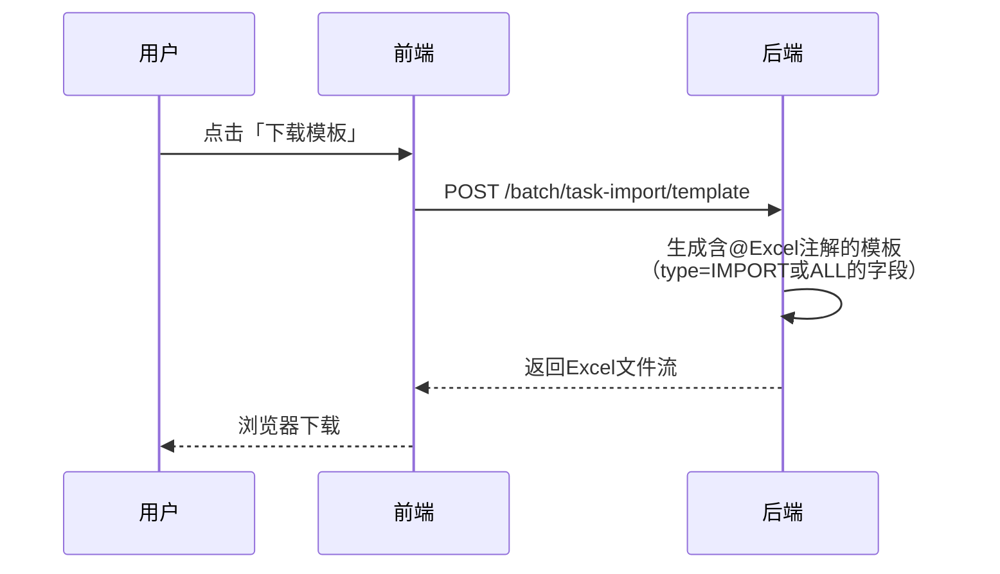
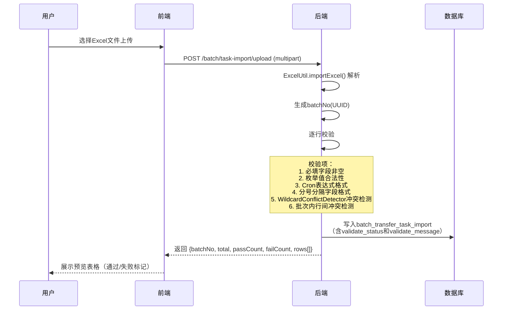
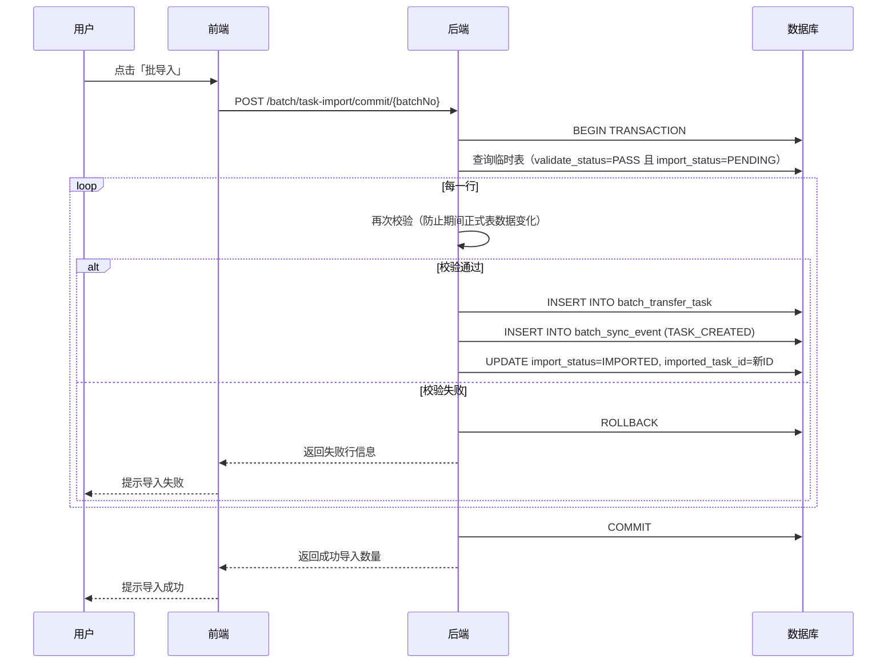
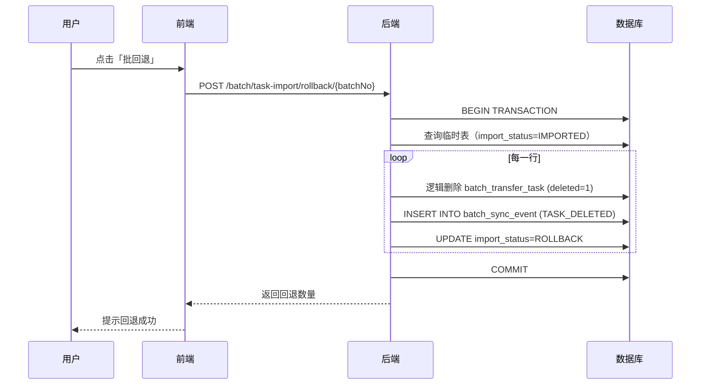
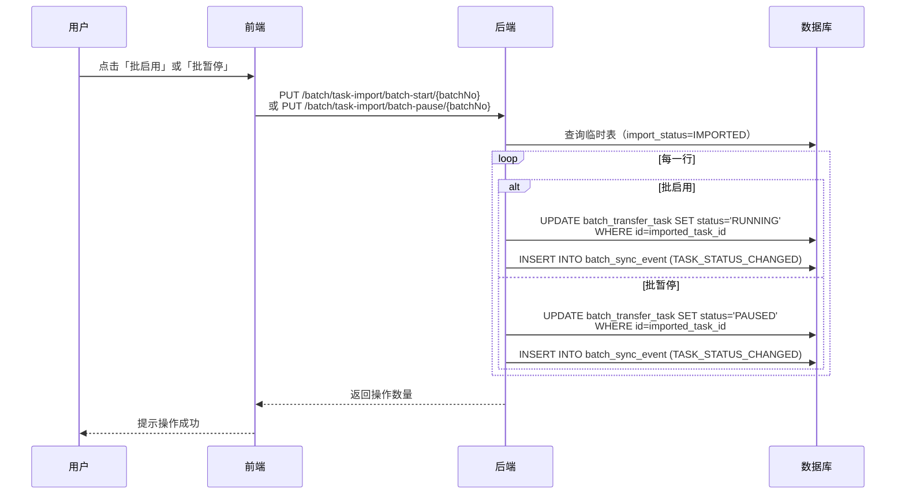

# 批量任务导入功能设计文档

## 1. 需求概述

在任务列表页面新增批量任务导入功能，支持通过Excel模板批量创建传输任务。核心流程：**下载模板 → 填写上传 → 预览校验 → 批量导入**。同时支持批回退、批启用、批暂停操作。

### 功能清单

| 编号 | 功能 | 说明 |
|------|------|------|
| F1 | 模板下载 | 下载批量任务Excel模板，含字段说明和下拉选项 |
| F2 | 批量上传 | 上传Excel文件，解析后存入临时表，返回校验结果 |
| F3 | 预览校验 | 展示临时表数据，标记校验通过/失败的行 |
| F4 | 批导入 | 将临时表中校验通过的记录事务性导入正式表 + 插入同步事件 |
| F5 | 批回退 | 撤回已导入的任务（删除正式表记录 + 插入TASK_DELETED事件） |
| F6 | 批启用 | 批量启动临时表中状态为READY的任务 |
| F7 | 批暂停 | 批量暂停临时表中状态为RUNNING的任务 |

### 前端菜单位置

在左侧导航栏「批量传输」目录下新增「任务导入」菜单项，与「任务列表」「传输明细」平级。

---

## 2. 数据模型

### 2.1 临时表 batch_transfer_task_import

与 `batch_transfer_task` 字段完全一致，额外增加以下字段：

| 字段 | 类型 | 说明 |
|------|------|------|
| `batch_no` | varchar(32) NOT NULL | 批次号，每次上传生成唯一批次号（UUID去横线） |
| `row_num` | int NOT NULL | Excel行号（从2开始，1为表头） |
| `validate_status` | varchar(10) NOT NULL DEFAULT 'PENDING' | 校验状态: PENDING/PASS/FAIL |
| `validate_message` | varchar(500) DEFAULT NULL | 校验失败原因 |
| `import_status` | varchar(10) NOT NULL DEFAULT 'PENDING' | 导入状态: PENDING/IMPORTED/ROLLBACK |
| `imported_task_id` | bigint DEFAULT NULL | 导入后对应的正式表任务ID（用于回退） |

索引：
- `idx_batch_no` (batch_no) — 按批次查询
- `idx_import_status` (import_status) — 按导入状态筛选
- `idx_imported_task_id` (imported_task_id) — 回退时反查

### 2.2 JSON字段Excel映射规则

数据库中JSON数组字段在Excel中使用**分号分隔文本**，导入时自动转换：

| 数据库字段 | Excel列名 | Excel格式示例 | 转换规则 |
|-----------|-----------|-------------|---------|
| target_agent_ids | 目标节点ID | agent-001;agent-002 | 分号分割 → JSON数组 |
| target_agent_names | 目标节点名称 | 节点A;节点B | 分号分割 → JSON数组 |
| target_dirs | 目标目录 | /data/recv;/backup/recv | 分号分割 → JSON数组 |
| include_patterns | 包含模式 | *.log;*.txt | 分号分割 → JSON数组 |
| exclude_patterns | 排除模式 | *.tmp;*.bak | 分号分割 → JSON数组 |
| routing_config | 路由配置 | — | 仅REGION_BASED时需填JSON字符串 |

---

## 3. 核心流程

### 3.1 模板下载流程



模板特点：
- 列头与导出Excel一致，用户可直接从导出的Excel修改后导入
- 枚举字段使用下拉选项（`@Excel.combo`）
- 必填字段在列头标注 `*`
- `status` 列默认值 `READY`，`id` 列留空（自动生成）

### 3.2 批量上传与校验流程



### 3.3 批导入流程（事务性）



**事务保证**：整个批导入是一个数据库事务，任何一行校验失败则全部回滚。

### 3.4 批回退流程



### 3.5 批启用/批暂停流程



---

## 4. API设计

### 4.1 后端接口

| 方法 | 路径 | 权限 | 说明 |
|------|------|------|------|
| POST | `/batch/task-import/template` | `batch:task:import` | 下载导入模板 |
| POST | `/batch/task-import/upload` | `batch:task:import` | 上传Excel并校验 |
| GET | `/batch/task-import/preview/{batchNo}` | `batch:task:import` | 预览临时表数据 |
| POST | `/batch/task-import/commit/{batchNo}` | `batch:task:import` | 批导入（事务） |
| POST | `/batch/task-import/rollback/{batchNo}` | `batch:task:import` | 批回退 |
| PUT | `/batch/task-import/batch-start/{batchNo}` | `batch:task:import` | 批启用 |
| PUT | `/batch/task-import/batch-pause/{batchNo}` | `batch:task:import` | 批暂停 |
| GET | `/batch/task-import/batches` | `batch:task:import` | 查询历史批次列表 |
| DELETE | `/batch/task-import/batch/{batchNo}` | `batch:task:import` | 删除批次（仅PENDING/ROLLBACK状态） |

### 4.2 上传接口请求/响应

**请求：** `multipart/form-data`，字段名 `file`

**响应：**

```json
{
  "code": 200,
  "data": {
    "batchNo": "a1b2c3d4e5f6",
    "total": 15,
    "passCount": 12,
    "failCount": 3,
    "rows": [
      {
        "rowNum": 2,
        "taskName": "日志传输任务",
        "sourceAgentId": "agent-001",
        "sourceDir": "/var/log",
        "validateStatus": "PASS",
        "validateMessage": null
      },
      {
        "rowNum": 3,
        "taskName": "",
        "sourceAgentId": "agent-002",
        "sourceDir": "/data/files",
        "validateStatus": "FAIL",
        "validateMessage": "任务名称不能为空"
      }
    ]
  }
}
```

---

## 5. 校验规则

### 5.1 格式校验（上传时执行）

| 校验项 | 规则 | 失败提示 |
|--------|------|---------|
| 任务名称 | 非空，≤200字符 | 任务名称不能为空 |
| 源Agent ID | 非空 | 源节点ID不能为空 |
| 源节点名称 | 非空 | 源节点名称不能为空 |
| 源目录 | 非空，Linux绝对路径格式 | 源目录格式不正确 |
| 目标节点ID | 非空，分号分隔 | 目标节点ID不能为空 |
| 目标节点名称 | 非空，分号分隔 | 目标节点名称不能为空 |
| 目标目录 | 非空，分号分隔 | 目标目录不能为空 |
| Cron表达式 | 若填写则校验格式（6-7位） | Cron表达式格式不正确 |
| 枚举字段 | 值必须在枚举范围内 | {字段名}值不合法 |
| 数值范围 | maxScanFiles[1,100000]等 | {字段名}超出范围 |

### 5.2 冲突校验（上传时 + 提交时双重校验）

使用 `WildcardConflictDetector.hasConflict()` 检测：

1. **与正式表现有任务冲突**：遍历正式表中同一 `source_agent_id` 下的所有任务，逐一检测通配符冲突
2. **批次内行间冲突**：同一批次内，相同 `source_agent_id` + `source_dir` 的行之间检测通配符冲突
3. **提交时二次校验**：防止上传后到提交前，正式表数据发生变化导致新的冲突

### 5.3 默认值处理

导入时以下字段自动设置默认值（用户无需在Excel中填写）：

| 字段 | 默认值 |
|------|--------|
| status | READY |
| id | 自增 |
| deleted | 0 |
| retry_enabled | 1 |
| max_scan_files | 10000 |
| retry_max_days | 7 |
| retry_interval_min | 30 |
| max_retry_count | 10 |
| retry_backoff_type | EXPONENTIAL |
| post_transfer_action | NONE |
| preserve_dir_structure | 1 |
| transfer_mode | ONE_TO_MANY |
| routing_strategy | BROADCAST |
| task_priority | 5 |
| scheduled_enabled | 0 |

---

## 6. 前端页面设计

### 6.1 页面布局

任务导入页面分为上下两个区域：

**上半区 — 操作区：**
- 左侧：上传组件（拖拽上传 + 点击选择），支持 .xlsx/.xls
- 右侧：操作按钮组（下载模板、批导入、批回退、批启用、批暂停、删除批次）

**下半区 — 数据区：**
- 批次列表Tab（展示历史批次，每个批次显示：批次号、上传时间、总行数、通过/失败数、导入状态）
- 选中批次后展示预览表格，校验失败的行标红，悬浮显示失败原因

### 6.2 交互流程

1. 用户点击「下载模板」获取Excel模板
2. 填写完成后点击上传区域或拖拽文件上传
3. 上传成功后自动展示预览表格，通过/失败行不同颜色标记
4. 用户确认后点击「批导入」，二次确认弹窗后执行
5. 导入成功后可点击「批启用」启动任务
6. 如需撤回，点击「批回退」

---

## 7. 菜单数据

在 `03-data.sql` 的 `sys_menu` 表中新增：

| menu_id | parent_id | menu_name | menu_type | perms | component | order_num |
|---------|-----------|-----------|-----------|-------|-----------|-----------|
| 2300 | 0 | 批量传输 | M | — | — | 6 |
| 2301 | 2300 | 任务列表 | C | batch:task:list | batch/TaskPage | 1 |
| 2302 | 2300 | 传输明细 | C | batch:subtask:list | batch/SubtaskPage | 2 |
| 2303 | 2300 | 任务导入 | C | batch:task:import | batch/TaskImportPage | 3 |
| 2304 | 2303 | 模板下载 | F | batch:task:import | — | 1 |
| 2305 | 2303 | 批量上传 | F | batch:task:import | — | 2 |
| 2306 | 2303 | 批量导入 | F | batch:task:import | — | 3 |
| 2307 | 2303 | 批量回退 | F | batch:task:import | — | 4 |
| 2308 | 2303 | 批量启用 | F | batch:task:import | — | 5 |
| 2309 | 2303 | 批量暂停 | F | batch:task:import | — | 6 |

> 注：2300/2301/2302 如果已存在则跳过，仅新增 2303-2309。

---

## 8. 关键技术决策

| 决策点 | 选择 | 理由 |
|--------|------|------|
| JSON字段Excel格式 | 分号分隔文本 | 用户友好，导入时自动转JSON |
| 冲突检测 | 复用WildcardConflictDetector | 与现有createTask逻辑一致 |
| 事务粒度 | 整个批次一个事务 | 满足"全部成功才算成功"的需求 |
| 批回退实现 | 逻辑删除+TASK_DELETED事件 | 与现有deleteTasks逻辑一致 |
| 临时表生命周期 | 批回退后保留，手动删除 | 保留审计追溯能力 |
| 模板生成 | 复用ExcelUtil.importTemplateExcel | 与现有用户导入模式一致 |
