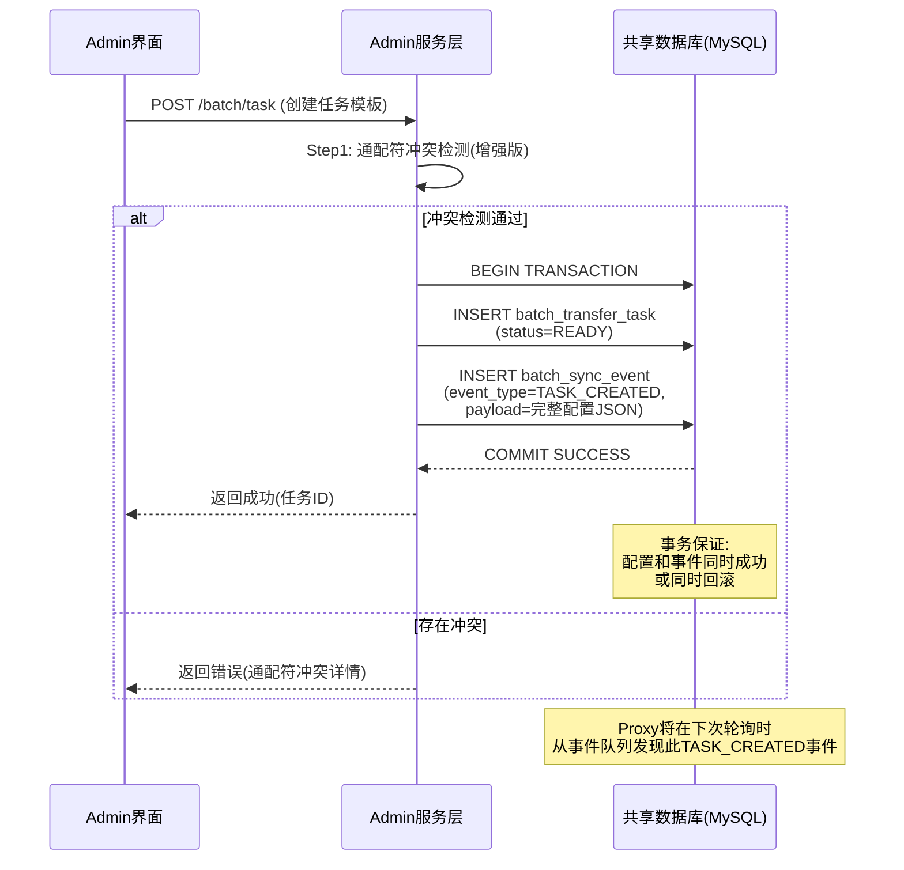
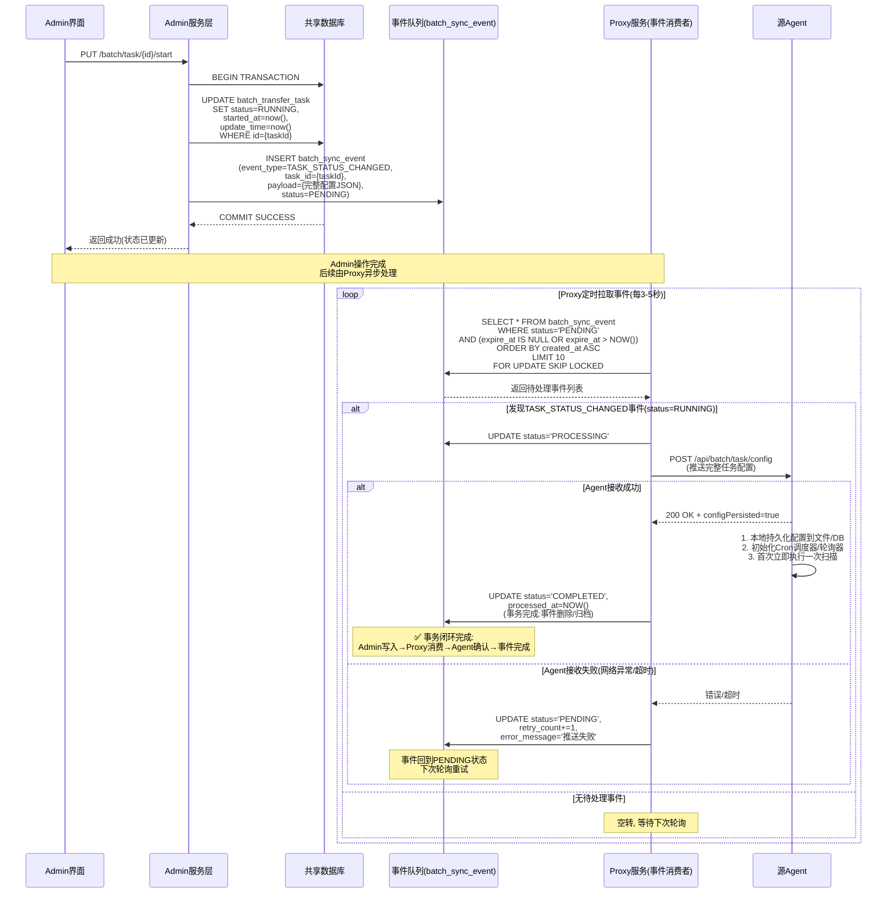
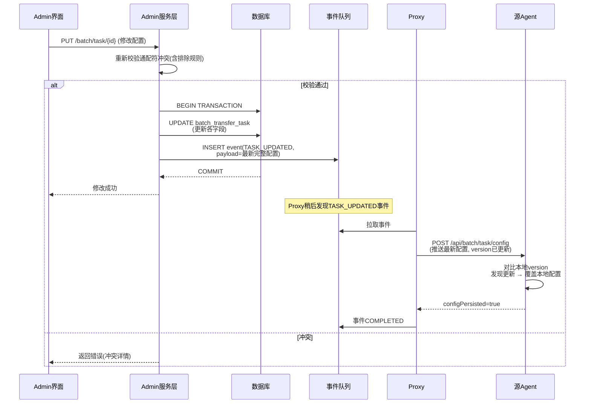
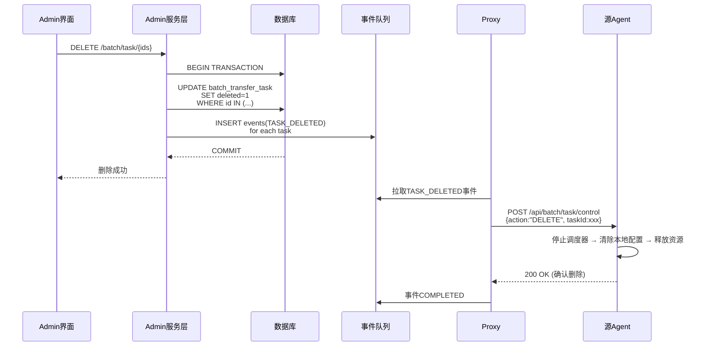
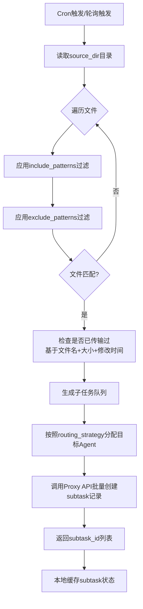
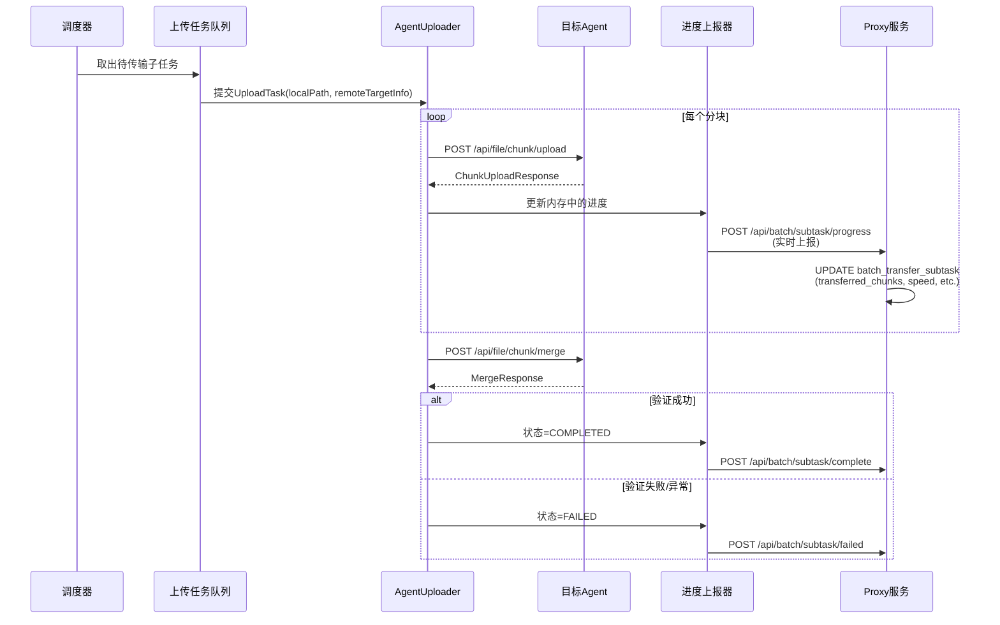
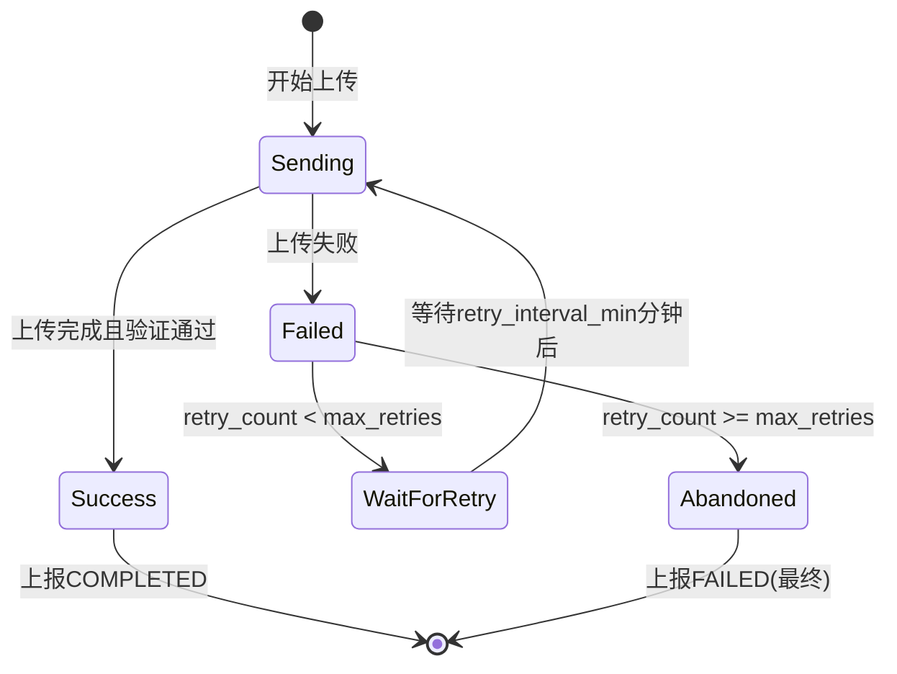

# 批量文件传输功能 - 业务需求与设计规格

## 1. 功能概述

### 1.1 目标

构建一个基于Agent P2P传输的批量文件分发系统，支持：

* **Admin**配置传输模板并持久化到共享数据库（任务CRUD + 监控展示）

* **Proxy**通过数据库事件队列获取变更，及时将配置下发给Source Agent，接收进度上报

* **Source Agent**自治执行：定时扫描、文件匹配、P2P传输、自动重试、进度实时上报

### 1.2 核心价值

* **去中心化传输**：Agent之间直接P2P传输，Proxy不参与数据流

* **解耦设计**：Admin与Proxy完全解耦，通过共享数据库+事件队列间接通信

* **事务可靠**：Admin配置更新与事件插入在同一事务，Proxy推送成功后才删除事件

* **高可用性**：Proxy/Agent宕机不影响已下发的任务执行

* **灵活调度**：支持Cron表达式和轮询间隔两种定时模式

* **可观测性**：实时进度上报，Admin可监控每个文件的传输状态

***

## 2. 系统架构

### 2.1 三层角色划分（解耦版+事件队列）

```
┌─────────────────────────────────────────────────────────────┐
│                        Admin (配置+展示)                      │
│  • 任务模板CRUD (直接操作DB)                                  │
│  • 实时监控大屏                                               │
│  • 通配符冲突检测(含排除规则)                                   │
└──────────────────────┬──────────────────────────────────────┘
                       │ JDBC事务 (更新配置 + 插入事件)
                       ▼
              ┌─────────────────────────────────┐
              │        共享数据库 (MySQL)          │
              │                                 │
              │  • batch_transfer_task           │
              │  • batch_transfer_subtask         │
              │  • batch_sync_event (事件队列)     │
              └──────────────┬──────────────────┘
                             │ Proxy轮询事件队列
                             ▼
┌─────────────────────────────────────────────────────────────┐
│                     Proxy (事件驱动同步中心)                   │
│                                                              │
│  • 从事件队列拉取变更事件                                       │
│  • 推送配置到Source Agent                                     │
│  • Agent确认持久化后删除事件(事务完成)                           │
│  • 进度接收 & 持久化到DB                                      │
│  • Agent注册管理                                             │
└──────────┬─────────────────────────────┬────────────────────┘
           │ 推送配置                     │ 接收进度
           ▼                             ▼
┌─────────────────────┐       ┌─────────────────────┐
│   Source Agent      │ P2P   │   Target Agent      │
│  • Cron调度器        │──────▶│  • 接收文件分块      │
│  • 目录扫描器        │       │  • 合并文件          │
│  • 文件匹配引擎      │       │  • 返回传输结果      │
│  • 路由策略执行      │       └─────────────────────┘
│  • 上传任务队列      │
│  • 重试管理器        │
│  • 进度上报器        │
│  • 配置本地持久化     │
└─────────────────────┘
```

### 2.2 核心设计原则

1. **Admin-Proxy解耦**：Admin不直接调用Proxy API，两者通过共享数据库+事件队列通信
2. **事件驱动**：Admin在事务中同时完成"配置更新+事件插入"，确保不丢失变更
3. **事务可靠**：Proxy只有收到Agent的持久化确认后，才删除事件记录（保证至少一次下发）
4. **Agent自治**：Source Agent本地维护任务状态和配置缓存，不依赖Proxy在线
5. **增量同步**：Proxy只处理有事件的配置变更，无事件不下发
6. **幂等性**：同一子任务重复上报进度只更新最新状态；同一事件重复推送Agent侧幂等处理
7. **精简设计**：避免过度抽象，核心逻辑集中在Agent端

***

## 3. 数据模型设计（完整SQL）

### 3.1 主表：batch\_transfer\_task（任务模板）

```sql
CREATE TABLE IF NOT EXISTS `batch_transfer_task` (
    `id` bigint NOT NULL AUTO_INCREMENT COMMENT '主键ID',
    `task_name` varchar(200) NOT NULL COMMENT '任务名称',
    `task_description` varchar(500) DEFAULT NULL COMMENT '任务描述',
    `source_agent_id` varchar(50) NOT NULL COMMENT '源Agent ID',
    `source_agent_name` varchar(100) NOT NULL COMMENT '源节点名称(格式: user@ip:port, 如root@10.240.85.177:7777, Admin创建任务时必填)',
    `source_dir` varchar(500) NOT NULL COMMENT '源目录绝对路径',
    `target_dirs` varchar(2000) NOT NULL COMMENT '目标节点目录(分号分隔, 与target_agents一一对应)',
    `include_patterns` text DEFAULT NULL COMMENT '包含通配符(JSON数组)',
    `exclude_patterns` text DEFAULT NULL COMMENT '排除通配符(JSON数组)',
    `scan_cron_expression` varchar(100) DEFAULT NULL COMMENT '定时扫描Cron表达式(6-7位), 如 "0 */5 * * * ?" 表示每5分钟扫描',
    `max_scan_files` int NOT NULL DEFAULT 10000 COMMENT '单次最大扫描文件数, 范围[1,100000]',
    `target_agent_ids` text NOT NULL COMMENT '目标Agent ID列表(JSON数组)',
    `target_agent_names` text NOT NULL COMMENT '目标节点名称列表(JSON数组, 格式: user@ip:port, 与target_agent_ids一一对应, Admin创建任务时必填)',
    `retry_enabled` tinyint NOT NULL DEFAULT 1 COMMENT '是否启用自动重试: 0-否 1-是',
    `retry_max_days` int NOT NULL DEFAULT 7 COMMENT '重试保留天数, 范围[1,30]',
    `retry_interval_min` int NOT NULL DEFAULT 30 COMMENT '首次重试间隔(分钟), 范围[5,1440]',
    `max_retry_count` int NOT NULL DEFAULT 10 COMMENT '单个子任务最大重试次数, 范围[1,100]',
    `retry_backoff_type` varchar(20) NOT NULL DEFAULT 'EXPONENTIAL' COMMENT '重试退避策略: LINEAR(线性)/EXPONENTIAL(指数退避,推荐)',
    `post_transfer_action` varchar(20) NOT NULL DEFAULT 'NONE' COMMENT '传输后操作: NONE/DELETE/BACKUP',
    `backup_dir` varchar(500) DEFAULT NULL COMMENT '备份目录绝对路径(post_transfer_action=BACKUP时必填)',
    `backup_mode` varchar(10) DEFAULT 'COPY' COMMENT '备份模式: COPY/MOVE',
    `preserve_dir_structure` tinyint NOT NULL DEFAULT 1 COMMENT '是否保持原始目录结构: 0-否 1-是',
    `transfer_mode` varchar(20) NOT NULL DEFAULT 'ONE_TO_MANY' COMMENT '传输模式: ONE_TO_ONE/ONE_TO_MANY',
    `routing_strategy` varchar(20) NOT NULL DEFAULT 'BROADCAST' COMMENT '路由策略: BROADCAST/ROUND_ROBIN/REGION_BASED/RANDOM',
    `routing_config` text DEFAULT NULL COMMENT '路由策略配置JSON(REGION_BASED时必填)',
    `status` varchar(20) NOT NULL DEFAULT 'READY' COMMENT '任务运行状态: READY-就绪(已配置)/RUNNING-运行中/PAUSED-已暂停',
    `started_at` datetime DEFAULT NULL COMMENT '首次启动时间',
    `create_by` varchar(64) DEFAULT '' COMMENT '创建人用户ID',
    `create_time` datetime NOT NULL DEFAULT CURRENT_TIMESTAMP COMMENT '创建时间',
    `update_by` varchar(64) DEFAULT '' COMMENT '更新人用户ID',
    `update_time` datetime NOT NULL DEFAULT CURRENT_TIMESTAMP ON UPDATE CURRENT_TIMESTAMP COMMENT '更新时间',
    `remark` varchar(500) DEFAULT NULL COMMENT '备注',
    `deleted` tinyint NOT NULL DEFAULT 0 COMMENT '逻辑删除标志: 0-未删除 1-已删除',
    PRIMARY KEY (`id`),
    KEY `idx_status` (`status`),
    KEY `idx_source_agent` (`source_agent_id`),
    KEY `idx_create_by` (`create_by`),
    KEY `idx_create_time` (`create_time`)
) ENGINE=InnoDB DEFAULT CHARSET=utf8mb4 COMMENT='批量传输任务表(模板配置)';
```

**用途**：Admin配置的传输任务模板，一个任务对应一个源目录→多个目标的映射关系。

**关键字段说明**：

| 字段                     | 类型            | 说明                                                                  |
| ---------------------- | ------------- | ------------------------------------------------------------------- |
| task\_name             | varchar(200)  | 任务名称，如"日志文件备份"、"配置文件同步"                                             |
| source\_agent\_id      | varchar(50)   | 源Agent ID（文件扫描发起方）                                                  |
| source\_agent\_name    | varchar(100)  | 源节点名称（**Admin创建任务时必填**，格式：user\@ip:port，如root\@10.240.85.177:7777）  |
| source\_dir            | varchar(500)  | 源目录绝对路径，如`/var/log/app`                                             |
| target\_agent\_ids     | text(JSON数组)  | 目标Agent ID列表，如`["agent-002", "agent-003"]`                          |
| target\_agent\_names   | text(JSON数组)  | 目标节点名称列表（**Admin创建任务时必填**，格式：user\@ip:port，与target\_agent\_ids一一对应） |
| target\_dirs           | varchar(2000) | 目标目录列表（分号分隔），如`/backup/node1;/backup/node2`                         |
| include\_patterns      | text(JSON数组)  | 包含通配符，如`["*.log", "*.txt"]`                                         |
| exclude\_patterns      | text(JSON数组)  | 排除通配符，如`["*.tmp", "debug*"]`                                        |
| scan\_cron\_expression | varchar(100)  | Cron表达式（6-7位）                                                       |
| routing\_strategy      | varchar(20)   | 路由策略：BROADCAST/ROUND\_ROBIN/REGION\_BASED/RANDOM                    |
| status                 | varchar(20)   | **任务状态：READY/RUNNING/PAUSED（三种状态）**                                 |
| retry\_enabled         | tinyint       | 是否启用自动重试：0-否 1-是（默认启用）                                              |
| retry\_max\_days       | int           | 重试保留天数，范围\[1, 30]（默认7天）                                             |
| retry\_interval\_min   | int           | 首次重试间隔（分钟），范围\[5, 1440]（默认30分钟）                                     |
| max\_retry\_count      | int           | 单个子任务最大重试次数，范围\[1, 100]（默认10次）                                      |
| **状态机**：               | <br />        | <br />                                                              |

```
  ┌───────┐    start()    ┌─────────┐   pause()   ┌──────┐
  │ READY │ ───────────▶  │ RUNNING │ ◀────────▶ │PAUSED │
  └───────┘               └─────────┘            └──────┘

  状态流转: READY → RUNNING ↔ PAUSED
  说明:
  - READY → RUNNING: 单向，启动后不可回退到READY
  - RUNNING ↔ PAUSED: 双向循环，可随时暂停和恢复
  - 终止任务: 通过删除(deleted=1)实现
```

**状态说明**：

| 状态          | 说明                  | Agent行为                |
| ----------- | ------------------- | ---------------------- |
| **READY**   | 就绪（已配置完成，等待启动）      | 不执行扫描和传输               |
| **RUNNING** | 运行中（Agent正在执行或等待调度） | 初始化调度器、定时扫描、P2P传输、上报进度 |
| **PAUSED**  | 已暂停（管理员手动暂停）        | 暂停调度器，正在执行的传输继续完成      |

<br />

**状态转换操作汇总表**：

| 操作         | 当前状态    | 目标状态    | 触发条件        | 数据库操作                                   | 事件类型                  | Agent影响                       |
| ---------- | ------- | ------- | ----------- | --------------------------------------- | --------------------- | ----------------------------- |
| 创建任务       | -       | READY   | Admin创建任务   | INSERT (status=READY)                   | TASK\_CREATED         | 无（未启动）                        |
| 启动(start)  | READY   | RUNNING | Admin点击启动   | UPDATE status=RUNNING,started\_at=NOW() | TASK\_STATUS\_CHANGED | 初始化调度器，开始扫描                   |
| 暂停(pause)  | RUNNING | PAUSED  | Admin点击暂停   | UPDATE status=PAUSED                    | TASK\_STATUS\_CHANGED | 暂停调度器，正在传输的继续完成               |
| 恢复(resume) | PAUSED  | RUNNING | Admin点击恢复   | UPDATE status=RUNNING                   | TASK\_STATUS\_CHANGED | 恢复调度器，继续正常执行                  |
| 修改配置       | 任意状态    | 不变      | Admin修改配置字段 | UPDATE (非status字段)                      | TASK\_UPDATED         | 热更新配置（RUNNING/PAUSED时）        |
| 删除任务       | 任意状态    | 已删除     | Admin删除任务   | UPDATE deleted=1                        | TASK\_DELETED         | 清除配置和调度器，停止生成新子任务，进行中的子任务允许完成 |

***

### 3.2 子表：batch\_transfer\_subtask（文件传输实例）

```sql
CREATE TABLE IF NOT EXISTS `batch_transfer_subtask` (
    `id` bigint NOT NULL AUTO_INCREMENT COMMENT '主键ID',
    `task_id` bigint NOT NULL COMMENT '关联的批量任务ID',
    `source_agent_id` varchar(50) NOT NULL COMMENT '源Agent ID',
    `source_agent_name` varchar(100) DEFAULT NULL COMMENT '源节点名称，格式：user@ip:port，如root@10.240.85.177:7777',
    `target_agent_id` varchar(50) NOT NULL COMMENT '目标Agent ID',
    `target_agent_name` varchar(100) DEFAULT NULL COMMENT '目标节点名称，格式：user@ip:port，如root@10.240.85.177:7777',
    `source_path` varchar(1000) NOT NULL COMMENT '源文件完整路径(sourceDir+relativePath)',
    `target_path` varchar(1000) NOT NULL COMMENT '目标文件完整路径(targetDir+relativePath)',
    `file_name` varchar(255) NOT NULL COMMENT '文件名(纯文件名,不含路径)',
    `file_size_bytes` bigint NOT NULL COMMENT '文件大小(字节)',
    `file_last_modified` datetime DEFAULT NULL COMMENT '文件最后修改时间',
    `status` varchar(20) NOT NULL DEFAULT 'QUEUED' COMMENT '子任务状态: QUEUED-排队中/SENDING-传输中/COMPLETED-已完成/FAILED-失败/RETRYING-重试中',
    `transfer_id` varchar(100) DEFAULT NULL COMMENT '底层分块传输会话ID(关联AgentUploader的transferId)',
    `transferred_chunks` int NOT NULL DEFAULT 0 COMMENT '已传输的分块数',
    `total_chunks` int NOT NULL DEFAULT 0 COMMENT '总分块数',
    `transferred_bytes` bigint NOT NULL DEFAULT 0 COMMENT '已传输字节数',
    `speed_bytes_per_sec` bigint DEFAULT NULL COMMENT '当前传输速率(字节/秒)',
    `started_at` datetime DEFAULT NULL COMMENT '开始传输时间',
    `completed_at` datetime DEFAULT NULL COMMENT '完成时间',
    `duration_ms` bigint DEFAULT NULL COMMENT '传输耗时(毫秒)',
    `error_code` varchar(50) DEFAULT NULL COMMENT '错误码',
    `error_message` text DEFAULT NULL COMMENT '错误详情',
    `error_stack_trace` text DEFAULT NULL COMMENT '异常堆栈(调试用)',
    `retry_count` int NOT NULL DEFAULT 0 COMMENT 'Agent本地重试次数',
    `last_retry_at` datetime DEFAULT NULL COMMENT '最后一次重试时间',
    `next_retry_after` datetime DEFAULT NULL COMMENT '下次可重试时间(Level 2)',
    `create_by` varchar(64) DEFAULT '' COMMENT '创建人(系统自动)',
    `create_time` datetime NOT NULL DEFAULT CURRENT_TIMESTAMP COMMENT '创建时间',
    `update_by` varchar(64) DEFAULT '' COMMENT '更新人(系统自动)',
    `update_time` datetime NOT NULL DEFAULT CURRENT_TIMESTAMP ON UPDATE CURRENT_TIMESTAMP COMMENT '更新时间',
    `remark` varchar(500) DEFAULT NULL COMMENT '备注',
    PRIMARY KEY (`id`),
    KEY `idx_task_source_target` (`task_id`, `source_path`(255), `target_agent_id`),
    KEY `idx_task_id` (`task_id`),
    KEY `idx_target_status` (`target_agent_id`, `status`),
    KEY `idx_status_retry` (`status`, `next_retry_after`),
    KEY `idx_transfer_id` (`transfer_id`)
) ENGINE=InnoDB DEFAULT CHARSET=utf8mb4 COMMENT='批量子任务表(文件×目标Agent的笛卡尔积)';
```

**用途**：每次扫描后生成的具体文件传输任务，是【文件×目标Agent】的笛卡尔积。

**关键字段说明**：

| 字段                                  | 类型            | 说明                                   |
| ----------------------------------- | ------------- | ------------------------------------ |
| task\_id                            | bigint        | 关联的主任务ID                             |
| source\_path                        | varchar(1000) | 源文件完整路径                              |
| target\_path                        | varchar(1000) | 目标文件完整路径                             |
| file\_size\_bytes                   | bigint        | 文件大小                                 |
| status                              | varchar(20)   | 子任务状态（见下方状态机）                        |
| transfer\_id                        | varchar(100)  | 底层AgentUploader的transferId（关联分块传输会话） |
| transferred\_chunks / total\_chunks | int           | 分块传输进度                               |
| retry\_count                        | int           | Agent本地重试次数                          |

**状态机（简化版 - 5状态）**：

```
┌─────────────────────────────────────────────────────────────┐
│              batch_transfer_subtask 状态机                    │
├─────────────────────────────────────────────────────────────┤
│                                                             │
│                     ┌──────────┐                             │
│                     │  QUEUED   │ ◀───── 初始状态              │
│                     └────┬─────┘                             │
│                          │                                   │
│                          ▼ 开始上传                           │
│                     ┌──────────┐                             │
│                     │  SENDING  │                            │
│                     └────┬─────┘                             │
│                   ┌─────┴─────┐                              │
│                   │           │                              │
│            传输成功 │     传输失败                             │
│                   ▼           ▼                              │
│             ┌──────────┐ ┌───────┐                           │
│             │COMPLETED │ │FAILED │                           │
│             └──────────┘ └───┬───┘                           │
│                               │                               │
│                        未达最大重试次数                        │
│                               ▼                               │
│                          ┌───────────┐                        │
│                          │ RETRYING  │                        │
│                          └─────┬─────┘                        │
│                                │ 等待期结束                     │
│                                └──────────▶ SENDING (重新上传) │
│                                                               |                         
└─────────────────────────────────────────────────────────────┘
```

**状态转换触发条件汇总表（5状态模型）**：

| 当前状态     | 目标状态      | 触发条件              | 数据库操作                                                    | Agent操作                      |
| -------- | --------- | ----------------- | -------------------------------------------------------- | ---------------------------- |
| QUEUED   | SENDING   | 调度器取出任务，开始上传      | status='SENDING', started\_at=NOW()                      | 初始化上传会话，获取transfer\_id       |
| SENDING  | COMPLETED | 所有分块上传成功且验证通过     | status='COMPLETED', completed\_at=NOW(), duration\_ms计算  | 执行post\_transfer\_action（可选） |
| SENDING  | FAILED    | 上传异常              | status='FAILED', error\_code/message填充                   | 保留进度信息（支持断点续传）               |
| FAILED   | RETRYING  | 未达最大重试次数，启用自动重试   | status='RETRYING', next\_retry\_after计算, retry\_count+=1 | 设置重试定时器，等待后重试             |
| RETRYING | SENDING   | 重试等待期结束           | status='SENDING'                                         | 使用原transfer\_id续传            |
| RETRYING | FAILED    | 重试次数耗尽 或 超过最大重试天数 | status='FAILED' (终态)                                     | 清理上传资源，上报最终失败                |

**设计原则说明**：

* **不可取消**：子任务一旦生成就必须执行完毕（成功或失败）

* **停止机制**：通过父任务的PAUSED/DELETED状态控制是否生成新子任务

* **优雅退出**：父任务删除或者暂停时，正在进行的传输允许自然完成，不再生成新子任务

**重试策略详细说明**：

| 配置项                  | 默认值         | 说明                         | 示例值         |
| -------------------- | ----------- | -------------------------- | ----------- |
| retry\_enabled       | true        | 是否启用自动重试                   | true/false  |
| retry\_max\_days     | 7           | 最大重试保留天数                   | 7天          |
| retry\_interval\_min | 30          | 首次重试间隔（分钟）                 | 30分钟        |
| max\_retry\_count    | 10          | 单个子任务最大重试次数                | 10次         |
| retry\_backoff\_type | exponential | 退避策略类型: linear/exponential | exponential |

**指数退避示例**：

```
第1次重试: 等待 30分钟 (retry_interval_min)
第2次重试: 等待 60分钟 (30 * 2)
第3次重试: 等待 120分钟 (60 * 2)
第4次重试: 等待 240分钟 (120 * 2)
... 
上限: 120分钟 (2小时)
```

***

### 3.3 事件队列表：batch\_sync\_event（配置同步事件队列）⭐核心新增

```sql
CREATE TABLE IF NOT EXISTS `batch_sync_event` (
	`id` bigint NOT NULL AUTO_INCREMENT COMMENT '事件ID',
    `event_type` varchar(20) NOT NULL COMMENT '事件类型: TASK_CREATED/TASK_UPDATED/TASK_DELETED/TASK_STATUS_CHANGED',
    `task_id` bigint NOT NULL COMMENT '关联的任务ID',
    `source_agent_id` varchar(50) NOT NULL COMMENT '源Agent ID(冗余存储,便于快速查询)',
    `payload` text DEFAULT NULL COMMENT '事件负载(JSON格式, 存储完整的任务配置快照)',
    `status` varchar(20) NOT NULL DEFAULT 'PENDING' COMMENT '事件处理状态: PENDING-待处理/PROCESSING-处理中/COMPLETED-已完成/FAILED-失败',
    `retry_count` int NOT NULL DEFAULT 0 COMMENT '重试次数',
    `error_message` text DEFAULT NULL COMMENT '失败原因',
    `created_at` datetime NOT NULL DEFAULT CURRENT_TIMESTAMP COMMENT '事件创建时间',
    `processed_at` datetime DEFAULT NULL COMMENT '事件处理完成时间',
    `expire_at` datetime DEFAULT NULL COMMENT '事件过期时间(超过此时间未处理则标记为FAILED)',
    `started_at` datetime DEFAULT NULL COMMENT '事件开始处理时间',
    `next_retry_at` datetime DEFAULT NULL COMMENT '下次可重试时间',
    PRIMARY KEY (`id`),
    KEY `idx_status_created` (`status`, `created_at`),
    KEY `idx_task_id` (`task_id`),
    KEY `idx_source_agent` (`source_agent_id`),
    KEY `idx_expire_at` (`expire_at`),
    KEY `idx_next_retry` (`next_retry_at`)
) ENGINE=InnoDB DEFAULT CHARSET=utf8mb4 COMMENT='批量任务配置同步事件队列';
```

**用途**：作为Admin与Proxy之间的异步通信队列，确保配置变更可靠传递给Agent。

**事件类型（event\_type）**：

| 事件类型                  | 触发场景                              | payload内容         |
| --------------------- | --------------------------------- | ----------------- |
| TASK\_CREATED         | Admin创建新任务                        | 完整任务配置JSON        |
| TASK\_UPDATED         | Admin修改任务配置（非状态变更）                | 完整任务配置JSON        |
| TASK\_DELETED         | Admin逻辑删除任务                       | 任务ID + 删除时间戳      |
| TASK\_STATUS\_CHANGED | Admin改变任务状态(READY↔RUNNING↔PAUSED) | 任务ID + 新状态 + 完整配置 |

**事件状态（status）完整定义与状态机**：

```
┌─────────────────────────────────────────────────────────────┐
│                  batch_sync_event 状态机                      │
├─────────────────────────────────────────────────────────────┤
│                                                             │
│   ┌─────────┐                                              │
│   │ PENDING │ ◀────── 初始状态                                │
│   └────┬────┘                                              │
│        │                                                    │
│        ▼ Proxy拉取并标记处理中                                 │
│   ┌───────────┐                                            │
│   │PROCESSING │                                            │
│   └─────┬─────┘                                            │
│         │                                                   │
│    ┌────┴────┬──────────────┐                               │
│    │         │              │                               │
│    ▼         ▼              ▼                               │
│ ┌────────┐ ┌───────┐  ┌────────┐                          │
│ │COMPLETED│ │PENDING│  │ FAILED │                          │
│ │ (成功)  │ │(重试)  │  │ (失败)  │                          │
│ └────────┘ └───┬───┘  └────────┘                          │
│                 │                                           │
│                 ▼ 再次尝试                                   │
│            ┌───────────┐                                    │
│            │PROCESSING │                                    │
│            └───────────┘                                    │
│                                                             │
│   特殊路径:                                                  │
│   PENDING ──▶ FAILED (过期未处理)                             │
│                                                             │
│   状态说明:                                                   │
│   ────────                                                   │
│   PENDING: 待处理                                             │
│     - 初始状态：Admin插入事件后默认为PENDING                    │
│     - 业务含义：Proxy尚未拉取或处理该事件                       │
│     - 可转换到: PROCESSING, FAILED                            │
│     - 数据特征: processed_at=NULL, retry_count=0             │
│     - 查询条件: status='PENDING' AND (expire_at IS NULL OR expire_at > NOW())│
│                                                             │
│   PROCESSING: 处理中                                          │
│     - 进入条件：Proxy拉取事件并使用FOR UPDATE SKIP LOCKED锁定   │
│     - 业务含义：Proxy正在向Agent推送配置或发送控制指令           │
│     - 可转换到: COMPLETED, PENDING(重试), FAILED              │
│     - 数据特征: 标记时间戳，防止长时间占用（超时检测）             │
│     - 锁定机制: 使用SELECT ... FOR UPDATE SKIP LOCKED          │
│                                                             │
│   COMPLETED: 已完成                                           │
│     - 进入条件：Agent确认持久化/删除操作成功                     │
│     - 业务含义：事件已成功处理，配置已可靠下发给Agent            │
│     - 终态：不可再转换到其他状态                                │
│     - 数据特征: processed_at=NOT NULL                         │
│     - 后续操作: 可归档或删除（保留7天后清理）                    │
│                                                             │
│   FAILED: 失败                                               │
│     - 进入条件:                                              │
│       • 推送失败且超过最大重试次数                              │
│       • 事件过期未处理                                        │
│       • Agent返回致命错误                                     │
│     - 终态：不可再转换到其他状态（需人工介入）                   │
│     - 数据特征: error_message有值, retry_count>=max_retry     │
│     - 后续处理: 告警通知管理员，保留30天供排查                    │
│                                                             │
│   状态转换规则:                                                │
│   ──────────                                                 │
│   1. PENDING → PROCESSING                                    │
│      触发条件: Proxy轮询线程拉取到该事件                        │
|      SQL操作: UPDATE status='PROCESSING'                     │
│               WHERE id={eventId} AND status='PENDING'         │
│               FOR UPDATE SKIP LOCKED                          │
│      并发控制: 使用SKIP LOCKED避免多个Proxy实例重复消费         │
│      超时检测: 如果PROCESSING状态超过5分钟未变更，自动回滚PENDING│
│                                                             │
│   2. PROCESSING → COMPLETED                                  │
│      触发条件: Agent返回configPersisted=true 或 删除确认成功    │
|      SQL操作: UPDATE status='COMPLETED', processed_at=NOW()  │
│      验证要点: 必须收到Agent的持久化确认才可标记完成             │
│      事务保证: Proxy端事务完成标志                             │
│                                                             │
│   3. PROCESSING → PENDING (重试)                             │
│      触发条件: 推送失败但未超过最大重试次数                      │
|      SQL操作: UPDATE status='PENDING',                       │
│                  retry_count+=1, error_message='...'          │
│      重试策略: 指数退避（1s, 2s, 4s, 8s... 上限60s）           │
│      下次处理: 等待退避期后再次进入PROCESSING                   │
│                                                             │
│   4. PROCESSING → FAILED                                    │
│      触发条件: 推送失败且retry_count >= max_retry_count(10次)  │
│              或 Agent返回致命错误                               │
│              或 处理超时(>5分钟)                               │
|      SQL操作: UPDATE status='FAILED',                        │
│                  error_message='超过最大重试次数/超时/致命错误'  │
│      告警触发: 发送告警通知管理员                               │
│      人工介入: 管理员需检查Agent状态和网络连接                    │
│                                                             │
│   5. PENDING → FAILED (过期)                                 │
│      触发条件: 当前时间 > expire_at 且仍未被处理                │
│      过期时间: 默认24小时（可配置）                             │
│      触发方式: 定时任务扫描过期事件                             │
|      SQL操作: UPDATE status='FAILED',                        │
│                  error_message='事件过期未处理'                 │
│      场景示例: Proxy长期宕机导致事件积压过期                     │
│                                                             │
│   事件生命周期管理:                                             │
│   ──────────────                                             │
│   创建阶段:                                                    │
│   - Admin在事务中INSERT事件（与配置更新同一事务）                │
│   - 设置created_at=NOW(), expire_at=NOW()+24h                 │
│   - payload包含完整的任务配置快照                              │
│                                                             │
│   消费阶段:                                                    │
│   - Proxy每3-5秒轮询一次PENDING事件                           │
│   - 使用FOR UPDATE SKIP LOCKED批量拉取（如10条）               │
│   - 在线程池中异步处理每个事件                                 │
│   - 推送到Agent并等待确认                                     │
│                                                             │
│   清理阶段:                                                    │
│   - COMPLETED事件: 每天凌晨3点归档/删除（保留最近7天）           │
│   - FAILED事件: 保留30天供人工排查                             │
│   - 过期PENDING事件: 自动标记FAILED                           │
│                                                             │
│   可靠性保证:                                                  │
│   ─────────                                                 │
│   - 至少一次投递: 事件可能重复推送，Agent侧需幂等处理            │
│   - 事务原子性: Admin侧配置+事件同事务，Proxy侧处理+确认同事务  │
│   - 幂等消费: 相同event_id不会重复处理完成                     │
│   - 断线恢复: Proxy重启后继续处理未完成的事件                   │
│   - 监控告警: 积压、失败、超时都有对应监控指标                   │
│                                                             │
└─────────────────────────────────────────────────────────────┘
```

**事件状态转换汇总表**：

| 当前状态       | 目标状态       | 触发条件                                | SQL操作                                                                             | 后续动作             |
| ---------- | ---------- | ----------------------------------- | --------------------------------------------------------------------------------- | ---------------- |
| PENDING    | PROCESSING | Proxy轮询拉取事件                         | UPDATE status='PROCESSING' WHERE id=? AND status='PENDING' FOR UPDATE SKIP LOCKED | 开始推送配置到Agent     |
| PROCESSING | COMPLETED  | Agent确认持久化成功(configPersisted=true)  | UPDATE status='COMPLETED', processed\_at=NOW()                                    | 事务完成，可归档事件       |
| PROCESSING | PENDING    | 推送失败但未达最大重试次数                       | UPDATE status='PENDING', retry\_count+=1, error\_message='...'                    | 等待退避期后重新处理       |
| PROCESSING | FAILED     | 超过最大重试次数(10次) 或 处理超时(>5分钟) 或 致命错误   | UPDATE status='FAILED', error\_message='...'                                      | 触发告警，需人工介入       |
| PENDING    | FAILED     | 事件过期未处理(current\_time > expire\_at) | UPDATE status='FAILED', error\_message='事件过期未处理'                                  | 触发告警，检查Proxy健康状态 |

**事件类型与payload结构**：

| 事件类型                  | 触发场景                              | payload内容                   | 目标Agent操作             |
| --------------------- | --------------------------------- | --------------------------- | --------------------- |
| TASK\_CREATED         | Admin创建新任务                        | 完整任务配置JSON（含所有字段）           | 本地持久化配置 + 初始化调度器      |
| TASK\_UPDATED         | Admin修改任务配置（非状态变更）                | 最新完整任务配置JSON（version更新）     | 对比版本号 → 热更新本地配置       |
| TASK\_DELETED         | Admin逻辑删除任务                       | {taskId, deletedAt, reason} | 停止调度器 → 清除本地配置 → 释放资源 |
| TASK\_STATUS\_CHANGED | Admin改变任务状态(READY↔RUNNING↔PAUSED) | 任务ID + 新状态 + 完整配置JSON       | 根据状态启动/暂停/停止调度器       |

**重试策略详细配置**：

| 配置项                        | 默认值    | 说明                         |
| -------------------------- | ------ | -------------------------- |
| max\_retry\_count          | 10     | 单个事件最大重试次数                 |
| retry\_backoff\_base\_ms   | 1000   | 重试基础间隔（毫秒）                 |
| retry\_backoff\_multiplier | 2      | 退避倍数（指数退避）                 |
| retry\_backoff\_max\_ms    | 60000  | 最大退避间隔（毫秒，60秒）             |
| push\_timeout\_ms          | 5000   | 单次推送超时（毫秒）                 |
| processing\_timeout\_ms    | 300000 | PROCESSING状态最大存活时间（毫秒，5分钟） |
| expire\_hours              | 24     | 事件过期时间（小时）                 |

**指数退避示例**：

```
第1次重试: 等待 1秒 (retry_backoff_base_ms)
第2次重试: 等待 2秒 (1 * 2)
第3次重试: 等待 4秒 (2 * 2)
第4次重试: 等待 8秒 (4 * 2)
第5次重试: 等待 16秒 (8 * 2)
...
上限: 60秒 (retry_backoff_max_ms)

总重试时间估算:
- 前10次重试总耗时 ≈ 1+2+4+8+16+32+60+60+60+60 = 303秒 ≈ 5分钟
- 加上每次push_timeout_ms(5秒) * 10次 = 50秒
- 总计约6分钟内完成所有重试或标记FAILED
```

**监控指标建议**：

| 指标名称                       | 类型        | 说明                    | 告警阈值         |
| -------------------------- | --------- | --------------------- | ------------ |
| batch\_events\_pending     | Gauge     | 当前PENDING事件数量         | >100 告警      |
| batch\_events\_processing  | Gauge     | 当前PROCESSING事件数量      | >50 告警（可能卡死） |
| batch\_events\_failed      | Gauge     | 当前FAILED事件数量          | >10 告警       |
| batch\_events\_total       | Counter   | 事件总数（按event\_type分组）  | -            |
| batch\_push\_latency\_ms   | Histogram | 配置推送耗时分布（P50/P95/P99） | P99 > 10s 告警 |
| batch\_push\_success\_rate | Gauge     | 推送成功率（成功/总尝试）         | < 95% 告警     |
| batch\_event\_age\_seconds | Gauge     | 最老事件年龄（秒，检测积压）        | > 3600s 告警   |
| batch\_retry\_count        | Histogram | 事件重试次数分布              | -            |

**关键设计点**：

1. **事务原子性**：Admin在同一个数据库事务中完成"配置更新 + 事件插入"
2. **幂等消费**：Proxy使用`SELECT ... FOR UPDATE SKIP LOCKED`避免并发重复消费
3. **可靠投递**：Agent确认持久化后才标记COMPLETED，否则保持PENDING允许重试
4. **过期清理**：超过`expire_at`未处理的事件自动标记FAILED，防止无限积压

***

## 4. 核心业务流程

### 4.1 任务创建流程（Admin → 共享DB + 事件队列）



**通配符冲突检测规则（增强版）**⭐重要更新：

**检测范围**：

* 同一`source_agent_id`下的所有**未删除**任务（`deleted = 0`）

* **所有状态**都要检测（READY/RUNNING/PAUSED），不仅仅是RUNNING状态

* 原因：即使任务是READY状态，一旦启动就会产生实际文件传输，必须提前避免冲突

**检测算法（考虑排除通配符）**：

```
输入: 新任务的 source_dir, include_patterns, exclude_patterns
输出: 是否存在冲突 + 冲突详情

算法步骤:
1. 获取同source_agent_id下所有 deleted=0 的现有任务
2. 对于每个现有任务:
   a. 计算两个任务的"有效匹配路径集合"
      - 有效匹配 = include_patterns匹配的文件 - exclude_patterns排除的文件
   b. 判断两个"有效匹配路径集合"是否有交集
      - 如果有交集 → 冲突!
   c. 具体判断逻辑:
      - 路径前缀重叠检查: /var/log vs /var/log/app (后者是前者子集)
      - 通配符展开模拟: *.log 可能匹配 app.log, debug.log 等
      - 排除规则应用: TaskA排除debug*, TaskB包含debug*.log → 不冲突
      
3. 返回第一个发现的冲突及详细说明
```

**示例场景**：

| 场景  | 任务A                 | 任务B                       | 是否冲突  | 原因                         |
| --- | ------------------- | ------------------------- | ----- | -------------------------- |
| 场景1 | `/var/log/*.log`    | `/var/log/app/*.log`      | ✅ 冲突  | 路径重叠，app/*.log也被*.log匹配    |
| 场景2 | `/var/log/*.log`    | `/var/log/*.log`,排除`app*` | ✅ 冲突  | 除app\*外,其他.log文件均被两个任务重复匹配 |
| 场景3 | `/data/*.txt`       | `/backup/*.txt`           | ❌ 不冲突 | 不同根目录                      |
| 场景4 | `/var/log/**/*.log` | `/var/log/app/*.log`      | ✅ 冲突  | \*\*递归匹配覆盖子目录              |
| 场景5 | `/var/log/app*.log` | `/var/log/*.log`,排除`app*` | ❌ 不冲突 | 排除规则完全隔离匹配范围               |

**场景详细分析**：

**场景2（已修正）- 部分重叠导致冲突**：

```
任务A: /var/log/*.log
任务B: /var/log/*.log, excludePatterns=["app*"]

文件列表:
├── debug.log        → 任务A✅ + 任务B✅ → ⚠️ 重叠!
├── error.log        → 任务A✅ + 任务B✅ → ⚠️ 重叠!
├── system.log       → 任务A✅ + 任务B✅ → ⚠️ 重叠!
├── app.log          → 任务A✅ + 任务B❌   → 无重叠
└── application.log  → 任务A✅ + 任务B❌   → 无重叠

结论: 3/5的文件存在重叠 → 判定冲突 ❗
```

**场景5（新增）- 完全隔离的不冲突示例**：

```
任务A: /var/log/app*.log (只匹配app开头的log)
任务B: /var/log/*.log, excludePatterns=["app*"] (排除app开头的)

文件列表:
├── app.log          → 任务A✅ + 任务B❌   → 无重叠
├── application.log  → 任务A✅ + 任务B❌   → 无重叠
├── apple.log        → 任务A✅ + 任务B❌   → 无重叠
├── debug.log        → 任务A❌ + 任务B✅   → 无重叠
└── error.log        → 任务A❌ + 任务B✅   → 无重叠

结论: 0/5的文件存在重叠 → 判定不冲突 ✅
```

**实现建议**：

* 使用Ant Path Matcher进行通配符匹配模拟

* 对复杂通配符组合进行采样测试（生成候选文件路径列表）

* 性能优化：先做快速路径前缀判断，再做精确通配符匹配

### 4.2 任务启动流程（Admin → DB事件队列 → Proxy → Agent）



**事务保证详解**：

#### Admin端事务（生产者）

**关键设计点**：

* 使用数据库事务注解保证原子性（如Spring `@Transactional`）

* payload存储**完整的任务配置快照**（而非仅存task\_id），防止并发修改导致配置不一致

* 设置合理的过期时间（如24小时），防止事件无限堆积

* 事务范围：配置更新 + 事件插入必须在同一事务中完成

* 失败处理：任一操作失败则整个事务回滚，保证数据一致性

#### Proxy端事务（消费者）

**关键设计点**：

* 使用`FOR UPDATE SKIP LOCKED`实现分布式锁，避免多实例Proxy并发消费同一事件

* \*\*必须等待Agent返回`configPersisted=true`\*\*才认为推送成功

* 失败的事件不删除，而是保持PENDING状态等待重试

* 超过最大重试次数（如10次）才标记FAILED并告警

* 事务范围：标记处理中 → 推送到Agent → 确认持久化 → 标记完成/重试

* 异常处理：推送失败时增加重试计数，未超限则回到PENDING状态

#### Agent端持久化确认

**关键设计点**：

* Agent必须**真正持久化到磁盘**后才能返回success

* 支持幂等：相同version的配置重复接收时直接返回success（不重复初始化）

* 持久化失败时明确返回错误信息，便于Proxy诊断

* 返回格式必须包含`configPersisted`布尔标志和`receivedAt`时间戳

* 本地持久化方式：文件系统或嵌入式数据库（如RocksDB、H2）

* 配置版本管理：通过version字段判断是否需要更新本地配置

##### Agent本地配置持久化格式 ⭐关键设计

**存储方式**：JSON文件系统（推荐，简单可靠）

**存储路径规范**：

```
{agent_home_dir}/batch-config/
├── tasks/
│   ├── task_1001.json          # 任务ID=1001的配置快照
│   ├── task_1002.json          # 任务ID=1002的配置快照
│   └── ...
├── tasks.meta.json             # 元数据索引（任务列表、版本号）
└── .lock                       # 文件锁（防止并发写入）
```

**单个任务配置文件格式（task\_{taskId}.json）**：

```json
{
  "taskId": 1001,
  "taskName": "日志备份",
  "status": "RUNNING",
  "version": "20260509103000",
  "receivedAt": "2026-05-09T10:30:00Z",
  "persistedAt": "2026-05-09T10:30:01Z",
  "sourceAgentId": "agent-001",
  "sourceAgentName": "root@10.240.85.177:7777",
  "sourceDir": "/var/log/app",
  "targetAgents": [
    {
      "agentId": "agent-002",
      "agentName": "root@node2:7777",
      "targetDir": "/backup/logs/node1"
    },
    {
      "agentId": "agent-003",
      "agentName": "root@node3:7777",
      "targetDir": "/backup/logs/node2"
    }
  ],
  "includePatterns": ["*.log"],
  "excludePatterns": ["debug*.log"],
  "scanConfig": {
    "cronExpression": "0 */5 * * * ?",
    "maxScanFiles": 10000
  },
  "transferConfig": {
    "routingStrategy": "BROADCAST",
    "maxBandwidthKbS": 10240,
    "preserveDirStructure": true,
    "postTransferAction": "NONE"
  },
  "retryConfig": {
    "enabled": true,
    "maxDays": 7,
    "intervalMin": 30,
    "maxRetryCount": 10,
    "backoffType": "EXPONENTIAL"
  },
  "startedAt": "2026-05-09T10:30:00Z"
}
```

**元数据索引文件格式（tasks.meta.json）**：

```json
{
  "lastUpdated": "2026-05-09T10:30:00Z",
  "taskCount": 2,
  "tasks": [
    {
      "taskId": 1001,
      "taskName": "日志备份",
      "status": "RUNNING",
      "version": "20260509103000"
    },
    {
      "taskId": 1002,
      "taskName": "配置同步",
      "status": "READY",
      "version": "20260509110000"
    }
  ]
}
```

**版本管理策略**：

| 场景                | version值                         | 处理方式                 |
| ----------------- | -------------------------------- | -------------------- |
| 首次接收TASK\_CREATED | `20260509103000` (update\_time)  | 创建新文件，初始化调度器         |
| 接收TASK\_UPDATED   | `20260509110000` (新update\_time) | 对比本地version，新则覆盖+热更新 |
| 接收重复推送            | 与本地相同                            | 幂等返回success，不执行任何操作  |
| 接收旧版本推送           | 比本地旧                             | 忽略并打印WARN日志          |

**持久化操作原子性保证**：

```
写入流程:
1. 写入临时文件: task_1001.json.tmp
2. 校验JSON格式完整性
3. 重命名(原子操作): mv task_1001.json.tmp → task_1001.json
4. 更新元数据: tasks.meta.json (同样使用tmp+rename)
5. 返回 configPersisted=true

读取流程:
1. 读取 task_1001.json
2. 校验JSON格式
3. 解析为内存对象(TaskConfig)
4. 如果文件损坏, 使用上次成功读取的缓存版本
```

**配置热更新机制**（RUNNING状态下的TASK\_UPDATED）：

```
Agent收到TASK_UPDATED事件 (version更新)
    ↓
对比本地缓存的TaskConfig.version
    ↓
┌─────────────────────────────────────┐
│ version相同 → 幂等返回success       │
└─────────────────────────────────────┘
    ↓ (version更新)
覆盖本地配置文件 (原子写入)
    ↓
更新内存中的TaskConfig对象 (volatile或CopyOnWrite)
    ↓
通知调度器重新加载配置:
  • Cron表达式变更 → 重建调度器
  • include/exclude_patterns变更 → 下次扫描生效
  • retry_config变更 → 立即应用新的重试参数
  • target_agents变更 → 标记待处理子任务CANCELLED + 重新生成
    ↓
返回 configPersisted=true
```

**多任务并行支持**：

* 每个任务独立一个JSON文件，互不影响

* 调度器按任务ID隔离（独立线程池或定时任务）

* 全局资源限制（如总并发上传数）在调度器外层控制

* 元数据索引提供快速查询能力（启动时无需扫描所有文件）

**启动加载流程**：

```
Agent进程启动
    ↓
检查 {agent_home_dir}/batch-config/ 目录是否存在
    ↓
┌─────────────┬──────────────────────────────────────┐
│ 目录不存在   │ 首次启动, 空配置, 等待Proxy推送        │
└─────────────┴──────────────────────────────────────┘
    ↓ (目录存在)
读取 tasks.meta.json
    ↓
遍历 tasks[].taskId 列表
    ↓
逐个加载 task_{taskId}.json 到内存
    ↓
对 status=RUNNING 的任务:
  • 重建Cron调度器/轮询器
  • 恢复未完成的子任务状态(从Proxy拉取)
  • 首次立即执行一次扫描(可选)
    ↓
输出日志: "已加载N个任务配置, 其中M个处于运行状态"
```

### 4.3 任务修改流程（配置变更）



**注意**：无论任务当前是什么状态（READY/RUNNING/PAUSED），修改配置都会生成TASK\_UPDATED事件。如果是RUNNING/PAUSED状态，Proxy会立即推送给Agent热更新配置。

### 4.4 任务删除流程



**删除语义**：

* 逻辑删除（`deleted=1`），不物理删除数据（保留历史记录用于审计）

* 必须通知Agent清除本地配置和调度器

* 正在进行的传输任务允许自然完成（不强制中断）

* 停止生成新的子任务（通过PAUSED状态或删除配置实现）

### 4.5 文件扫描与子任务生成（Source Agent内部）



**文件去重规则**：

* 同一文件在【同一天】内如果已经成功传输过（COMPLETED状态），则跳过

* 判断依据：文件名 + 文件大小 + 最后修改时间

### 4.6 P2P传输执行（Source Agent → Target Agent）



**关键点**：

* 复用现有的`AgentUploader`类，无需修改其核心逻辑

* 通过`UploadListener`回调接口捕获进度事件

* `remoteTargetInfo`格式：`ip:port@username:destFilePath`（兼容现有API）

### 4.7 自动重试机制（Source Agent内部）



**重试配置来源**：任务模板中的`retry_config`字段

**重试策略**：

1. **指数退避**：首次等待`retry_interval_min`分钟，后续每次翻倍（上限2小时）
2. **最大重试天数**：超过`retry_max_days`的任务标记为最终失败
3. **最大重试次数**：超过max_retry_count后标记为最终失败

### 4.8 进度上报策略（Agent → Proxy → DB）

**上报时机**：

1. **每个分块完成后**：立即上报（real-time）
2. **状态变更时**：QUEUED→SENDING→COMPLETED/FAILED
3. **定期心跳**：每30秒上报一次当前活跃任务的摘要（即使无变化）

**上报内容**：

```json
{
  "subtaskId": 2001,
  "taskId": 1001,
  "transferId": "uuid-1234",
  "status": "SENDING",
  "progress": {
    "transferredChunks": 15,
    "totalChunks": 20,
    "transferredBytes": 15728640,
    "speedBytesPerSec": 5242880
  },
  "timestamp": "2026-05-09T10:30:00"
}
```

**Proxy处理逻辑**：

* 接收后立即写入共享数据库（UPDATE语句）

* 如果同一subtaskId的多次上报乱序到达，以最新timestamp为准

* 批量优化：使用JDBC Batch Update提高吞吐量

#### 进度上报可靠性保障机制 ⭐关键设计

##### Agent侧：本地缓冲 + 失败重试

**内存缓冲区设计**：

```
┌─────────────────────────────────────────────────────┐
│              ProgressReporter (单例)                  │
│                                                     │
│  ┌───────────────────────────────────────────┐     │
│  │        ConcurrentMap<Long, ProgressBuffer> │     │
│  │   (key=subtaskId, value=进度缓冲区)          │     │
│  └───────────────────────────────────────────┘     │
│                      │                              │
│                      ▼                              │
│  ┌───────────────────────────────────────────┐     │
│  │         BlockingQueue<ProgressEvent>       │     │
│  │      (待上报事件队列, 容量10000)            │     │
│  └───────────────────────────────────────────┘     │
│                      │                              │
│                      ▼                              │
│  ┌───────────────────────────────────────────┐     │
│  │     上报线程池 (3个线程, 核心上报逻辑)       │     │
│  └───────────────────────────────────────────┘     │
│                                                     │
│  配置参数:                                           │
│  • buffer.flush.interval.ms = 1000  (1秒刷盘)       │
│  • buffer.max.size = 500             (最大缓存条数)  │
│  • retry.max.count = 3               (最大重试次数)  │
│  • retry.backoff.ms = [1000, 2000, 4000]            │
└─────────────────────────────────────────────────────┘
```

**ProgressEvent数据结构**：

```java
class ProgressEvent {
    long subtaskId;
    String status;              // SENDING/COMPLETED/FAILED/RETRYING
    int transferredChunks;
    int totalChunks;
    long transferredBytes;
    long speedBytesPerSec;      // 可选, 仅SENDING状态有值
    long timestamp;            // Agent本地时间戳(毫秒)
    int sequenceNumber;         // 自增序列号(用于乱序检测)
}
```

**上报失败处理策略**：

| 失败场景               | 处理方式                   | 重试次数   |
| ------------------ | ---------------------- | ------ |
| Proxy连接超时          | 加入重试队列，1秒后重试           | 3次     |
| Proxy返回5xx错误       | 加入重试队列，指数退避            | 3次     |
| Proxy返回4xx错误(参数错误) | 记录ERROR日志，不重试（需人工介入）   | 0次     |
| 网络不可达              | 缓存到本地文件，等待网络恢复后补报      | 持久化到磁盘 |
| 连续失败超过阈值           | 触发告警，标记Proxy不可用，降低上报频率 | -      |

**本地持久化补报机制**（极端场景）：

```java
// 当内存队列满或连续失败时，写入本地文件
class ProgressPersistenceService {
    
    Path fallbackFile = Paths.get("batch-config/.progress.fallback.log");
    
    // 追加模式写入(性能优先)
    void persistToDisk(List<ProgressEvent> events) {
        // JSON Lines格式, 每行一个事件
        Files.write(fallbackFile, 
            events.stream()
                .map(this::toJson)
                .collect(toList()),
            StandardOpenOption.CREATE,
            StandardOpenOption.APPEND);
    }
    
    // 启动时或网络恢复时批量补报
    List<ProgressEvent> loadAndClear() {
        if (!Files.exists(fallbackFile)) return emptyList();
        
        List<ProgressEvent> events = Files.lines(fallbackFile)
            .map(this::fromJson)
            .filter(Objects::nonNull)
            .collect(toList());
            
        // 补报成功后删除文件
        Files.deleteIfExists(fallbackFile);
        return events;
    }
}
```

**补报去重规则**：

```
Agent重启后读取 .progress.fallback.log
    ↓
批量调用 POST /api/batch/subtask/progress/batch
    ↓
Proxy端处理:
  对每个subtaskId, 只保留timestamp最新的记录
  旧记录直接忽略(返回200但不更新DB)
    ↓
补报完成 → 删除fallback文件
```

##### Proxy侧：接收缓冲区 + 批量写入

**Proxy端处理架构**：

```
┌─────────────────────────────────────────────────────┐
│              ProgressReceiver (Spring Bean)           │
│                                                     │
│  POST /api/batch/subtask/progress                   │
│  POST /api/batch/subtask/progress/batch (批量)      │
│                      │                              │
│                      ▼                              │
│  ┌───────────────────────────────────────────┐     │
│  │    Disruptor/RingBuffer (高性能队列)       │     │
│  │    容量: 65536 (2的幂次, 无锁设计)         │     │
│  └───────────────────────────────────────────┘     │
│                      │                              │
│                      ▼                              │
│  ┌───────────────────────────────────────────┐     │
│  │     批量刷新线程 (每200ms或积累100条触发)    │     │
│  └───────────────────────────────────────────┘     │
│                      │                              │
│                      ▼                              │
│  JDBC Batch Update (批量写入DB)                     │
│  UPDATE batch_transfer_subtask SET ... WHERE id=?   │
└─────────────────────────────────────────────────────┘
```

**批量写入SQL示例**：

```sql
-- 批量更新进度 (JDBC Batch, 一次提交50条)
UPDATE batch_transfer_subtask 
SET status = ?,
    transferred_chunks = ?,
    total_chunks = ?,
    transferred_bytes = ?,
    speed_bytes_per_sec = ?,
    update_time = NOW()
WHERE id = ?
  AND (? > update_time OR update_time IS NULL);  -- 乐观锁: 只接受更新的数据

-- 受影响行数 = 0 表示该记录已被更新过(旧数据), 忽略即可
```

**限流保护机制**：

```yaml
# application.yml (Proxy模块)
batch:
  progress:
    rate-limit:
      enabled: true
      max-requests-per-second: 1000    # 每个Agent上限1000 req/s
      burst-size: 100                  # 允许突发100个请求
      max-payload-size-kb: 512         # 单次请求最大512KB
    
    batch-config:
      flush-interval-ms: 200           # 每200ms刷盘一次
      min-batch-size: 10               # 至少积累10条才批量写入
      max-batch-size: 50               # 单次最多写50条
      
    cleanup:
      completed-retention-days: 30     # COMPLETED子任务保留30天
      failed-retention-days: 7         # FAILED子任务保留7天
```

**最终一致性保证**：

```
时间线(T1-T10展示完整的一致性链路):

T1: Agent分块#15上传成功
    → 内存缓冲区: subtask_2001.progress = {chunks:15, bytes:15MB}

T2: Reporter线程取出事件, 调用Proxy API
    → HTTP POST /api/batch/subtask/progress

T3: Proxy接收到进度, 写入RingBuffer
    → 此时DB中还是旧数据(chunks:14)

T4: Proxy批量刷新线程触发(积累了10条)
    → JDBC Batch UPDATE DB (包含T2这条)

T5: Admin前端轮询GET /api/batch/subtask/list
    → 从DB查询到最新进度(chunks:15) ✅

异常场景:

T6: T2步骤HTTP超时(Proxy GC暂停)
    → Reporter捕获异常, 重试队列+1

T7: 1秒后重试第1次, 仍然超时
    → 重试队列+2

T8: 2秒后重试第2次, 成功!
    → 进度终于到达Proxy ✅ (延迟3秒, 可接受)

T9: 极端情况: Proxy宕机10分钟
    → Agent连续失败3次, 写入.progress.fallback.log
    → 内存缓冲区继续正常工作(不影响传输)

T10: Proxy恢复上线
    → Agent检测到网络恢复, 加载fallback文件批量补报
    → Proxy接收并批量写入DB
    → Admin看到进度跳跃式更新(从60%直接到95%) ✅
```

**监控指标（进度上报专用）**：

| 指标名称                              | 类型        | 说明              | 告警阈值            |
| --------------------------------- | --------- | --------------- | --------------- |
| `batch_progress_buffer_size`      | Gauge     | Agent端缓冲区当前大小   | > 5000 告警(积压严重) |
| `batch_progress_fallback_count`   | Counter   | 写入fallback文件的次数 | > 0 就要关注        |
| `batch_progress_retry_count`      | Histogram | 上报重试次数分布        | P99 > 3 告警      |
| `batch_progress_batch_latency_ms` | Histogram | Proxy端批量写入耗时    | P99 > 500ms 告警  |
| `batch_progress_loss_rate`        | Gauge     | 进度丢失率(估算)       | > 1% 告警         |

### 4.9 容错与恢复机制

#### 场景1：Proxy宕机期间Admin创建了新任务

```
时间线:
T1: Admin创建任务 → 事务成功: DB配置✅ + 事件队列✅ (TASK_CREATED)
T2: Admin启动任务 → 事务成功: DB status=RUNNING✅ + 事件队列✅ (TASK_STATUS_CHANGED)
T3: Proxy宕机或网络中断
T4: Admin修改任务配置 → 事务成功: DB配置更新✅ + 事件队列✅ (TASK_UPDATED)
T5: 事件队列中积累多个PENDING事件...
T6: Proxy恢复上线
T7: Proxy轮询事件队列 → 发现多个待处理事件
T8: Proxy按时间顺序依次处理:
    - 先处理TASK_CREATED (可能已被后续事件覆盖, 跳过)
    - 再处理TASK_STATUS_CHANGED (推送RUNNING配置到Agent)
    - 最后处理TASK_UPDATED (推送最新配置, version更新)
T9: Agent接收到最终配置, 开始执行
```

**关键点**：

* 所有配置变更都已安全地保存在事件队列中，不会丢失

* Proxy恢复后按`created_at`顺序处理，确保最终状态正确

* Agent端支持幂等：相同任务多次推送时，以最新version为准

#### 场景2：Source Agent传输过程中崩溃重启

```
时间线:
T1: Agent正在传输fileA.log（已完成60%）
T2: Agent进程崩溃
T3: Agent重启, 从本地持久化的配置文件加载任务列表
T4: Agent从RocksDB恢复未完成的UploadTask队列
T5: AgentUploader自动续传（断点续传能力已有）
T6: 继续上报进度到Proxy → 写入DB
T7: Admin前端可看到进度从60%继续增长
```

**依赖现有能力**：

* `AgentUploader`已支持RocksDB持久化队列

* 已支持断点续传（查询missing chunks）

* Agent本地配置持久化（本次新增）

#### 场景3：Target Agent临时不可用

```
时间线:
T1: Source Agent尝试上传到Target Agent-002 → 连接失败
T2: AgentUploader触发重试（内置机制）
T3: 达到最大重试次数后, 标记该子任务FAILED
T4: Agent上报FAILED状态到Proxy → 写入DB (proxy_retry_count=0)
T5: Proxy调度器检测到FAILED状态的子任务
T6: Proxy计算next_retry_after时间, 更新proxy_retry_count=1
T7: 到达next_retry_after后, Source Agent下次扫描时发现该子任务仍为FAILED
T8: Agent重新执行传输（作为新的一次尝试）
```

#### 场景4：Agent未收到Proxy推送（降级拉取）

```
时间线:
T1: Proxy推送配置到Agent → 网络超时失败
T2: 事件仍为PENDING状态, retry_count++
T3: Proxy再次尝试推送... (最多重试10次)
T4: 若Proxy持续失败, 事件最终标记FAILED + 告警
T5: Agent启动时主动调用 GET /api/batch/tasks?agentId={self} (降级方案)
T6: Proxy返回该Agent相关的所有RUNNING状态任务及最新配置
T7: Agent对比本地缓存的version字段
T8: 发现缺失或旧版本的任务 → 加载执行
```

**双保险机制**：

* 主路径：事件队列可靠投递（事务保证）

* 降级路径：Agent主动拉取（应对极端故障场景）

***

## 5. API设计

### 5.1 Admin API（任务管理 - Admin模块提供）

Admin直接操作共享数据库并在事务中插入事件，不调用Proxy。

| 方法     | 路径                            | 说明                                       | 实现位置           |
| ------ | ----------------------------- | ---------------------------------------- | -------------- |
| POST   | `/batch/task`                 | 创建任务（默认READY状态）                          | my-panel-admin |
| PUT    | `/batch/task/{id}`            | 修改任务配置（事务: 更新配置+插入TASK\_UPDATED事件）       | my-panel-admin |
| DELETE | `/batch/task/{ids}`           | 批量逻辑删除（事务: 标记deleted+插入TASK\_DELETED事件）  | my-panel-admin |
| GET    | `/batch/task/{id}`            | 查询任务详情                                   | my-panel-admin |
| GET    | `/batch/task/list`            | 分页查询任务列表（过滤deleted=0）                    | my-panel-admin |
| PUT    | `/batch/task/{id}/start`      | 启动任务（READY→RUNNING，事务: 更新状态+插入事件）        | my-panel-admin |
| PUT    | `/batch/task/{id}/pause`      | 暂停任务（RUNNING→PAUSED，事务: 更新状态+插入事件）       | my-panel-admin |
| PUT    | `/batch/task/{id}/resume`     | 恢复任务（PAUSED→RUNNING，事务: 更新状态+插入事件）       | my-panel-admin |
| PUT    | `/batch/task/{id}/stop`       | 停止任务（RUNNING/PAUSED→READY，事务: 更新状态+插入事件） | my-panel-admin |
| GET    | `/batch/subtask/list`         | 分页查询子任务列表                                | my-panel-admin |
| GET    | `/batch/subtask/{id}`         | 查询子任务详情                                  | my-panel-admin |
| GET    | `/batch/task/{id}/statistics` | 任务统计信息                                   | my-panel-admin |

**重要**：Admin的所有写操作都在**同一个事务**中完成两项工作：

1. 更新`batch_transfer_task`表的配置/状态
2. 向`batch_sync_event`表插入对应的事件记录

**事务失败处理**：

* 如果事件插入失败 → 整个事务回滚，配置修改不会生效

* Admin接口返回500错误，提示用户重试

* 保证不会出现"配置已更新但Proxy不知道"的不一致状态

### 5.2 Proxy ↔ Agent API（配置下发与进度上报 - Proxy模块提供）

#### 5.2.1 Proxy → Agent（配置下发）

| 方法   | 路径                        | 说明                                         | 触发时机                                                       |
| ---- | ------------------------- | ------------------------------------------ | ---------------------------------------------------------- |
| POST | `/api/batch/task/config`  | 推送任务配置（含version，Agent需返回configPersisted标志） | Proxy消费TASK\_CREATED/TASK\_UPDATED/TASK\_STATUS\_CHANGED事件 |
| POST | `/api/batch/task/control` | 发送控制指令(DELETE)                             | Proxy消费TASK\_DELETED事件                                     |

**Agent返回格式**：

```json
{
  "success": true,
  "data": {
    "configPersisted": true,
    "receivedAt": "2026-05-09T10:30:00Z",
    "version": "20260509103000"
  }
}
```

#### 5.2.2 Agent → Proxy（进度上报 & 降级拉取）

| 方法   | 路径                             | 说明                |
| ---- | ------------------------------ | ----------------- |
| GET  | `/api/batch/tasks?agentId=xxx` | Agent拉取任务列表（降级方案） |
| POST | `/api/batch/subtask/create`    | 批量创建子任务记录         |
| POST | `/api/batch/subtask/progress`  | 上报传输进度            |
| POST | `/api/batch/subtask/complete`  | 上报完成              |
| POST | `/api/batch/subtask/failed`    | 上报失败              |
| POST | `/api/batch/subtask/retrying`  | 上报重试中             |

***

## 6. 事件队列机制详解 ⭐核心章节

### 6.1 架构图

```
┌─────────────────────────────────────────────────────────────┐
│                      Proxy 服务                              │
│                                                              │
│  ┌──────────────────┐    ┌───────────────────┐              │
│  │  EventPoller     │───▶│ EventHandler      │              │
│  │  (事件轮询线程)    │    │  (事件处理器)       │              │
│  │                   │    │                   │              │
│  │  • 每3-5秒轮询    │    │  • 解析事件类型      │              │
│  │  • FOR UPDATE     │    │  • 推送到Agent      │              │
│  │    SKIP LOCKED    │    │  • 确认后删除事件     │              │
│  └──────────────────┘    └─────────┬─────────┘              │
│                                   │                         │
│                          ┌--------▼--------┐                │
│                          │ RetryScheduler  │                │
│                          │ (重试调度器)      │                │
│                          │                  │                │
│                          │ • 扫描FAILED事件   │                │
│                          │ • 指数退避重试      │                │
│                          │ • 超限告警         │                │
│                          └──────────────────┘                │
└─────────────────────────────────────────────────────────────┘
```

### 6.2 轮询策略配置

```yaml
# application.yml (Proxy模块)
batch:
  sync:
    poll-interval-seconds: 3          # 事件轮询间隔（秒），建议3-5
    batch-size: 10                   # 每次最多拉取10个事件
    push-timeout-ms: 5000             # 单次推送超时（毫秒）
    max-retry-count: 10               # 事件最大重试次数
    retry-backoff-base-ms: 1000       # 重试基础退避（毫秒）
    expire-hours: 24                  # 事件过期时间（小时）
    cleanup-cron: "0 0 3 * * ?"       # 清理已完成事件的定时任务（每天凌晨3点）
```

### 6.3 事件轮询处理逻辑

**轮询处理流程**：

1. **定时轮询触发**：Proxy每3-5秒执行一次事件轮询
2. **批量拉取待处理事件**：

   * 查询条件：`status='PENDING'` 且未过期

   * 使用`FOR UPDATE SKIP LOCKED`避免并发消费

   * 限制每次拉取数量（如10条）
3. **异步处理每个事件**：

   * 在线程池中异步处理，不阻塞轮询线程

   * 标记事件状态为`PROCESSING`
4. **事件类型分发**：

   * `TASK_CREATED/TASK_UPDATED/TASK_STATUS_CHANGED` → 推送配置到Agent

   * `TASK_DELETED` → 发送删除指令到Agent
5. **结果处理**：

   * 成功：标记为`COMPLETED`，记录处理完成时间

   * 失败：增加重试计数，未超限则回到`PENDING`等待重试

   * 超限：标记为`FAILED`并触发告警

**配置推送流程**：

* 从事件的payload中解析完整任务配置JSON

* 根据source\_agent\_id获取Agent的访问地址

* 通过HTTP POST推送配置到Agent的接收接口

* 验证Agent返回的`configPersisted`标志

* 只有确认持久化成功才认为推送完成

**删除指令发送流程**：

* 构建控制命令JSON（包含action和taskId）

* 发送到Agent的控制接口

* 等待Agent确认删除操作完成

### 6.4 事件生命周期管理

```
事件状态流转:

PENDING ──▶ PROCESSING ──▶ COMPLETED (成功)
  │              │
  │              ▼
  │           PENDING (重试, retry_count++)
  │              │
  │              ├──▶ PROCESSING ──▶ COMPLETED (重试成功)
  │              │
  │              └──▶ FAILED (超过max_retry_count, 告警)
  │
  └──▶ FAILED (过期未处理)

清理策略:
• COMPLETED事件: 每天凌晨3点批量归档/删除（保留最近7天）
• FAILED事件: 保留30天供人工排查，之后自动清理
• PENDING事件: 超过expire_time自动标记FAILED
```

### 6.5 性能优化考虑

1. **批量拉取**：每次使用`LIMIT 10` + `FOR UPDATE SKIP LOCKED`，避免锁争用
2. **异步处理**：拉取后在线程池中异步处理，不阻塞轮询线程
3. **payload预计算**：Admin端插入事件时就序列化好完整配置，Proxy无需再查DB
4. **索引优化**：

   * `idx_status_created(status, created_at)` 支持高效查询PENDING事件

   * `idx_expire_at(expire_at)` 支持快速清理过期事件
5. **连接池**：Proxy到Agent的HTTP调用使用连接池复用
6. **事件压缩**：对大payload可考虑GZIP压缩（可选）

### 6.6 监控指标

建议暴露以下监控指标（可通过Prometheus + Grafana展示）：

| 指标名称                       | 类型        | 说明                    |
| -------------------------- | --------- | --------------------- |
| batch\_events\_pending     | Gauge     | 当前PENDING事件数量         |
| batch\_events\_processing  | Gauge     | 当前PROCESSING事件数量      |
| batch\_events\_failed      | Gauge     | 当前FAILED事件数量          |
| batch\_events\_total       | Counter   | 事件总数（按event\_type分组）  |
| batch\_push\_latency\_ms   | Histogram | 配置推送耗时分布（P50/P95/P99） |
| batch\_push\_success\_rate | Gauge     | 推送成功率（成功/总尝试）         |
| batch\_event\_age\_seconds | Gauge     | 最老事件年龄（检测积压）          |

***

## 7. 路由策略详解

### 7.1 BROADCAST（广播，默认）

* **行为**：每个文件传输到所有目标Agent

* **场景**：日志备份、配置同步

* **子任务数**：文件数 × 目标Agent数

### 7.2 ROUND\_ROBIN（轮询）

* **行为**：按顺序轮流选择目标Agent

* **场景**：负载均衡分发

* **子任务数**：文件数 × 1（每个文件只传到一个Agent）

### 7.3 RANDOM（随机）

* **行为**：随机选择一个目标Agent

* **场景**：测试、非关键数据分发

### 7.4 REGION\_BASED（区域优先）

* **行为**：根据routing\_config中的区域映射规则选择

* **配置示例**：

```json
{
  "regionMapping": {
    "us-east": ["agent-002", "agent-003"],
    "eu-west": ["agent-004", "agent-005"]
  },
  "defaultRegion": "us-east"
}
```

***

## 8. 前端页面设计（概要）

### 8.1 任务列表页

* 表格展示：任务名、源Agent、目标Agent数量、状态、最近执行时间、操作按钮

* 操作：编辑、启动/暂停/停止、删除、查看详情

* 筛选：按状态、源Agent、创建时间筛选

### 8.2 任务详情/编辑页

* **基本信息**：任务名称、描述、源Agent选择、源目录

* **目标配置**：多选目标Agent + 对应目标目录

* **过滤规则**：包含/排除通配符（支持动态添加行）

* **调度配置**：Cron表达式 或 轮询间隔（二选一）

* **传输配置**：路由策略、带宽限制、目录结构保持

* **重试配置**：开关、最大天数、间隔

* **传输后操作**：无操作/删除源文件/备份（备份需填备份目录）

### 8.3 监控大屏（子任务列表）

* 实时刷新（WebSocket或轮询）

* 展示字段：文件名、源路径、目标Agent、状态、进度条、速度、耗时

* 支持按任务ID、状态、目标Agent筛选

* 批量操作：手动重试

***

## 9. 性能与限制

### 9.1 数据库优化

* subtask表的`idx_status_retry`索引支持高效查询待重试任务

* 定期归档：COMPLETED状态超过30天的子任务迁移到历史表

* 批量上报使用JDBC Batch Update

* 事件队列表使用`FOR UPDATE SKIP LOCKED`避免热点竞争

### 9.3 网络开销估算

* 假设单个文件100MB，分块大小1MB = 100个分块

* 每个分块上报一次进度 ≈ 500 bytes

* 总上报量 ≈ 50 KB/文件（相对于100MB文件可忽略）

### 9.4 事件队列性能估算

* 假设每分钟产生10个配置变更事件

* 每3秒轮询一次，每次处理10个事件

* 单事件推送耗时 < 1秒（局域网环境）

* 事件积压风险极低（处理能力 >> 产生速率）

***

## 10. 安全性考虑

10.1 **权限控制**：

* Admin操作需要`batch:task:*`权限

* Agent调用Proxy API需要携带Agent Token（复用现有认证机制）

10.2 **路径安全**：

* 源目录和目标目录必须为绝对路径

* 防止路径穿越攻击（如`../../../etc/passwd`）

10.3 **数据隔离**：

* 不同租户/用户的任务数据隔离（基于create\_by字段）

10.4 **API安全**：

* Proxy→Agent的下发接口需要鉴权（防止恶意调用）

* Agent→Proxy的上报接口需要限流（防止Agent异常导致大量请求）

10.5 **事件安全**：

* 事件队列操作需要数据库权限控制

* 防止恶意注入无效事件（Admin接口权限控制）

* 事件payload签名验证（可选，防篡改）

***

## 11. 实施路线图（建议）

### Phase 1：核心MVP（最小可行产品）

1. **数据库表结构创建**：schema.sql中添加三张表（第3节的完整DDL）

   * batch\_transfer\_task

   * batch\_transfer\_subtask

   * batch\_sync\_event ⭐新增
2. **Admin模块**：

   * 任务CRUD API（事务性：配置更新+事件插入）

   * 通配符冲突检测（增强版，含排除规则）

   * 权限控制
3. **Proxy模块**：

   * EventPoller（事件轮询器，3-5秒间隔）

   * EventHandler（事件处理器，推送+确认+删除）

   * RetryScheduler（失败重试调度器）

   * 进度接收API（Agent→Proxy）
4. **Agent模块**：

   * Cron调度器 + 文件扫描器

   * 配置本地持久化（文件/嵌入式DB）

   * 复用AgentUploader + UploadListener

   * 进度上报器（Agent→Proxy）

   * 配置接收API（返回configPersisted确认）
5. **Admin前端**：任务列表 + 创建/编辑表单 + 子任务监控表格

### Phase 2：增强功能

1. 多种路由策略实现（ROUND\_ROBIN, RANDOM, REGION\_BASED）
2. 传输后操作（DELETE, BACKUP）
3. 统计报表（成功率、平均速度、传输量趋势图）
4. 事件队列监控面板（PENDING/PROCESSING/FAILED数量、推送延迟等）

### Phase 3：优化与运维

1. WebSocket实时推送（替代前端轮询）
2. 子任务历史归档
3. 告警集成（连续失败N次触发告警）
4. 性能调优与压测
5. 事件队列高可用（多Proxy实例消费，使用分布式锁）

***

## 12. 技术风险与应对

| 风险             | 影响          | 应对措施                        |
| -------------- | ----------- | --------------------------- |
| 大量小文件导致子任务爆炸   | DB压力过大      | 限制max\_scan\_files + 批量插入优化 |
| Agent长时间离线导致积压 | 恢复后风暴式传输    | 实现限流和优先级队列                  |
| Cron表达式解析错误    | 任务不执行       | 使用Quartz库验证表达式合法性           |
| 网络分区导致进度丢失     | 监控不准确       | Agent本地缓存 + 重启后补报           |
| 事件队列积压         | 配置下发延迟      | 监控告警 + 自动扩容Proxy实例          |
| Admin事务失败      | 配置无法保存      | 明确错误提示 + 建议用户重试             |
| Agent持久化失败     | 事件反复重试   \* | 限制重试次数 + 告警人工介入             |
| 高并发下DB写入瓶颈     | 进度上报延迟      | Proxy先写内存队列再批量刷DB           |

\*\* 注意：Agent持久化失败的概率很低（本地文件/DB写入），但需要设计好重试和告警机制以防万一。

***

## 13. 附录：配置字段完整映射表

### 13.1 DB字段 → JSON配置映射

| DB字段名                    | JSON路径                              | 类型        | 示例值                                      |
| ------------------------ | ----------------------------------- | --------- | ---------------------------------------- |
| id                       | taskId                              | Long      | 1001                                     |
| task\_name               | taskName                            | String    | "日志备份"                                   |
| task\_description        | taskDescription                     | String    | "每日备份应用日志"                               |
| source\_agent\_id        | - (用于路由)                            | String    | "agent-001"                              |
| source\_agent\_name      | sourceAgentName                     | String    | "root\@10.240.85.177:7777"               |
| source\_dir              | sourceDir                           | String    | "/var/log/app"                           |
| target\_agent\_ids       | targetAgents\[].agentId             | String\[] | \["agent-002","agent-003"]               |
| target\_agent\_names     | targetAgents\[].agentName           | String\[] | \["root\@node2:7777","root\@node3:7777"] |
| target\_dirs             | targetAgents\[].targetDir           | String\[] | \["/backup/n1","/backup/n2"]             |
| include\_patterns        | includePatterns\[]                  | String\[] | \["\*.log"]                              |
| exclude\_patterns        | excludePatterns\[]                  | String\[] | \["debug\*"]                             |
| scan\_cron\_expression   | scanConfig.cronExpression           | String    | "0 \*/5 \* \* \* ?"                      |
| max\_scan\_files         | scanConfig.maxScanFiles             | Integer   | 10000                                    |
| max\_bandwidth\_kb\_s    | transferConfig.maxBandwidthKbS      | Integer   | 10240                                    |
| preserve\_dir\_structure | transferConfig.preserveDirStructure | Boolean   | true                                     |
| post\_transfer\_action   | transferConfig.postTransferAction   | String    | "NONE"                                   |
| backup\_dir              | transferConfig.backupDir            | String    | "/backup/archived"                       |
| backup\_mode             | transferConfig.backupMode           | String    | "COPY"                                   |
| transfer\_mode           | transferConfig.transferMode         | String    | "ONE\_TO\_MANY"                          |
| routing\_strategy        | transferConfig.routingStrategy      | String    | "BROADCAST"                              |
| routing\_config          | transferConfig.routingConfig        | Object    | {...}                                    |
| retry\_enabled           | retryConfig.enabled                 | Boolean   | true                                     |
| retry\_max\_days         | retryConfig.maxDays                 | Integer   | 7                                        |
| retry\_interval\_min     | retryConfig.intervalMin             | Integer   | 30                                       |
| status                   | status                              | String    | "RUNNING"                                |
| update\_time             | version                             | String    | "20260509103000"                         |

### 13.2 状态枚举定义

**任务状态（batch\_transfer\_task.status）**：

* `READY` - 就绪（已配置完成，等待启动）

* `RUNNING` - 运行中（已启动，Agent正在执行或等待调度）

* `PAUSED` - 已暂停（管理员手动暂停，正在执行的扫描继续完成）

**子任务状态（batch\_transfer\_subtask.status）**：

* `QUEUED` - 排队中（已生成，等待上传）

* `SENDING` - 传输中（正在上传分块）

* `COMPLETED` - 已完成（所有分块上传成功且验证通过）

* `FAILED` - 失败（上传失败，可能重试）

* `RETRYING` - 重试中（等待重试窗口到期）

**事件类型（batch\_sync\_event.event\_type）**：

* `TASK\_CREATED` - 任务创建

* `TASK\_UPDATED` - 任务配置更新

* `TASK\_DELETED` - 任务删除

* `TASK\_STATUS\_CHANGED` - 任务状态变更

**事件状态（batch\_sync\_event.status）**：

* `PENDING` - 待处理

* `PROCESSING` - 处理中

* `COMPLETED` - 已完成

* `FAILED` - 失败

**传输后操作（post\_transfer\_action）**：

* `NONE` - 无操作（传输完成后不做任何处理）

* `DELETE` - 删除源文件（传输成功后删除源文件）

* `BACKUP` - 备份（传输成功后将源文件移动/复制到backup\_dir）

**路由策略（routing\_strategy）**：

* `BROADCAST` - 广播（每个文件发给所有目标）

* `ROUND\_ROBIN` - 轮询（轮流选择目标）

* `RANDOM` - 随机（随机选择一个目标）

* `REGION\_BASED` - 区域优先（根据区域映射选择）

### 13.3 事件payload示例

**TASK\_CREATED / TASK\_UPDATED / TASK\_STATUS\_CHANGED 事件的payload**：

```json
{
  "taskId": 1001,
  "taskName": "日志备份",
  "sourceAgentId": "agent-001",
  "sourceAgentName": "root@10.240.85.177:7777",
  "sourceDir": "/var/log/app",
  "targetAgents": [
    {"agentId": "agent-002", "agentName": "root@node2:7777", "targetDir": "/backup/logs/node1"},
    {"agentId": "agent-003", "agentName": "root@node3:7777", "targetDir": "/backup/logs/node2"}
  ],
  "includePatterns": ["*.log"],
  "excludePatterns": ["debug*.log"],
  "scanConfig": {
    "cronExpression": "0 */5 * * * ?",
    "maxScanFiles": 10000
  },
  "transferConfig": {
    "routingStrategy": "BROADCAST",
    "maxBandwidthKbS": 10240,
    "preserveDirStructure": true,
    "postTransferAction": "NONE"
  },
  "retryConfig": {
    "enabled": true,
    "maxDays": 7,
    "intervalMin": 30
  },
  "status": "RUNNING",
  "version": "20260509103000",
  "snapshotTime": "2026-05-09T10:30:00Z"
}
```

**TASK\_DELETED 事件的payload**：

```json
{
  "taskId": 1001,
  "deletedAt": "2026-05-09T11:00:00Z",
  "reason": "ADMIN_DELETE"
}
```

