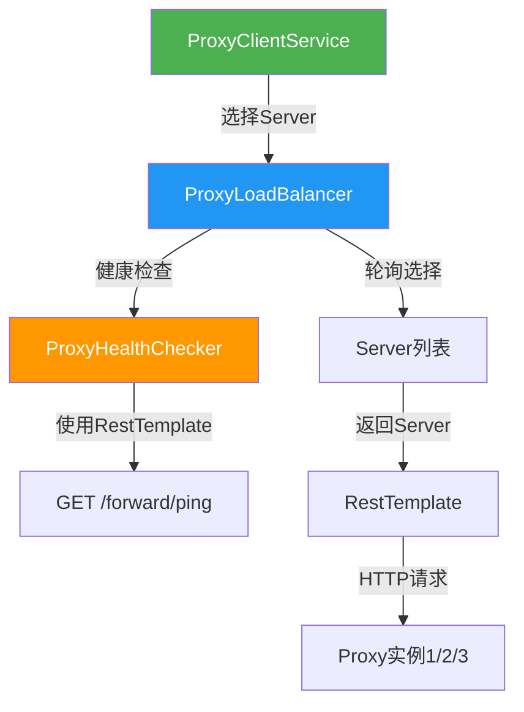
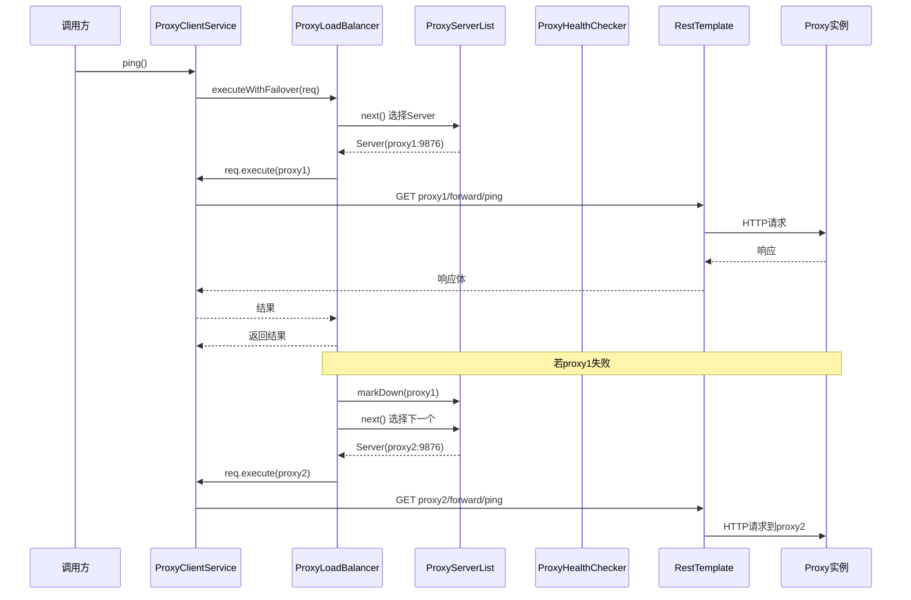

# Admin Proxy 负载均衡调用器设计文档

## 1. 需求背景

当前 `ProxyClientService` 使用单个 `proxyUrl` 字符串调用 Proxy，存在单点故障风险。用户需要支持逗号分隔配置多个 Proxy 地址，实现负载均衡和高可用。

## 2. 现状分析

### 2.1 Admin 端现状

```yaml
app:
  proxy-url: ${PROXY_URL:http://localhost:9876}  # 仅支持单个地址
```

`ProxyClientService` 直接使用 `RestTemplate` + 固定 `proxyUrl` 发请求，无负载均衡、无故障转移、无健康检查。

### 2.2 Agent 端现状

Agent 的 `DynamicProxyServerList` + `AgentRegistryClient` 使用 `my-panel-common` 中的 `LoadBalancerClient`，实现了：
- 多 Proxy 地址轮询
- TCP/HTTP 健康检查
- 故障自动摘除与恢复

### 2.3 现有框架分析

`my-panel-common` 的 `LoadBalancerClient` 存在以下问题，不适合直接在 Admin 端使用：

| 问题 | 说明 |
|------|------|
| 自带 HttpClient | 使用 `ApacheHttpClient`/`SimpleHttpClient`，绕过了 Spring 的 `RestTemplate`，丢失拦截器、错误处理、消息转换器等能力 |
| 非Spring管理 | 纯 Java 对象，无法注入 Spring Bean，无法使用 `@Value` 配置 |
| 健康检查独立 | 健康检查使用自己的 HTTP 客户端，与业务请求的 `RestTemplate` 不一致 |
| 重试逻辑粗糙 | `doExecute` 中失败后直接标记 `recordHealthCheckFailure`，没有区分网络异常和业务异常 |

## 3. 设计方案

### 3.1 核心思路

**不直接使用 `LoadBalancerClient`**，而是复用 `my-panel-common` 中的 `Server`、`ServerList`、`StaticServerList`、`RoundRobinLoadBalancer` 等基础组件，自行封装一个 **Spring 友好的负载均衡调用器**，底层使用 `RestTemplate` 发请求。

### 3.2 架构图



### 3.3 类设计

#### 3.3.1 ProxyServerList - Proxy服务器列表

```java
// 位于 com.cq.panel.admin.server.service.proxy
@Data
public class ProxyServerList {
    private final List<Server> servers;
    private final AtomicInteger index;  // 轮询计数器
    
    // 从逗号分隔的URL字符串解析
    public static ProxyServerList fromUrls(String urls);
    
    // 获取下一个可用Server（轮询）
    public Server next();
    
    // 获取所有存活Server
    public List<Server> getAliveServers();
    
    // 标记Server存活/宕机
    public void markAlive(Server server);
    public void markDown(Server server);
}
```

#### 3.3.2 ProxyHealthChecker - Proxy健康检查器

```java
// 位于 com.cq.panel.admin.server.service.proxy
@Component
public class ProxyHealthChecker {
    private final RestTemplate restTemplate;
    
    // 检查单个Proxy是否存活（调用 /forward/ping）
    public boolean isHealthy(Server server);
    
    // 批量检查所有Proxy
    public void checkAll(ProxyServerList serverList);
}
```

#### 3.3.3 ProxyLoadBalancer - Proxy负载均衡器

```java
// 位于 com.cq.panel.admin.server.service.proxy
@Component
public class ProxyLoadBalancer {
    private final ProxyServerList serverList;
    private final ProxyHealthChecker healthChecker;
    private final ScheduledExecutorService scheduler;
    
    // 选择一个可用的Proxy Server
    // 优先选择存活的，轮询策略
    // 所有Server宕机时，降级为轮询所有（给恢复机会）
    public Server chooseServer();
    
    // 请求失败时回调，标记Server并触发重试
    public <T> T executeWithFailover(LoadBalancedRequest<T> request);
    
    // 启动定时健康检查
    @PostConstruct
    public void startHealthCheck();
    
    @PreDestroy
    public void shutdown();
}
```

#### 3.3.4 LoadBalancedRequest - 带故障转移的请求封装

```java
@FunctionalInterface
public interface LoadBalancedRequest<T> {
    T execute(Server server);  // 使用选中的Server执行请求
}
```

### 3.4 ProxyClientService 重构



### 3.5 配置格式

```yaml
app:
  proxy-urls: ${PROXY_URLS:http://localhost:9876}  # 逗号分隔，兼容旧配置
  proxy:
    load-balance-algorithm: round_robin    # 负载均衡算法
    health-check-enabled: true             # 是否启用健康检查
    health-check-interval: 30000           # 健康检查间隔(ms)
    health-check-failure-threshold: 3      # 连续失败N次标记宕机
    health-check-success-threshold: 2      # 连续成功N次标记恢复
    retry-count: 2                         # 请求失败重试次数
```

**向后兼容**：`proxy-urls` 支持单个地址（无逗号）和多个地址（逗号分隔），旧配置 `proxy-url` 仍然可用。

### 3.6 故障转移策略

1. **请求失败时**：标记当前 Server 为可疑，自动切换到下一个可用 Server 重试
2. **所有 Server 宕机时**：降级为轮询所有 Server（给恢复机会），而非直接抛异常
3. **健康检查**：定时调用 `/forward/ping` 检测 Server 存活状态
4. **熔断恢复**：连续 N 次健康检查成功后自动恢复 Server 到可用列表

### 3.7 与 Agent 端实现的优化对比

| 维度 | Agent 端 (DynamicProxyServerList) | Admin 端 (新设计) |
|------|-----------------------------------|-------------------|
| HTTP 客户端 | 自研 HttpClient | Spring RestTemplate（复用拦截器等能力） |
| Spring 集成 | 无，纯 Java | 完全 Spring 管理，@Component + @Value |
| 配置方式 | 硬编码 | YAML 配置，支持环境变量 |
| 健康检查 | 独立 HTTP 客户端 | 复用 RestTemplate，与业务请求一致 |
| 故障转移 | LoadBalancerClient 内置 | ProxyLoadBalancer 封装，更灵活 |
| 服务发现 | 从 Proxy discover 动态获取 | 静态配置（Admin 不需要动态发现） |
| 降级策略 | 无可用 Server 直接抛异常 | 降级轮询所有，给恢复机会 |

## 4. 文件清单

| 操作 | 文件 | 说明 |
|------|------|------|
| 新建 | `admin/service/proxy/ProxyServerList.java` | Proxy服务器列表管理 |
| 新建 | `admin/service/proxy/ProxyHealthChecker.java` | Proxy健康检查 |
| 新建 | `admin/service/proxy/ProxyLoadBalancer.java` | 负载均衡器 |
| 新建 | `admin/service/proxy/LoadBalancedRequest.java` | 请求封装接口 |
| 修改 | `admin/service/ProxyClientService.java` | 使用 ProxyLoadBalancer 替代固定 proxyUrl |
| 修改 | `admin/resources/application.yml` | 新增 proxy 负载均衡配置 |
| 新建 | `admin/service/proxy/ProxyLoadBalancerConfig.java` | 配置属性类 |
| 新建 | 测试类 | ProxyServerListTest, ProxyHealthCheckerTest, ProxyLoadBalancerTest, ProxyClientServiceTest |

## 5. 测试策略

- **ProxyServerListTest**: URL 解析、轮询选择、标记宕机/恢复
- **ProxyHealthCheckerTest**: 健康检查成功/失败/超时
- **ProxyLoadBalancerTest**: 负载均衡选择、故障转移、降级策略
- **ProxyClientServiceTest**: 集成测试，验证多 Proxy 场景下的请求转发
