# 批量文件传输系统 - 详细设计文档

**版本**: 1.0\
**日期**: 2026-04-30\
**作者**: System Design Team\
**状态**: 待评审

***

## 文档目录

1. [项目背景与目标](#1-项目背景与目标)
2. [需求规格说明](#2-需求规格说明)
3. [架构设计（方案C：混合模式）](#3-架构设计方案c混合模式)
4. [数据模型设计](#4-数据模型设计)
5. [核心业务流程](#5-核心业务流程)
6. [API接口详细定义](#6-api接口详细定义)
7. [Agent端改造方案](#7-agent端改造方案)
8. [Proxy端组件设计](#8-proxy端组件设计)
9. [Admin后端服务设计](#9-admin后端服务设计)
10. [前端UI组件设计](#10-前端ui组件设计)
11. [错误处理与重试机制](#11-错误处理与重试机制)
12. [性能优化策略](#12-性能优化策略)
13. [安全性设计](#13-安全性设计)
14. [监控与告警](#14-监控与告警)
15. [配置管理](#15-配置管理)
16. [数据库迁移脚本](#16-数据库迁移脚本)
17. [实施计划与里程碑](#17-实施计划与里程碑)

***

## 1. 项目背景与目标

### 1.1 业务背景

当前My-Panel系统已具备Agent间单文件分块传输能力（基于`AgentUploader`/`AgentDownloader`），但在实际运维场景中存在以下痛点：

- **批量操作缺失**：无法一次性传输整个目录或匹配特定模式的文件集合
- **一对多分发低效**：需要手动为每个目标Agent重复创建单文件任务
- **进度不透明**：缺乏任务级、目标级、文件级的多维度进度监控
- **队列不可见**：无法感知Agent端发送/重试队列的堵塞情况
- **带宽无管控**：多任务并行时可能占满网络带宽影响其他业务

### 1.2 项目目标

构建一个**企业级批量文件传输系统**，实现：

| 目标          | 描述                       | 优先级 |
| ----------- | ------------------------ | --- |
| **目录级批量传输** | 基于Glob通配符的文件扫描与过滤        | P0  |
| **一对多广播**   | 源Agent同时向多个目标Agent推送文件   | P0  |
| **三层进度监控**  | 任务级 → 目标Agent级 → 单文件级    | P0  |
| **队列可视化**   | 实时监控发送队列和重试队列深度及堵塞检测     | P0  |
| **智能重试**    | 失败任务自动进入重试队列，支持N天内的周期性重试 | P1  |
| **带宽控制**    | 全局带宽限制 + 单任务带宽配额         | P1  |
| **堵塞自愈**    | 自动检测队列堵塞并给出缓解建议          | P2  |

### 1.3 系统边界

```
┌─────────────────────────────────────────────────────────────┐
│                     批量文件传输系统                          │
│                                                             │
│  ✅ 包含:                                                   │
│     - 任务创建与管理 (Admin UI)                              │
│     - 文件扫描与Glob匹配 (Source Agent)                      │
│     - 批量子任务调度 (Proxy)                                 │
│     - P2P分块传输 (复用现有Uploader/Downloader)              │
│     - 进度聚合与展示 (Admin UI)                              │
│     - 队列监控与堵塞检测 (Proxy)                             │
│                                                             │
│  ❌ 不包含:                                                 │
│     - 文件内容处理/转换                                     │
│     - 增量同步算法 (本次仅支持全量传输)                       │
│     - 跨区域传输优化 (如CDN加速)                             │
│     - 文件版本控制                                          │
└─────────────────────────────────────────────────────────────┘
```

***

## 2. 需求规格说明

### 2.1 功能性需求

#### FR-01: 批量任务创建

**优先级**: P0\
**描述**: 管理员通过Admin UI创建批量传输任务，配置以下参数：

| 参数                   | 类型            | 必填 | 默认值           | 说明                                                       |
| -------------------- | ------------- | -- | ------------- | -------------------------------------------------------- |
| `taskName`           | String        | 是  | -             | 任务名称，最大200字符                                             |
| `sourceAgentId`      | String        | 是  | -             | 源Agent ID（从注册中心选择）                                       |
| `sourceDir`          | String        | 是  | -             | 源目录绝对路径，如 `/var/app/logs`                                |
| `includePatterns`    | List\<String> | 否  | `["*"]`       | Glob包含模式，如 `["*.log", "logs/**/*.gz"]`                   |
| `excludePatterns`    | List\<String> | 否  | `[]`          | Glob排除模式，如 `["*.tmp", "temp/*"]`                         |
| `scanFrequencySec`   | Int           | 否  | 300           | 扫描间隔（秒），范围\[60, 86400]                                   |
| `maxScanFiles`       | Int           | 否  | 10000         | 单次扫描最大文件数，范围\[100, 100000]                               |
| `targetAgents`       | List\<String> | 是  | -             | 目标Agent ID列表，至少1个                                        |
| `maxBandwidthKbS`    | Int           | 否  | null          | 单任务带宽上限(KB/s)，null=不限                                    |
| `retryEnabled`       | Boolean       | 否  | true          | 是否启用自动重试                                                 |
| `retryMaxDays`       | Int           | 否  | 7             | 重试保留天数，范围\[1, 30]                                        |
| `retryIntervalMin`   | Int           | 否  | 30            | 重试间隔（分钟），范围\[5, 1440]                                    |
| `postTransferAction` | String        | 否  | NONE          | 传输后操作: NONE/DELETE/BACKUP                                |
| `backupDir`          | String        | 否  | null          | 备份目录绝对路径（BACKUP模式必填）                                     |
| `transferMode`       | String        | 否  | ONE\_TO\_MANY | 传输模式: ONE\_TO\_ONE/ONE\_TO\_MANY                         |
| `routingStrategy`    | String        | 否  | BROADCAST     | 路由策略: BROADCAST/SINGLE/ROUND\_ROBIN/REGION\_BASED/RANDOM |
| `routingConfig`      | String(JSON)  | 否  | null          | 路策略配置（REGION\_BASED模式时必填）                                |

**校验规则**:

1. `sourceDir`必须是绝对路径且不以`/`结尾（Windows路径除外）
2. `includePatterns`和`excludePatterns`必须符合Glob语法规范
3. `targetAgents`不能包含`sourceAgentId`
4. `maxBandwidthKbS`若指定则必须 > 0
5. 同一源目录+目标组合在任务进行中不允许重复创建
6. **`postTransferAction=BACKUP`时，`backupDir`为必填且必须是可写目录**
7. **`postTransferAction=DELETE`时，需前端二次确认，防止误删**
8. **`transferMode=ONE_TO_ONE`时，`routingStrategy=BROADCAST`自动降级为`SINGLE`**
9. **`routingStrategy=REGION_BASED`时，`routingConfig`为必填且JSON格式合法**

#### FR-02: 文件扫描与Glob匹配

**优先级**: P0\
**描述**: Source Agent根据配置的通配符规则扫描目录，返回匹配的文件元数据列表。

**Glob语法规范**:

| 模式示例                       | 匹配示例                                    | 说明            |
| -------------------------- | --------------------------------------- | ------------- |
| `*.log`                    | `app.log`, `error.log`                  | 当前目录下所有.log文件 |
| `**/*.java`                | `src/main/App.java`                     | 递归匹配所有子目录     |
| `logs/{access,error}*.log` | `logs/access2026.log`, `logs/error.log` | 大括号展开         |
| `file?.txt`                | `file1.txt`, `fileA.txt`                | 单字符通配符        |
| `[abc]*.xml`               | `a.xml`, `bconfig.xml`                  | 字符集匹配         |
| `temp/*`                   | `temp/file1`, `temp/sub/file2`          | 排除整个目录        |

**扫描行为**:

1. 使用`java.nio.file.Files.walkFileTree()`遍历目录树
2. 对每个文件路径依次应用所有`includePatterns`（OR逻辑）
3. 对通过包含规则的文件应用所有`excludePatterns`（AND逻辑排除）
4. 按`lastModifiedTime`升序排列（先传旧文件）
5. 截断至`maxScanFiles`上限
6. 计算每个文件的MD5（可选，根据配置决定）

**返回数据结构**:

```json
{
  "files": [
    {
      "relativePath": "logs/app.log",
      "absolutePath": "/var/app/logs/app.log",
      "sizeBytes": 10485760,
      "lastModified": "2026-04-30T09:00:00Z",
      "md5": "d41d8cd98f00b204e9800998ecf8427e"
    }
  ],
  "totalFiles": 1200,
  "totalSizeBytes": 2147483648,
  "truncated": false
}
```

#### FR-03: 子任务生成与分发

**优先级**: P0\
**描述**: Proxy接收文件列表后，生成子任务的笛卡尔积（文件 × 目标Agent），并下发给Source Agent。

**子任务生成逻辑**:

```
输入:
  - files: [f1, f2, f3]
  - targets: [AgentB, AgentC]

输出: 6个子任务
  - (f1, AgentB), (f1, AgentC)
  - (f2, AgentB), (f2, AgentC)
  - (f3, AgentB), (f3, AgentC)
```

**分发协议**:

- HTTP POST到Source Agent的`/api/v1/batch/dispatch`端点
- 请求体包含完整的子任务列表和带宽限制配置
- Source Agent将子任务加入本地RocksDB持久化队列
- 返回确认信息（接收的子任务数量）

#### FR-04: 并行传输执行

**优先级**: P0\
**描述**: Source Agent使用现有的`AgentUploader`能力，并行向多个目标Agent传输文件。

**并发模型**:

```
                    ┌──→ AgentB (Worker Thread 1)
SendQueue ──┬───────┼──→ AgentB (Worker Thread 2)
(优先级队列) │       ├──→ AgentC (Worker Thread 3)
            │       └──→ AgentC (Worker Thread 4)
            │
            └──→ ... (最多 N = targetCount × concurrentUploads 个线程)
```

**关键约束**:

1. **总并发数** = `targetAgents数量 × agentConfig.uploadConcurrentUploads`
2. **全局带宽限制**: 若配置了`maxBandwidthKbS`，通过`TrafficRateLimiter`限流
3. **单个文件传输**: 复用现有分块上传逻辑（断点续传、校验等）

#### FR-05: 三层进度上报

**优先级**: P0\
**描述**: Target Agent在接收文件过程中周期性向Proxy上报进度，Proxy聚合后推送给Admin UI。

**上报频率**:

- **Target Agent → Proxy**: 每5秒一次（HTTP POST）或实时WebSocket
- **Proxy → Admin UI**: WebSocket实时推送

**上报内容**:

```json
{
  "taskId": 1001,
  "subtaskId": 5001,
  "targetAgentId": "agent-test-02",
  "filePath": "logs/app.log",
  "status": "SENDING",
  "transferredChunks": 67,
  "totalChunks": 100,
  "transferSpeedBytesPerSec": 8388608,
  "timestamp": "2026-04-30T10:15:30Z"
}
```

**状态枚举**:

| 状态          | 触发条件             |
| ----------- | ---------------- |
| `QUEUED`    | 子任务已入队，等待执行      |
| `SENDING`   | 正在传输中            |
| `COMPLETED` | 所有chunk传输完成并校验通过 |
| `FAILED`    | 传输失败（超过本地重试次数）   |
| `RETRYING`  | 已进入重试队列等待下次尝试    |

#### FR-06: 队列监控与堵塞检测

**优先级**: P0\
**描述**: Proxy实时监控各Agent的发送队列和重试队列状态，检测堵塞并触发告警。

**监控指标**:

| 指标                        | 类型    | 告警阈值                            |
| ------------------------- | ----- | ------------------------------- |
| `sendQueueDepth`          | INT   | WARNING ≥ 1000, CRITICAL ≥ 5000 |
| `retryQueueDepth`         | INT   | WARNING ≥ 100, CRITICAL ≥ 500   |
| `avgWaitTimeMs`           | LONG  | CRITICAL > 300000 (5分钟)         |
| `queueUtilizationPercent` | FLOAT | WARNING > 50%, CRITICAL > 80%   |

**数据采集方式**:

- Source Agent每10秒主动上报队列快照到Proxy
- Proxy存储最近1小时的快照数据用于趋势分析
- 定时任务每30秒运行堵塞检测算法

**堵塞等级定义**:

| 等级         | 条件        | 行为            |
| ---------- | --------- | ------------- |
| `NORMAL`   | 所有关键指标正常  | 无操作           |
| `WARNING`  | 任一指标达到警告线 | 记录日志，UI显示黄色标识 |
| `CRITICAL` | 任一指标达到严重线 | 触发告警通知，生成缓解建议 |

#### FR-07: 失败重试机制

**优先级**: P1\
**描述**: 传输失败的子任务进入重试队列，按配置的策略自动重试。

**两级重试模型**:

**Level 1: Agent本地快速重试（秒\~分钟级）**

- 触发条件: 网络超时、连接重置等瞬时错误
- 重试次数: 由`agentConfig.uploadMaxRetries`控制（默认3次）
- 重试间隔: 指数退避 `delay = baseDelay * 2^attempt`（baseDelay=1s）
- 执行位置: Agent端`BatchAwareAgentUploader.onTaskFailed()`

**Level 2: Proxy调度层慢速重试（小时\~天级）**

- 触发条件: Level 1重试耗尽后的最终失败
- 重试窗口: 由`task.retryMaxDays`控制（默认7天）
- 重试间隔: 由`task.retryIntervalMin`控制（默认30分钟）
- 执行位置: Proxy端`RetryScheduler`定时任务（Quartz Job）

**重试流程**:

```
子任务失败
    ↓
Level 1: retryCount < maxRetries?
    ├─ YES → 加入Agent RetryQueue (延迟1s, 2s, 4s...)
    │        ↓ 成功 → COMPLETED
    │        ↓ 再次失败 → retryCount++
    │
    └─ NO → 上报Proxy: SUBTASK_FINAL_FAILURE
             ↓
             Level 2: currentTime < createdTime + retryMaxDays?
             ├─ YES → 存入DB retry_queue表
             │        ↓ Quartz定时扫描 → 重新下发到Agent
             │
             └─ NO → 标记 EXPIRED, 发送失败通知
```

#### FR-08: 动态参数调整

**优先级**: P2\
**描述**: 运维人员可在任务执行过程中动态调整参数以缓解堵塞。

**可调参数**:

| 参数                 | 调整时机            | 生效时间          |
| ------------------ | --------------- | ------------- |
| `scanFrequencySec` | 下次扫描时生效         | 立即（下次触发）      |
| `maxScanFiles`     | 下次扫描时生效         | 立即（下次触发）      |
| `maxBandwidthKbS`  | Agent收到新配置后立即生效 | ≤10秒（取决于上报周期） |
| `retryEnabled`     | 立即生效            | 立即            |
| `retryIntervalMin` | 下次重试调度时生效       | 立即（下次触发）      |

#### FR-09: 传输后处理（删除/备份）

**优先级**: P1\
**描述**: 任务所有子任务完成后，对源文件执行后续处理操作。

**支持的操作模式**:

| 模式          | 枚举值      | 说明                      | 适用场景           |
| ----------- | -------- | ----------------------- | -------------- |
| **无操作**     | `NONE`   | 传输完成后不执行任何操作（默认）        | 仅做文件复制/同步      |
| **删除源文件**   | `DELETE` | 所有目标Agent成功接收后，删除源文件    | 日志归档后清理、磁盘空间释放 |
| **备份到指定目录** | `BACKUP` | 将文件移动/复制到指定的备份目录，保留目录结构 | 重要文件归档、合规性要求   |

**触发条件**:

```
任务完成判定:
  ├─ 全部子任务 COMPLETED → 触发传输后处理
  ├─ PARTIAL_FAILED (部分失败) → 
  │   ├─ 仅对成功的文件执行后处理
  │   └─ 失败的文件跳过，不执行删除/备份
  └─ FAILED / CANCELLED / EXPIRED → 不执行任何后处理
```

**安全机制**:

1. **前端二次确认**: 选择DELETE模式时，创建任务弹窗显示警告提示
2. **操作范围限制**: 仅处理本次任务扫描到的文件，不影响其他文件
3. **备份目录校验**: BACKUP模式下必须配置有效且可写的目录
4. **原子性保证**: 单个文件的备份/删除失败不影响其他文件
5. **完整审计**: 记录每个文件的处理结果（成功/失败+原因）
6. **失败告警**: 处理失败的文件生成告警事件

**DELETE模式流程**:

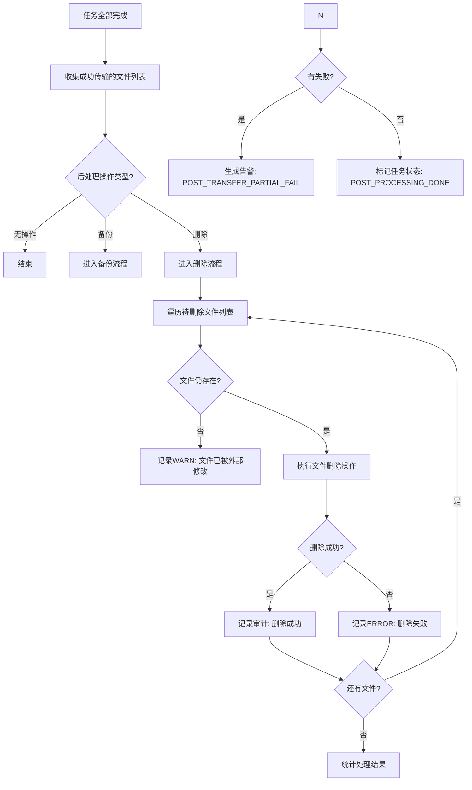

**BACKUP模式流程**:

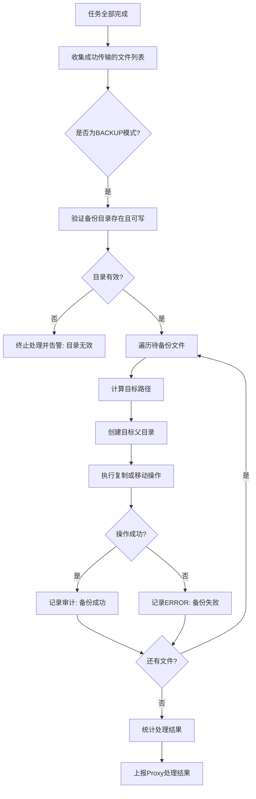

**备份策略选项** (可选参数):

| 参数名                    | 类型      | 默认值   | 说明                          |
| ---------------------- | ------- | ----- | --------------------------- |
| `backupMode`           | String  | COPY  | `COPY`=复制保留原文件, `MOVE`=移动剪切 |
| `preserveDirStructure` | Boolean | true  | 是否保持原始目录结构                  |
| `overwriteExisting`    | Boolean | false | 目标文件已存在时是否覆盖                |

#### FR-10: 传输模式与路由策略

**优先级**: P0\
**描述**: 支持配置传输任务的传输模式（一对一/一对多）和目标Agent的路由策略。

**传输模式 (transferMode)**:

| 模式        | 枚举值           | 说明                       | 适用场景            |
| --------- | ------------- | ------------------------ | --------------- |
| **一对一传输** | `ONE_TO_ONE`  | 每个文件只传输到一个目标Agent        | 负载均衡、单机备份、分片存储  |
| **一对多广播** | `ONE_TO_MANY` | 每个文件传输到所有目标Agent（现有默认行为） | 配置分发、日志同步、多副本冗余 |

**路由策略 (routingStrategy)**:

| 策略       | 枚举值            | 说明                                          | 适用场景             |
| -------- | -------------- | ------------------------------------------- | ---------------- |
| **广播模式** | `BROADCAST`    | 所有目标Agent都接收文件（默认，仅ONE\_TO\_MANY模式有效）       | 配置分发、全量同步        |
| **单机模式** | `SINGLE`       | 每个文件只选择一台目标Agent传输，重传时保证始终路由到同一台Agent（会话粘性） | 单机备份、避免重复、节省带宽   |
| **轮询模式** | `ROUND_ROBIN`  | 按顺序轮流分配给不同的目标Agent，实现负载均衡                   | 分布式存储、负载分散       |
| **区域路由** | `REGION_BASED` | 根据目标Agent的区域标签进行路由，文件按规则分配到指定区域的Agent       | 多地域部署、就近原则、合规性要求 |
| **随机模式** | `RANDOM`       | 随机选择一台目标Agent，适用于无状态要求的场景                   | 简单负载均衡、测试环境      |

**路由策略与传输模式的关系**:

```
┌─────────────────────┬───────────────────┬──────────────────────────────────────┐
│   transferMode      │ routingStrategy   │              行为说明                  │
├─────────────────────┼───────────────────┼──────────────────────────────────────┤
│ ONE_TO_ONE (1:1)    │ BROADCAST (默认)   │ ❌ 不兼容 - 自动降级为 SINGLE 策略          │
│ ONE_TO_ONE (1:1)    │ SINGLE            │ ✅ 推荐 - 每个文件选1台，重传保同一台         │
│ ONE_TO_ONE (1:1)    │ ROUND_ROBIN       │ ✅ 可用 - 文件轮流分配到不同Agent           │
│ ONE_TO_ONE (1:1)    │ REGION_BASED      │ ✅ 可用 - 按区域标签选择Agent             │
│ ONE_TO_ONE (1:1)    │ RANDOM            │ ✅ 可用 - 随机选择一台Agent               │
├─────────────────────┼───────────────────┼──────────────────────────────────────┤
│ ONE_TO_MANY (1:N)   │ BROADCAST (默认)   │ ✅ 推荐 - 所有Agent都接收（原有行为）        │
│ ONE_TO_MANY (1:N)   │ SINGLE            │ ⚠️ 语义冲突 - 每文件选1台，等效于ONE_TO_ONE   │
│ ONE_TO_MANY (1:N)   │ ROUND_ROBIN       │ ⚠️ 语义冲突 - 同上                      │
│ ONE_TO_MANY (1:N)   │ REGION_BASED      │ ⚠️ 部分可用 - 每文件按区域选1台              │
│ ONE_TO_MANY (1:N)   │ RANDOM            │ ⚠️ 语义冲突 - 同上                      │
└─────────────────────┴───────────────────┴──────────────────────────────────────┘
```

**各路由策略详细说明**:

##### SINGLE（单机/会话粘性）

```
特点:
  - 基于文件路径的哈希一致性路由
  - 相同文件永远路由到同一台Agent
  - 重试、重传都保证在同一台Agent执行

算法:
  targetIndex = hash(filePath) % targetAgents.length
  selectedAgent = targetAgents[targetIndex]

适用场景:
  - 单机冷备：主节点故障时快速切换
  - 避免多副本浪费存储空间
  - 需要文件集中管理的场景
```

##### ROUND\_ROBIN（轮询）

```
特点:
  - 全局计数器，按顺序分配
  - 保证均匀分布到各Agent
  - 简单有效，无需额外配置

算法:
  globalCounter = (globalCounter + 1) % targetAgents.length
  selectedAgent = targetAgents[globalCounter]

适用场景:
  - 存储集群的负载均衡
  - 各Agent性能相近的场景
  - 无状态要求的文件分发
```

##### REGION\_BASED（区域路由）

```
特点:
  - 基于Agent的区域标签匹配
  - 支持优先级和fallback机制
  - 需要在agent_registry表增加region字段

配置示例:
  routingConfig: {
    "rules": [
      {"pattern": "logs/**/*.log", "region": "cn-east", "priority": 1},
      {"pattern": "archive/**", "region": "cn-north", "priority": 1},
      {"defaultRegion": "cn-east"}
    ]
  }

适用场景:
  - 多地域部署，数据就近存储
  - 合规性要求（数据必须存储在特定区域）
  - CDN边缘节点同步
```

**子任务生成逻辑变化**:

```
原始设计 (笛卡尔积):
  files × targetAgents = N × M 个子任务

新设计 (根据模式动态生成):

  ONE_TO_ONE + SINGLE/ROUND_ROBIN/REGION/RANDOM:
    files → 每个文件选1个target → N 个子任务
    
  ONE_TO_MANY + BROADCAST:
    files × targetAgents = N × M 个子任务 (保持原有行为)
    
  ONE_TO_MANY + 其他策略:
    每个文件选1个target → N 个子任务 (降级为ONE_TO_ONE语义)
```

### 2.2 非功能性需求

#### NFR-01: 性能要求

| 指标          | 目标值            | 测试条件               |
| ----------- | -------------- | ------------------ |
| **单任务吞吐量**  | ≥ 50 MB/s      | 千兆局域网，100MB文件      |
| **并发任务数**   | ≥ 10个批量任务同时运行  | Proxy 4核8G         |
| **文件扫描速度**  | ≤ 5秒 / 10000文件 | SSD硬盘，普通目录结构       |
| **API响应延迟** | P99 < 200ms    | 任务列表查询（分页）         |
| **UI刷新延迟**  | ≤ 1秒           | WebSocket消息到达至渲染完成 |
| **队列上报延迟**  | ≤ 2秒           | Agent生成快照至Proxy存储  |

#### NFR-02: 可靠性要求

| 指标        | 目标值                         |
| --------- | --------------------------- |
| **数据一致性** | 传输完成后源文件MD5 = 目标文件MD5（100%） |
| **任务持久化** | Proxy重启后任务不丢失（MySQL持久化）     |
| **队列持久化** | Agent重启后队列不丢失（RocksDB持久化）   |
| **断点续传**  | 网络中断后从最后成功传输的chunk继续        |
| **可用性**   | 单点故障不影响已开始的传输（Agent自治）      |

#### NFR-03: 可扩展性要求

| 维度          | 支持能力                        |
| ----------- | --------------------------- |
| **水平扩展**    | Proxy可部署多实例（需共享MySQL）       |
| **Agent数量** | 支持100+ Agent同时在线            |
| **单任务目标数**  | 支持1\~20个目标Agent             |
| **单任务文件数**  | 支持10万+文件（需合理设置maxScanFiles） |
| **存储扩展**    | DB表分区（按taskId哈希）            |

#### NFR-04: 安全性要求

| 要求         | 实现方式                                   |
| ---------- | -------------------------------------- |
| **认证鉴权**   | Admin操作需JWT Token + 角色权限（复用现有AuthLite） |
| **传输加密**   | Agent间HTTPS/TLS（复用现有Netty HTTPS配置）     |
| **路径遍历防护** | 校验`sourceDir`不包含`..`，规范化路径             |
| **权限隔离**   | Agent只能访问配置中指定的目录                      |
| **审计日志**   | 记录所有任务创建、暂停、取消、参数变更操作                  |

***

## 3. 架构设计（方案C：混合模式）

### 3.1 架构总览图

```
┌─────────────────────────────────────────────────────────────────────────┐
│                         表现层 (Presentation Layer)                     │
│                                                                         │
│   ┌───────────────────────────────────────────────────────────────┐     │
│   │                  my-panel-ui (React 19 + Ant Design 6)         │     │
│   │                                                                │     │
│   │  ┌──────────┐  ┌──────────┐  ┌──────────┐  ┌──────────────┐  │     │
│   │  │ TaskList │  │TaskDetail│  │QueueMon  │  │Dashboard     │  │     │
│   │  │ (任务列表)│  │ (任务详情)│  │ (队列监控)│  │ (仪表盘)     │  │     │
│   │  └────┬─────┘  └────┬─────┘  └────┬─────┘  └──────┬───────┘  │     │
│   └───────┼────────────┼────────────┼────────────────┼───────────┘     │
│           │ Axios/WS   │ Axios/WS   │ Axios/WS       │ Axios/WS       │
└───────────┼────────────┼────────────┼────────────────┼───────────────┘
            │            │            │                │
            ▼            ▼            ▼                ▼
┌─────────────────────────────────────────────────────────────────────────┐
│                        API网关层 (Gateway Layer)                        │
│                                                                         │
│   ┌───────────────────────────────────────────────────────────────┐     │
│   │              my-panel-admin (Spring Boot 4)                    │     │
│   │                                                                │     │
│   │  ┌────────────┐  ┌────────────┐  ┌────────────┐               │     │
│   │  │BatchTaskCtrl│  │MonitorCtrl │  │QueueCtrl   │               │     │
│   │  │(任务管理)   │  │(监控查询)   │  │(队列查询)  │               │     │
│   │  └─────┬──────┘  └─────┬──────┘  └─────┬──────┘               │     │
│   │        │              │              │  AuthFilter           │     │
│   │  ┌─────▼──────────────▼──────────────▼──────────────────┐    │     │
│   │  │              BatchTransferService (业务编排)           │    │     │
│   │  └───────────────────────┬───────────────────────────────┘    │     │
│   └──────────────────────────┼────────────────────────────────────┘     │
│                              │ MySQL/Redis                             │
└──────────────────────────────┼─────────────────────────────────────────┘
                               │ HTTP REST
                               ▼
┌─────────────────────────────────────────────────────────────────────────┐
│                        调度核心层 (Orchestration Layer)                  │
│                                                                         │
│   ┌───────────────────────────────────────────────────────────────┐     │
│   │                   my-panel-proxy (Spring Boot 4)               │     │
│   │                                                                │     │
│   │  ┌─────────────────────────────────────────────────────────┐  │     │
│   │  │                 BatchTaskScheduler (任务调度器)          │  │     │
│   │  │  - startTask() / pauseTask() / cancelTask()             │  │     │
│   │  │  - triggerFileScan() / generateSubtasks()               │  │     │
│   │  │  - dispatchToSourceAgent()                              │  │     │
│   │  └────────────────────────┬────────────────────────────────┘  │     │
│   │                           │                                    │     │
│   │  ┌────────────────────────┴────────────────────────────────┐  │     │
│   │  │              BandwidthManager (带宽管理器)               │  │     │
│   │  │  - allocateGlobalQuota()                                │  │     │
│   │  │  - enforcePerTaskLimit()                                │  │     │
│   │  │  - adjustDynamicAllocation()                            │  │     │
│   │  └────────────────────────┬────────────────────────────────┘  │     │
│   │                           │                                    │     │
│   │  ┌────────────────────────┴────────────────────────────────┐  │     │
│   │  │               RetryScheduler (重试调度器)                │  │     │
│   │  │  - scanExpiredRetries() [Quartz Job, 每30min]           │  │     │
│   │  │  - redispatchToAgent()                                  │  │     │
│   │  │  - markExpiredTasks()                                   │  │     │
│   │  └────────────────────────┬────────────────────────────────┘  │     │
│   │                           │                                    │     │
│   │  ┌────────────────────────┴────────────────────────────────┐  │     │
│   │  │              QueueMonitor (堵塞检测器)                   │  │     │
│   │  │  - analyzeQueues() [Scheduled, 每30s]                   │  │     │
│   │  │  - detectCongestion()                                   │  │     │
│   │  │  - generateMitigationSuggestions()                      │  │     │
│   │  └────────────────────────┬────────────────────────────────┘  │     │
│   │                           │                                    │     │
│   │  ┌────────────────────────┴────────────────────────────────┐  │     │
│   │  │          ProgressAggregator (进度聚合器)                 │  │     │
│   │  │  - receiveSubtaskProgress()                             │  │     │
│   │  │  - calculateTaskSummary()                               │  │     │
│   │  │  - broadcastViaWebSocket()                              │  │     │
│   │  └─────────────────────────────────────────────────────────┘  │     │
│   │                                                                │     │
│   │  ┌────────────┐  ┌────────────┐  ┌────────────┐               │     │
│   │  │RegistrySvc │  │ConfigSvc   │  │HealthCheck  │               │     │
│   │  │(现有)      │  │(现有)      │  │(现有)      │               │     │
│   │  └────────────┘  └────────────┘  └────────────┘               │     │
│   └───────────────────────────────────────────────────────────────┘     │
│                              │                                           │
│                   HTTP/gRPC to Agents                                   │
│              ┌────────────┼────────────┐                                │
│              ▼            ▼            ▼                                │
└──────────────┴────────────┴────────────┴────────────────────────────────┘
                               │
┌──────────────────────────────┼──────────────────────────────────────────┐
│                      执行层 (Execution Layer)                           │
│                                                                      │
│   ┌─────────────────────┐  ┌─────────────────────┐                     │
│   │   Agent A (Source)  │  │   Agent B (Target)  │                     │
│   │                     │  │                     │                     │
│   │  ┌───────────────┐  │  │  ┌───────────────┐  │                     │
│   │  │BatchFileScanner│  │  │  │ChunkReceiver  │  │                     │
│   │  │(文件扫描器)    │  │  │  │(分块接收器)   │  │  ← 复用现有Handler  │
│   │  └───────┬───────┘  │  │  └───────┬───────┘  │                     │
│   │          │          │  │          │          │                     │
│   │  ┌───────▼───────┐  │  │  ┌───────▼───────┐  │                     │
│   │  │QueueManager   │  │  │  │ProgressReporter│  │                     │
│   │  │(队列管理器)    │  │  │  │(进度上报器)    │  │                     │
│   │  ├──────────────┤  │  │  └───────────────┘  │                     │
│   │  │ SendQueue    │  │  │                     │                     │
│   │  │ (优先级队列)  │  │  │  ┌───────────────┐  │                     │
│   │  ├──────────────┤  │  │  │FileValidator  │  │                     │
│   │  │ RetryQueue   │  │  │  │(文件校验器)    │  │                     │
│   │  │ (延迟队列)    │  │  │  └───────────────┘  │                     │
│   │  └───────┬───────┘  │  │                     │                     │
│   │          │          │  │                     │                     │
│   │  ┌───────▼───────┐  │  │                     │                     │
│   │  │BatchAware     │  │  │                     │                     │
│   │  │AgentUploader  │  │  │                     │                     │
│   │  │(增强版上传器)  │  │  │                     │                     │
│   │  └───────────────┘  │  │                     │                     │
│   └─────────────────────┘  └─────────────────────┘                     │
│                                                                      │
│   ┌─────────────────────┐                                             │
│   │   Agent C (Target)  │  ... 更多目标Agent                           │
│   └─────────────────────┘                                             │
└──────────────────────────────────────────────────────────────────────┘
```

### 3.2 组件职责矩阵

| 组件                          | 所属模块  | 核心职责                | 技术栈                                   |
| --------------------------- | ----- | ------------------- | ------------------------------------- |
| **BatchTaskScheduler**      | Proxy | 任务生命周期管理、子任务拆分、下发指令 | Spring Service                        |
| **BandwidthManager**        | Proxy | 全局带宽分配、单任务限流        | Token Bucket Algorithm                |
| **RetryScheduler**          | Proxy | 跨天级重试调度             | Quartz Scheduler                      |
| **QueueMonitor**            | Proxy | 堵塞检测、告警生成、缓解建议      | Spring @Scheduled                     |
| **ProgressAggregator**      | Proxy | 三层进度计算、WebSocket广播  | WebSocket + Redis Pub/Sub             |
| **BatchFileScanner**        | Agent | 目录遍历、Glob匹配、元数据收集   | java.nio.file                         |
| **QueueManager**            | Agent | 双队列管理（发送+重试）、指标收集   | RocksDB + ConcurrentHashMap           |
| **BatchAwareAgentUploader** | Agent | 批量感知的上传执行器、回调增强     | 继承现有AgentUploader                     |
| **ProgressReporter**        | Agent | 周期性进度上报到Proxy       | HttpClient + ScheduledExecutorService |
| **BatchTaskController**     | Admin | REST API端点、请求校验     | Spring MVC + Validation               |
| **BatchTransferService**    | Admin | 业务逻辑编排、DB操作         | Spring Service + MyBatis              |
| **TaskListPage**            | UI    | 任务列表展示、筛选、批量操作      | React + Ant Design Table              |
| **TaskDetailPage**          | UI    | 三层进度展示、实时更新         | React + ECharts Progress              |
| **QueueMonitorPage**        | UI    | 队列可视化、趋势图、告警列表      | React + ECharts Line/Bar              |

### 3.3 数据流架构

#### 3.3.1 主数据流（任务启动 → 完成）

```
[Admin用户]
    │
    │ 1. POST /api/v1/batch/tasks (创建任务)
    ▼
[Admin API Layer]
    │ 校验参数 → 写入 batch_transfer_task 表 (status=PENDING)
    │
    ▼
[Proxy - BatchTaskScheduler.startTask()]
    │
    ├─► 2. 更新 status=SCANNING
    │
    ├─► 3. HTTP POST → Source Agent /api/v1/batch/scan
    │       参数: sourceDir, includePatterns, excludePatterns, maxFiles
    │
    ◄── 4. 返回: [{filePath, sizeBytes, md5}, ...]
    │
    ├─► 5. 生成子任务笛卡尔积 (files × targetAgents)
    │       写入 batch_transfer_subtask 表 (status=QUEUED)
    │       更新 task.totalFiles, totalSizeBytes
    │
    ├─► 6. 更新 status=TRANSFERRING
    │
    ├─► 7. HTTP POST → Source Agent /api/v1/batch/dispatch
    │       参数: {taskId, subtasks[], maxBandwidthKBps}
    │
    ◄── 8. 确认: {receivedCount: 3600}
    │
    ▼
[Source Agent - QueueManager]
    │
    ├─► 9. 将 subtasks 分组写入 SendQueue (RocksDB)
    │       应用 bandwidth limit (如有)
    │
    ▼
[Source Agent - BatchAwareAgentUploader Worker Pool]
    │
    ├─► 10. 从 SendQueue 取出任务
    │
    ├─► 11. 调用现有 uploadChunk() 方法传输到 Target Agent
    │        (分块、断点续传、MD5校验)
    │
    ├─► 12. 每完成一个chunk → 回调 onChunkProgress()
    │
    ├─► 13. 文件完成 → 回调 onTaskCompleted()
    │        ├─► 14. HTTP POST → Proxy /api/v1/batch/progress
    │        │       {taskId, subtaskId, status=COMPLETED}
    │        └─► 更新本地队列指标
    │
    ├─► 15. 文件失败 → 回调 onTaskFailed()
    │        ├─► retryCount < maxRetries?
    │        │   └─► YES → 加入 RetryQueue (指数退避延迟)
    │        └─► NO → HTTP POST → Proxy (FINAL_FAILURE)
    │
    ▼
[Proxy - ProgressAggregator]
    │
    ├─► 16. 更新 subtask 状态 in DB
    │
    ├─► 17. 重新计算 task.summary (聚合所有subtask)
    │
    ├─► 18. WebSocket broadcast → Admin UI
    │
    ▼
[Admin UI - TaskDetailPage]
    │
    └─► 19. 实时更新三层进度展示
            (任务级 / 目标Agent级 / 文件级)
```

#### 3.3.2 辅助数据流（队列监控）

```
[Source Agent - QueueMetricsCollector]
    │
    │ 每10秒采集一次
    │
    ├─► sendQueue.depth(), peakDepth(), avgWaitTime()
    ├─► retryQueue.depth(), errorDistribution()
    ├─► processingRate (过去1分钟的吞吐量)
    │
    ▼
    │ HTTP POST → Proxy /api/v1/batch/queue/snapshot
    │
    ▼
[Proxy - QueueMonitor]
    │
    ├─► 写入 agent_queue_snapshot 表
    │
    ├─► 每30秒运行 analyzeQueues()
    │       ├─► 计算 congestionLevel (NORMAL/WARNING/CRITICAL)
    │       ├─► 若等级变化 → 记录告警事件
    │       └─► 若 CRITICAL → 生成 mitigationSuggestions
    │
    ▼
[Admin UI - QueueMonitorPage]
    │
    └─► 展示实时队列状态 + 趋势图 + 告警列表
```

***

## 4. 数据模型设计

### 4.1 ER关系图

```
┌────────────────────────────┐       ┌────────────────────────────┐
│   batch_transfer_task      │       │   batch_transfer_subtask   │
│   (批量任务主表)            │       │   (子任务表)                │
├────────────────────────────┤       ├────────────────────────────┤
│ PK  id (BIGINT AUTO_INC)   │──┐    │ PK  id (BIGINT AUTO_INC)   │
│     task_name (VARCHAR200) │  │    │ FK  task_id (BIGINT)       │◄─┘
│     source_agent_id (V50)   │  │    │     file_path (VARCHAR1000)│
│     source_dir (VARCHAR500) │  │    │     file_size_bytes (BIGINT│
│     target_dirs (V2000)     │  │    │     file_md5 (CHAR32)     │
│     include_patterns (TEXT) │  │    │ FK  target_agent_id (V50)  │
│     exclude_patterns (TEXT) │  │    │     status (ENUM)         │
│     scan_frequency_sec (INT)│  │    │     transfer_id (V100)    │
│     max_scan_files (INT)    │  │    │     transferred_chunks(INT)│
│     target_agents (JSON)    │  │    │     total_chunks (INT)    │
│     max_bandwidth_kb_s (INT)│  │    │     error_message (TEXT)   │
│     retry_enabled (BOOL)    │  │    │     retry_count (INT)      │
│     retry_max_days (INT)    │  │    │     last_retry_at (DATETIME│
│     retry_interval_min (INT)│  │    │     create_time (DATETIME)  │
│     post_transfer_action(V20)│  │    │     started_at (DATETIME)  │
│     backup_dir (VARCHAR500)  │  │    │     completed_at (DATETIME)│
│     transfer_mode (V20)      │  │    └────────────────────────────┘
│     routing_strategy (V20)   │  │              │
│     routing_config (TEXT)    │  │              │
│     status (ENUM)           │  │    └────────────────────────────┘
│     transferred_files (INT) │  │              │
│     transferred_size(BIGINT)│  │              │
│     post_process_files(INT) │  │              │
│     post_process_failed(INT)│  │              │
│     failed_files (INT)      │  │              │ 1:N
│     create_time (DATETIME)   │  │              │
│     update_time (DATETIME)   │  │              │
│     started_at (DATETIME)   │  │              │
│     completed_at (DATETIME) │  │              │
│     post_processed_at(DT)   │  │              │
│     create_by (V50)         │  │              │
│     update_by (V50)         │  │              │
│     remark (V500)           │  │              │
└────────────────────────────┘  │              │
┌────────────────────────────┐  │  ┌───────────┴───────────┐
│   agent_queue_snapshot     │  │  │  sys_user (现有表)     │
│   (队列快照表)              │  │  │  agent_registry (现有) │
├────────────────────────────┤  │  └───────────────────────┘
│ PK  id (BIGINT AUTO_INC)   │  │
│     agent_id (VARCHAR50)   │  │
│     task_id (BIGINT)       │  │  关联关系:
│     send_queue_depth (INT) │  │  - task.created_by → user.id
│     send_queue_max_depth   │  │  - task.source_agent_id → agent.agent_id
│     retry_queue_depth (INT)│  │  - subtask.target_agent_id → agent.agent_id
│     retry_queue_max_depth  │  │  - snapshot.agent_id → agent.agent_id
│     avg_wait_time_ms (BIG) │  │
│     processing_rate (DEC)  │  │
│     is_congested (BOOL)    │  │
│     congestion_level (ENUM)│  │
│     snapshot_time (DT)     │  │
└────────────────────────────┘  │
                                │
┌────────────────────────────┐  │
│   batch_transfer_operation │  │
│   (操作审计日志表)          │  │
├────────────────────────────┤  │
│ PK  id (BIGINT AUTO_INC)   │  │
│     task_id (BIGINT)       │  │
│     operation_type (ENUM)  │  │  CREATE/START/PAUSE/
│     operator_id (V50)      │  │         RESUME/CANCEL/
│     operator_name (V100)   │  │         CONFIG_UPDATE
│     old_value (TEXT)       │  │
│     new_value (TEXT)       │  │
│     operation_time (DT)    │  │
│     remark (TEXT)          │  │
└────────────────────────────┘  │
                                │
┌────────────────────────────┐  │
│   batch_alert_event        │  │
│   (告警事件表)              │  │
├────────────────────────────┤  │
│ PK  id (BIGINT AUTO_INC)   │  │
│     agent_id (VARCHAR50)   │  │
│     alert_level (ENUM)     │  │  INFO/WARNING/ERROR
│     alert_type (ENUM)      │  │  QUEUE_CONGESTION/
│     message (VARCHAR500)   │  │         TASK_FAILURE/
│     metrics_snapshot(JSON) │  │         BANDWIDTH_EXCEEDED
│     is_resolved (BOOL)     │  │
│     resolved_at (DT)       │  │
│     create_time (DT)       │  │
│     update_time (DT)       │  │
│     create_by (V50)        │  │
│     update_by (V50)        │  │
│     remark (V500)          │  │
└────────────────────────────┘  │
└───────────────────────────────┘
```

### 4.2 详细表结构DDL

#### 4.2.1 batch\_transfer\_task（批量任务主表）

```sql
CREATE TABLE `batch_transfer_task` (
    `id` BIGINT NOT NULL AUTO_INCREMENT COMMENT '主键ID',
    
    -- 基本信息
    `task_name` VARCHAR(200) NOT NULL COMMENT '任务名称',
    `task_description` VARCHAR(500) DEFAULT NULL COMMENT '任务描述',
    
    -- 源配置
    `source_agent_id` VARCHAR(50) NOT NULL COMMENT '源Agent ID',
    `source_dir` VARCHAR(500) NOT NULL COMMENT '源目录绝对路径',
    `target_dirs` VARCHAR(2000) NOT NULL COMMENT '目标节点目录(分号分隔, 与target_agents一一对应, 例: /data/backup;/data/logs;/data/archive)',
    
    -- Glob通配符规则
    `include_patterns` TEXT DEFAULT NULL 
        COMMENT '包含通配符(JSON数组), 例: ["*.log","logs/**/*.gz"]',
    `exclude_patterns` TEXT DEFAULT NULL 
        COMMENT '排除通配符(JSON数组), 例: ["*.tmp","temp/*"]',
    
    -- 扫描控制参数
    `scan_frequency_sec` INT NOT NULL DEFAULT 300 
        COMMENT '扫描间隔(秒), 范围[60,86400], 默认5分钟',
    `max_scan_files` INT NOT NULL DEFAULT 10000 
        COMMENT '单次最大扫描文件数, 范围[100,100000]',
    
    -- 目标Agent列表 (JSON数组)
    `target_agents` JSON NOT NULL COMMENT '目标Agent ID列表, 例: ["agent-01","agent-02"]',
    
    -- 带宽控制
    `max_bandwidth_kb_s` INT DEFAULT NULL 
        COMMENT '单任务最大带宽(KB/s), NULL表示不限制',
    
    -- 重试策略
    `retry_enabled` TINYINT(1) NOT NULL DEFAULT 1 COMMENT '是否启用自动重试: 0-否 1-是',
    `retry_max_days` INT NOT NULL DEFAULT 7 
        COMMENT '重试保留天数, 范围[1,30]',
    `retry_interval_min` INT NOT NULL DEFAULT 30
        COMMENT '重试间隔(分钟), 范围[5,1440]',
    
    -- 传输后处理策略
    `post_transfer_action` VARCHAR(20) NOT NULL DEFAULT 'NONE'
        COMMENT '传输后操作: NONE-无操作, DELETE-删除源文件, BACKUP-备份到指定目录',
    `backup_dir` VARCHAR(500) DEFAULT NULL
        COMMENT '备份目录绝对路径(post_transfer_action=BACKUP时必填)',
    `backup_mode` VARCHAR(10) DEFAULT 'COPY'
        COMMENT '备份模式: COPY-复制保留原文件, MOVE-移动剪切原文件',
    `preserve_dir_structure` TINYINT(1) NOT NULL DEFAULT 1
        COMMENT '是否保持原始目录结构: 0-否 1-是',
    
    -- 传输模式与路由策略 (新增)
    `transfer_mode` VARCHAR(20) NOT NULL DEFAULT 'ONE_TO_MANY'
        COMMENT '传输模式: ONE_TO_ONE-一对一, ONE_TO_MANY-一对多广播',
    `routing_strategy` VARCHAR(20) NOT NULL DEFAULT 'BROADCAST'
        COMMENT '路由策略: BROADCAST-广播, SINGLE-单机粘性, ROUND_ROBIN-轮询, REGION_BASED-区域路由, RANDOM-随机',
    `routing_config` TEXT DEFAULT NULL
        COMMENT '路由策略配置JSON(REGION_BASED时必填), 例: {"rules":[...],"defaultRegion":"cn-east"}',
    
    -- 任务状态 (增加POST_PROCESSING状态)
    `status` ENUM('PENDING','SCANNING','TRANSFERRING','PAUSED',
                  'POST_PROCESSING',  -- 新增: 正在执行传输后处理
                  'COMPLETED','PARTIAL_FAILED','FAILED','CANCELLED','EXPIRED')
        NOT NULL DEFAULT 'PENDING' COMMENT '任务状态',
    
    -- 统计信息 (由子任务聚合而来)
    `total_files` INT NOT NULL DEFAULT 0 COMMENT '待传输文件总数',
    `total_size_bytes` BIGINT NOT NULL DEFAULT 0 COMMENT '待传输总大小(字节)',
    `transferred_files` INT NOT NULL DEFAULT 0 COMMENT '已完成文件数',
    `transferred_size_bytes` BIGINT NOT NULL DEFAULT 0 COMMENT '已传输大小(字节)',
    `failed_files` INT NOT NULL DEFAULT 0 COMMENT '失败文件数',
    
    -- 传输后处理统计
    `post_process_files` INT NOT NULL DEFAULT 0 COMMENT '已后处理文件数(删除/备份成功)',
    `post_process_failed` INT NOT NULL DEFAULT 0 COMMENT '后处理失败文件数',
    
    -- 时间戳
    `create_time` DATETIME NOT NULL DEFAULT CURRENT_TIMESTAMP COMMENT '创建时间',
    `update_time` DATETIME NOT NULL DEFAULT CURRENT_TIMESTAMP ON UPDATE CURRENT_TIMESTAMP COMMENT '更新时间',
    `started_at` DATETIME DEFAULT NULL COMMENT '开始执行时间',
    `completed_at` DATETIME DEFAULT NULL COMMENT '传输完成时间',
    `post_processed_at` DATETIME DEFAULT NULL COMMENT '后处理完成时间',

    -- 审计字段
    `create_by` VARCHAR(50) DEFAULT NULL COMMENT '创建人用户ID',
    `update_by` VARCHAR(50) DEFAULT NULL COMMENT '更新人用户ID',
    `remark` VARCHAR(500) DEFAULT NULL COMMENT '备注',
    `deleted` TINYINT(1) NOT NULL DEFAULT 0 COMMENT '逻辑删除标志',

    PRIMARY KEY (`id`),
    INDEX `idx_status` (`status`),
    INDEX `idx_source_agent` (`source_agent_id`),
    INDEX `idx_create_by` (`create_by`),
    INDEX `idx_create_time` (`create_time`)
) ENGINE=InnoDB DEFAULT CHARSET=utf8mb4 COLLATE=utf8mb4_unicode_ci
  COMMENT='批量文件传输任务表';
```

#### 4.2.2 batch\_transfer\_subtask（子任务表）

```sql
CREATE TABLE `batch_transfer_subtask` (
    `id` BIGINT NOT NULL AUTO_INCREMENT COMMENT '主键ID',
    
    -- 关联关系
    `task_id` BIGINT NOT NULL COMMENT '关联的批量任务ID',
    
    -- 文件信息
    `file_path` VARCHAR(1000) NOT NULL COMMENT '文件相对路径(相对于sourceDir)',
    `file_name` VARCHAR(255) NOT NULL COMMENT '文件名(纯文件名,不含路径)',
    `file_size_bytes` BIGINT NOT NULL COMMENT '文件大小(字节)',
    `file_md5` CHAR(32) DEFAULT NULL COMMENT '文件MD5校验值(32位十六进制)',
    `file_last_modified` DATETIME DEFAULT NULL COMMENT '文件最后修改时间',
    
    -- 目标维度 (一对多的核心)
    `target_agent_id` VARCHAR(50) NOT NULL COMMENT '目标Agent ID',
    
    -- 子任务状态
    `status` ENUM('QUEUED','SENDING','COMPLETED','FAILED','RETRYING','CANCELLED')
        NOT NULL DEFAULT 'QUEUED' COMMENT '子任务状态',
    
    -- 传输进度 (关联底层分块传输)
    `transfer_id` VARCHAR(100) DEFAULT NULL 
        COMMENT '底层分块传输会话ID(关联AgentUploader的transferId)',
    `transferred_chunks` INT NOT NULL DEFAULT 0 COMMENT '已传输的分块数',
    `total_chunks` INT NOT NULL DEFAULT 0 COMMENT '总分块数',
    `transferred_bytes` BIGINT NOT NULL DEFAULT 0 COMMENT '已传输字节数',
    
    -- 性能指标
    `speed_bytes_per_sec` BIGINT DEFAULT NULL COMMENT '当前传输速率(字节/秒)',
    `started_at` DATETIME DEFAULT NULL COMMENT '开始传输时间',
    `completed_at` DATETIME DEFAULT NULL COMMENT '完成时间',
    `duration_ms` BIGINT DEFAULT NULL COMMENT '传输耗时(毫秒)',
    
    -- 错误与重试信息
    `error_code` VARCHAR(50) DEFAULT NULL COMMENT '错误码',
    `error_message` TEXT DEFAULT NULL COMMENT '错误详情',
    `error_stack_trace` TEXT DEFAULT NULL COMMENT '异常堆栈(调试用)',
    `retry_count` INT NOT NULL DEFAULT 0 COMMENT 'Agent本地重试次数',
    `proxy_retry_count` INT NOT NULL DEFAULT 0 COMMENT 'Proxy调度层重试次数',
    `last_retry_at` DATETIME DEFAULT NULL COMMENT '最后一次重试时间',
    `next_retry_after` DATETIME DEFAULT NULL COMMENT '下次可重试时间(Level 2)',

    -- 审计字段
    `create_time` DATETIME NOT NULL DEFAULT CURRENT_TIMESTAMP COMMENT '创建时间',
    `update_time` DATETIME NOT NULL DEFAULT CURRENT_TIMESTAMP ON UPDATE CURRENT_TIMESTAMP COMMENT '更新时间',
    `create_by` VARCHAR(50) DEFAULT NULL COMMENT '创建人(系统自动)',
    `update_by` VARCHAR(50) DEFAULT NULL COMMENT '更新人(系统自动)',
    `remark` VARCHAR(500) DEFAULT NULL COMMENT '备注',

    PRIMARY KEY (`id`),
    UNIQUE KEY `uk_task_file_target` (`task_id`, `file_path`(255), `target_agent_id`),
    INDEX `idx_task_id` (`task_id`),
    INDEX `idx_target_status` (`target_agent_id`, `status`),
    INDEX `idx_status_retry` (`status`, `next_retry_after`),
    INDEX `idx_transfer_id` (`transfer_id`)
) ENGINE=InnoDB DEFAULT CHARSET=utf8mb4 COLLATE=utf8mb4_unicode_ci
  COMMENT='批量子任务表(文件×目标Agent的笛卡尔积)';
```

#### 4.2.3 agent\_queue\_snapshot（队列快照表）

```sql
CREATE TABLE `agent_queue_snapshot` (
    `id` BIGINT NOT NULL AUTO_INCREMENT COMMENT '主键ID',
    
    -- 关联信息
    `agent_id` VARCHAR(50) NOT NULL COMMENT 'Agent ID',
    `task_id` BIGINT DEFAULT NULL COMMENT '关联的任务ID(NULL=全局快照)',
    
    -- 发送队列指标
    `send_queue_depth` INT NOT NULL DEFAULT 0 COMMENT '当前发送队列深度',
    `send_queue_peak_depth` INT NOT NULL DEFAULT 0 COMMENT '发送队列历史峰值深度',
    `send_queue_capacity` INT NOT NULL DEFAULT 10000 COMMENT '发送队列容量上限',
    `send_queue_utilization_pct` DECIMAL(5,2) NOT NULL DEFAULT 0.00 
        COMMENT '发送队列使用率(百分比)',
    `send_queue_avg_wait_ms` BIGINT NOT NULL DEFAULT 0 
        COMMENT '发送队列平均等待时间(毫秒)',
    
    -- 重试队列指标
    `retry_queue_depth` INT NOT NULL DEFAULT 0 COMMENT '当前重试队列深度',
    `retry_queue_peak_depth` INT NOT NULL DEFAULT 0 COMMENT '重试队列历史峰值深度',
    `retry_next_schedule_time` DATETIME DEFAULT NULL COMMENT '最近一次计划重试时间',
    
    -- 处理效率
    `processing_rate_per_sec` DECIMAL(10,2) NOT NULL DEFAULT 0.00 
        COMMENT '处理速率(文件/秒, 过去1分钟滑动平均)',
    `success_rate_pct` DECIMAL(5,2) NOT NULL DEFAULT 100.00 
        COMMENT '成功率(百分比, 过去1小时)',
    
    -- 堵塞检测结果
    `congestion_level` ENUM('NORMAL','WARNING','CRITICAL') 
        NOT NULL DEFAULT 'NORMAL' COMMENT '堵塞等级',
    `is_congested` TINYINT(1) NOT NULL DEFAULT 0 COMMENT '是否处于堵塞状态',
    `congestion_reason` VARCHAR(500) DEFAULT NULL COMMENT '堵塞原因描述',
    
    -- 错误分布 (JSON格式)
    `error_distribution` JSON DEFAULT NULL 
        COMMENT '错误原因分布, 例: [{"code":"TIMEOUT","count":5}]',
    
    -- Top-N 等待最久的任务 (JSON数组)
    `longest_waiting_tasks` JSON DEFAULT NULL
        COMMENT '等待时间最长的Top5任务',

    -- 快照时间(业务时间)
    `snapshot_time` DATETIME NOT NULL DEFAULT CURRENT_TIMESTAMP COMMENT '快照采集时间',

    -- 审计字段
    `create_time` DATETIME NOT NULL DEFAULT CURRENT_TIMESTAMP COMMENT '创建时间',
    `update_time` DATETIME NOT NULL DEFAULT CURRENT_TIMESTAMP ON UPDATE CURRENT_TIMESTAMP COMMENT '更新时间',
    `create_by` VARCHAR(50) DEFAULT NULL COMMENT '创建人(系统自动)',
    `update_by` VARCHAR(50) DEFAULT NULL COMMENT '更新人(系统自动)',
    `remark` VARCHAR(500) DEFAULT NULL COMMENT '备注',

    PRIMARY KEY (`id`),
    INDEX `idx_agent_time` (`agent_id`, `snapshot_time`),
    INDEX `idx_congestion` (`is_congested`, `congestion_level`, `snapshot_time`)
) ENGINE=InnoDB DEFAULT CHARSET=utf8mb4 COLLATE=utf8mb4_unicode_ci
  COMMENT='Agent队列状态快照表(用于监控和趋势分析)';

-- 定期清理策略: 保留最近7天的数据
-- DELETE FROM agent_queue_snapshot WHERE snapshot_time < DATE_SUB(NOW(), INTERVAL 7 DAY);
```

#### 4.2.4 batch\_transfer\_operation\_log（操作审计日志表）

```sql
CREATE TABLE `batch_transfer_operation_log` (
    `id` BIGINT NOT NULL AUTO_INCREMENT COMMENT '主键ID',
    
    -- 关联信息
    `task_id` BIGINT NOT NULL COMMENT '任务ID',
    `operator_id` VARCHAR(50) DEFAULT NULL COMMENT '操作人用户ID',
    `operator_name` VARCHAR(100) DEFAULT NULL COMMENT '操作人姓名',
    `operator_ip` VARCHAR(45) DEFAULT NULL COMMENT '操作人IP地址',
    
    -- 操作详情
    `operation_type` ENUM(
        'CREATE',        // 创建任务
        'START',         // 启动任务
        'PAUSE',         // 暂停任务
        'RESUME',        // 恢复任务
        'CANCEL',        // 取消任务
        'CONFIG_UPDATE', // 配置参数调整
        'MANUAL_RETRY',  // 手动重试子任务
        'DELETE'         // 删除任务
    ) NOT NULL COMMENT '操作类型',
    
    -- 变更前后值 (JSON格式, 方便追溯)
    `old_config` JSON DEFAULT NULL COMMENT '变更前的配置快照',
    `new_config` JSON DEFAULT NULL COMMENT '变更后的配置快照',
    
    -- 补充信息
    `remark` VARCHAR(500) DEFAULT NULL COMMENT '备注说明',
    `operation_time` DATETIME NOT NULL DEFAULT CURRENT_TIMESTAMP COMMENT '操作时间',

    -- 审计字段
    `create_time` DATETIME NOT NULL DEFAULT CURRENT_TIMESTAMP COMMENT '创建时间',
    `update_time` DATETIME NOT NULL DEFAULT CURRENT_TIMESTAMP ON UPDATE CURRENT_TIMESTAMP COMMENT '更新时间',
    `create_by` VARCHAR(50) DEFAULT NULL COMMENT '创建人(系统自动)',
    `update_by` VARCHAR(50) DEFAULT NULL COMMENT '更新人',

    PRIMARY KEY (`id`),
    INDEX `idx_task_id` (`task_id`),
    INDEX `idx_operator` (`operator_id`),
    INDEX `idx_operation_time` (`operation_time`),
    INDEX `idx_type_time` (`operation_type`, `operation_time`)
) ENGINE=InnoDB DEFAULT CHARSET=utf8mb4 COLLATE=utf8mb4_unicode_ci
  COMMENT='批量传输操作审计日志表';
```

#### 4.2.5 batch\_alert\_event（告警事件表）

```sql
CREATE TABLE `batch_alert_event` (
    `id` BIGINT NOT NULL AUTO_INCREMENT COMMENT '主键ID',
    
    -- 关联信息
    `agent_id` VARCHAR(50) DEFAULT NULL COMMENT '相关Agent ID',
    `task_id` BIGINT DEFAULT NULL COMMENT '相关任务ID',
    
    -- 告警详情
    `alert_level` ENUM('INFO','WARNING','ERROR','CRITICAL') 
        NOT NULL COMMENT '告警级别',
    `alert_category` ENUM(
        'QUEUE_CONGESTION',     // 队列堵塞
        'TASK_FAILURE',         // 任务失败
        'TASK_PARTIAL_FAIL',    // 部分失败
        'BANDWIDTH_EXCEEDED',   // 带宽超限
        'AGENT_OFFLINE',        // Agent离线
        'SCAN_ERROR',           // 扫描错误
        'RETRY_EXHAUSTED'       // 重试耗尽
    ) NOT NULL COMMENT '告警分类',
    `alert_title` VARCHAR(200) NOT NULL COMMENT '告警标题',
    `alert_message` TEXT NOT NULL COMMENT '告警详细消息',
    
    -- 关键指标快照 (便于事后分析)
    `metrics_snapshot` JSON DEFAULT NULL COMMENT '触发告警时的关键指标快照',
    
    -- 处理状态
    `is_resolved` TINYINT(1) NOT NULL DEFAULT 0 COMMENT '是否已解决: 0-未解决 1-已解决',
    `resolved_by` VARCHAR(50) DEFAULT NULL COMMENT '解决人',
    `resolved_at` DATETIME DEFAULT NULL COMMENT '解决时间',
    `resolution_note` VARCHAR(500) DEFAULT NULL COMMENT '解决方案备注',
    
    -- 通知记录
    `notification_sent` TINYINT(1) NOT NULL DEFAULT 0 COMMENT '是否已发送通知',
    `notification_channels` JSON DEFAULT NULL
        COMMENT '通知渠道, 例: ["email","webhook","sms"]',

    -- 审计字段
    `create_time` DATETIME NOT NULL DEFAULT CURRENT_TIMESTAMP COMMENT '告警触发时间',
    `update_time` DATETIME NOT NULL DEFAULT CURRENT_TIMESTAMP ON UPDATE CURRENT_TIMESTAMP COMMENT '更新时间',
    `create_by` VARCHAR(50) DEFAULT NULL COMMENT '创建人(系统自动)',
    `update_by` VARCHAR(50) DEFAULT NULL COMMENT '更新人',
    `remark` VARCHAR(500) DEFAULT NULL COMMENT '备注',

    PRIMARY KEY (`id`),
    INDEX `idx_level_resolved` (`alert_level`, `is_resolved`),
    INDEX `idx_agent_task` (`agent_id`, `task_id`),
    INDEX `idx_category_time` (`alert_category`, `create_time`),
    INDEX `idx_create_time` (`create_time`)
) ENGINE=InnoDB DEFAULT CHARSET=utf8mb4 COLLATE=utf8mb4_unicode_ci
  COMMENT='批量传输告警事件表';

-- 清理策略: 保留最近90天的已解决告警, 未解决的永久保留
```

***

## 5. 核心业务流程

### 5.1 任务完整生命周期

```
状态转换图:

  ┌─────────┐
  │ PENDING │ ◄───────────────────────┐
  └────┬────┘                         │
       │ create()                     │ delete()
       ▼                              │
  ┌─────────┐                         │
  │SCANNING │                         │
  └────┬────┘                         │
       │ scan completed               │
       ▼                              │
  ┌─────────────┐    pause()    ┌──────────┐
  │TRANSFERRING │ ────────────►│  PAUSED  │
  └──────┬──────┘              └────┬─────┘
         │                          │ resume()
         │                          ▼
         │                    ┌─────────────┐
         │                    │TRANSFERRING │
         │                    └──────┬──────┘
         │                           │
         │        ┌──────────────────┤
         │        ▼                  ▼
         │  ┌──────────┐    ┌───────────────┐
         │  │COMPLETED │    │PARTIAL_FAILED │
         │  └──────────┘    └───────┬───────┘
         │                          │
         │                    retry all failed?
         │                    or manual retry
         │                          │
         │                          ▼
         │                    ┌─────────────┐
         └───────────────────►│TRANSFERRING │
                              └─────────────┘

  后处理路径 (新增):
  COMPLETED/PARTIAL_FAILED ──有后处理配置──► POST_PROCESSING
  POST_PROCESSING ──处理完成──► COMPLETED (更新后处理统计)
  POST_PROCESSING ──部分失败──► PARTIAL_FAILED (标记后处理失败数)

  异常路径:
  TRANSFERRING ──cancel()──► CANCELLED
  SCANNING ──scan error──► FAILED
  any state ──expire──► EXPIRED (仅对重试中的任务)
```

### 5.2 详细时序图：任务创建到首次传输

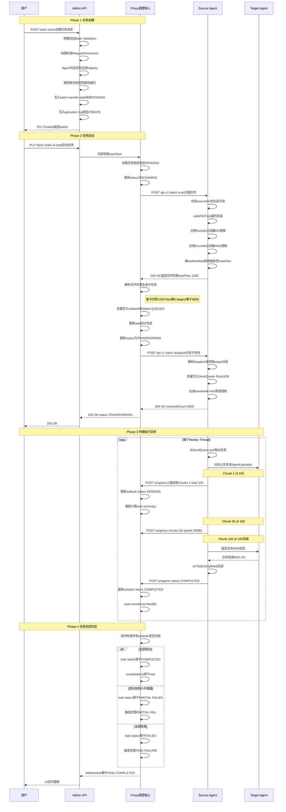

### 5.3 传输后处理时序图 (新增 - Phase 5)

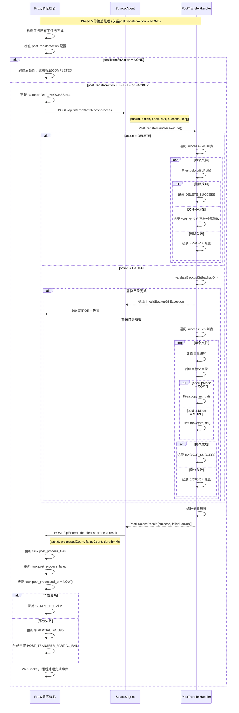

### 5.4 文件扫描详细流程

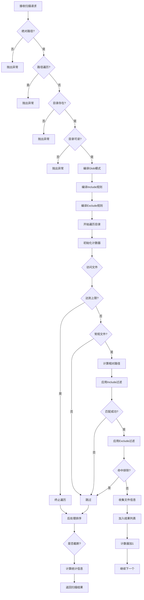

### 5.4 队列管理与堵塞检测流程

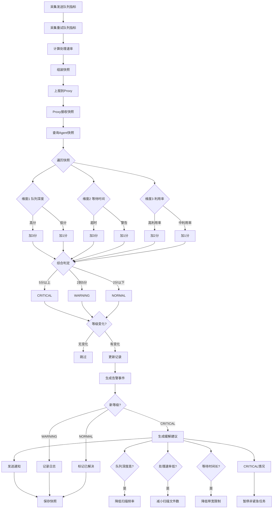

***

## 6. API接口详细定义

### 6.1 批量任务管理 API

#### 6.1.1 创建批量任务

**Endpoint**: `POST /api/v1/batch/tasks`\
**权限**: `batch:task:create`\
**Content-Type**: `application/json`

**Request Body**:

```json
{
  "taskName": "生产环境日志同步-20260430",
  "taskDescription": "每日定时同步生产日志到测试环境用于问题排查",
  
  "sourceAgentId": "agent-prod-01",
  "sourceDir": "/var/app/logs",
  
  "includePatterns": [
    "*.log",
    "archive/**/*.gz",
    "traces/*.txt"
  ],
  
  "excludePatterns": [
    "*.tmp",
    "*.swp",
    "debug/*",
    ".gitignore"
  ],
  
  "scanFrequencySec": 300,
  "maxScanFiles": 5000,
  
  "targetAgents": [
    "agent-test-01",
    "agent-test-02",
    "agent-staging"
  ],
  
  "maxBandwidthKbS": 10240,
  
  "retryEnabled": true,
  "retryMaxDays": 7,
  "retryIntervalMin": 30,
  
  -- 传输后处理配置 (新增)
  "postTransferAction": "BACKUP",
  "backupDir": "/data/backup/logs",
  "backupMode": "COPY",
  "preserveDirStructure": true,
  
  -- 传输模式与路由策略 (新增)
  "transferMode": "ONE_TO_ONE",
  "routingStrategy": "ROUND_ROBIN",
  "routingConfig": null
}
```

**Validation Rules**:

| 字段                     | 类型            | 必填   | 校验规则                        | 默认值            | <br />        | <br />        | <br />  | <br />    |
| ---------------------- | ------------- | ---- | --------------------------- | -------------- | ------------- | ------------- | ------- | --------- |
| `taskName`             | String        | ✅    | @NotBlank, @Size(max=200)   | -              | <br />        | <br />        | <br />  | <br />    |
| `taskDescription`      | String        | ❌    | @Size(max=500)              | -              | <br />        | <br />        | <br />  | <br />    |
| `sourceAgentId`        | String        | ✅    | @NotBlank                   | -              | <br />        | <br />        | <br />  | <br />    |
| `sourceDir`            | String        | ✅    | @NotBlank, @Pattern(绝对路径正则) | -              | <br />        | <br />        | <br />  | <br />    |
| `includePatterns`      | List\<String> | ❌    | @Pattern(Glob格式校验)          | \["\*"]        | <br />        | <br />        | <br />  | <br />    |
| `excludePatterns`      | List\<String> | ❌    | @Pattern(Glob格式校验)          | \[]            | <br />        | <br />        | <br />  | <br />    |
| `scanFrequencySec`     | Integer       | ❌    | @Min(60), @Max(86400)       | 300            | <br />        | <br />        | <br />  | <br />    |
| `maxScanFiles`         | Integer       | ❌    | @Min(100), @Max(100000)     | 10000          | <br />        | <br />        | <br />  | <br />    |
| `targetAgents`         | List\<String> | ✅    | @NotEmpty, @Size(max=20)    | -              | <br />        | <br />        | <br />  | <br />    |
| `maxBandwidthKbS`      | Integer       | ❌    | @Min(1)                     | null (不限)      | <br />        | <br />        | <br />  | <br />    |
| `retryEnabled`         | Boolean       | ❌    | -                           | true           | <br />        | <br />        | <br />  | <br />    |
| `retryMaxDays`         | Integer       | ❌    | @Min(1), @Max(30)           | 7              | <br />        | <br />        | <br />  | <br />    |
| `retryIntervalMin`     | Integer       | ❌    | @Min(5), @Max(1440)         | 30             | <br />        | <br />        | <br />  | <br />    |
| `postTransferAction`   | String        | ❌    | @Pattern(NONE               | DELETE         | BACKUP)       | NONE          | <br />  | <br />    |
| `backupDir`            | String        | 条件必填 | @NotBlank, BACKUP模式时必填      | null           | <br />        | <br />        | <br />  | <br />    |
| `backupMode`           | String        | ❌    | @Pattern(COPY               | MOVE)          | COPY          | <br />        | <br />  | <br />    |
| `preserveDirStructure` | Boolean       | ❌    | -                           | true           | <br />        | <br />        | <br />  | <br />    |
| `transferMode`         | String        | ❌    | @Pattern(ONE\_TO\_ONE       | ONE\_TO\_MANY) | ONE\_TO\_MANY | <br />        | <br />  | <br />    |
| `routingStrategy`      | String        | ❌    | @Pattern(BROADCAST          | SINGLE         | ROUND\_ROBIN  | REGION\_BASED | RANDOM) | BROADCAST |
| `routingConfig`        | String(JSON)  | 条件必填 | JSON格式合法, REGION\_BASED时必填  | null           | <br />        | <br />        | <br />  | <br />    |

**自定义业务校验**:

- **目标不能包含源**: `targetAgents` 不能包含 `sourceAgentId`
- **Agent可达性**: 源Agent和至少一个目标Agent必须在线
- **路径安全**: `sourceDir` 不能包含 `..` 防止路径遍历
- **模式兼容性**: `transferMode=ONE_TO_ONE` 时 `routingStrategy=BROADCAST` 自动降级为 `SINGLE`
- **区域路由配置**: `routingStrategy=REGION_BASED` 时 `routingConfig` 必须包含有效的规则配置
- **任务唯一性**: 同一源目录+目标组合在任务进行中不允许重复创建

**Response 201 Created**:

```json
{
  "code": 200,
  "message": "任务创建成功",
  "data": {
    "taskId": 1001,
    "taskName": "生产环境日志同步-20260430",
    "status": "PENDING",
    "sourceAgentId": "agent-prod-01",
    "targetCount": 3,
    "createdAt": "2026-04-30T10:00:00Z",
    "createdBy": "admin"
  }
}
```

**Error Responses**:

```json
// 400 Bad Request - 参数校验失败
{
  "code": 400,
  "message": "参数校验失败",
  "errors": [
    {"field": "sourceDir", "message": "必须是绝对路径"},
    {"field": "targetAgents", "message": "目标Agent列表不能包含源Agent自身"}
  ]
}

// 404 Not Found - Agent不存在
{
  "code": 404,
  "message": "源Agent [agent-prod-01] 未注册或离线"
}

// 409 Conflict - 重复任务
{
  "code": 409,
  "message": "已存在相同源目录和目标的进行中任务 [taskId=999]"
}
```

***

#### 6.1.2 启动任务

**Endpoint**: `PUT /api/v1/batch/tasks/{taskId}/start`\
**权限**: `batch:task:start`\
**Path Variable**: `taskId` (LONG)

**Request Body**: 无 (或可选的覆盖参数)

**Preconditions**:

1. 任务状态必须为 `PENDING` 或 `PAUSED`
2. 源Agent必须在线
3. 至少有一个目标Agent在线

**Business Logic**:

```
1. 加载任务实体
2. 校验状态允许转换
3. 查询源Agent在线状态 (AgentRegistry)
4. 查询目标Agent在线状态 (至少1个在线即可)
5. 调用 Proxy.BatchTaskScheduler.startTask(taskId)
6. 记录操作日志 (operation_type=START)
7. 返回异步启动确认
```

**Response 200 OK**:

```json
{
  "code": 200,
  "message": "任务已启动",
  "data": {
    "taskId": 1001,
    "status": "SCANNING",
    "message": "正在触发文件扫描，请稍候...",
    "estimatedDuration": "预计扫描耗时 < 10秒"
  }
}
```

***

#### 6.1.3 暂停任务

**Endpoint**: `PUT /api/v1/batch/tasks/{taskId}/pause`\
**权限**: `batch:task:pause`

**Behavior**:

- 将任务状态从 `TRANSFERRING` → `PAUSED`
- 通知Source Agent停止从SendQueue取新任务
- 已在传输中的文件允许完成当前chunk后停止
- 不影响已完成的子任务

**Implementation Details**:

**暂停任务流程**:

1. **状态校验**: 确认任务当前状态为 `TRANSFERRING`
2. **更新数据库**: 将状态修改为 `PAUSED`，持久化到MySQL
3. **通知Agent**: 向Source Agent发送 `PauseCommand`（graceful模式，允许当前文件传输完成）
4. **记录日志**: 写入 `operation_log` 表，记录操作人和时间
5. **事件发布**: 通过WebSocket推送状态变更事件给Admin UI

**关键点**:

- 优雅暂停：不中断正在传输的文件，仅停止从队列取新任务
- 已完成的子任务保持 `COMPLETED` 不变
- 正在传输的子任务允许完成当前chunk后停止

***

#### 6.1.4 取消任务

**Endpoint**: `PUT /api/v1/batch/tasks/{taskId}/cancel`\
**权限**: `batch:task:cancel`

**Behavior**:

- 立即终止任务，状态 → `CANCELLED`
- 通知Source Agent清空该任务的SendQueue和RetryQueue
- 已完成的子任务保持COMPLETED不变
- 进行中的子任务标记为CANCELLED
- 不删除历史记录（可后续手动清理）

***

#### 6.1.5 动态调整参数

**Endpoint**: `PUT /api/v1/batch/tasks/{taskId}/config`\
**权限**: `batch:task:update`

**Request Body**:

```json
{
  "scanFrequencySec": 600,
  "maxScanFiles": 2000,
  "maxBandwidthKbS": 5120,
  "retryEnabled": true,
  "retryIntervalMin": 60
}
```

**Response**:

```json
{
  "code": 200,
  "message": "配置已更新",
  "data": {
    "taskId": 1001,
    "appliedAt": "2026-04-30T10:30:00Z",
    "changes": [
      {"field": "scanFrequencySec", "oldValue": 300, "newValue": 600},
      {"field": "maxBandwidthKbS", "oldValue": 10240, "newValue": 5120}
    ],
    "effectiveNote": "带宽限制将在下次Agent上报周期内生效(≤10秒)"
  }
}
```

***

### 6.2 任务查询 API

#### 6.2.1 任务列表（分页筛选）

**Endpoint**: `GET /api/v1/batch/tasks`\
**权限**: `batch:task:list`

**Query Parameters**:

| 参数              | 类型       | 必填 | 默认值       | 说明                                      |
| --------------- | -------- | -- | --------- | --------------------------------------- |
| `page`          | Int      | 否  | 1         | 页码                                      |
| `size`          | Int      | 否  | 10        | 每页条数 (max=100)                          |
| `status`        | String   | 否  | ALL       | 状态筛选: PENDING/SCANNING/TRANSFERRING/... |
| `sourceAgentId` | String   | 否  | -         | 源Agent筛选                                |
| `keyword`       | String   | 否  | -         | 任务名模糊搜索                                 |
| `dateFrom`      | DateTime | 否  | -         | 创建时间起始                                  |
| `dateTo`        | DateTime | 否  | -         | 创建时间截止                                  |
| `sortBy`        | String   | 否  | createdAt | 排序字段: createdAt/status/progress         |
| `sortOrder`     | String   | 否  | DESC      | ASC/DESC                                |

**Response**:

```json
{
  "code": 200,
  "data": {
    "total": 25,
    "pages": 3,
    "currentPage": 1,
    "list": [
      {
        "taskId": 1001,
        "taskName": "生产日志同步-20260430",
        "status": "TRANSFERRING",
        "statusLabel": "传输中",
        
        "progress": {
          "percent": 65.5,
          "transferredFiles": 786,
          "totalFiles": 1200,
          "failedFiles": 3,
          "transferredSizeGB": 1.34,
          "totalSizeGB": 2.05
        },
        
        "sourceAgent": {
          "agentId": "agent-prod-01",
          "agentName": "生产主节点"
        },
        
        "targets": {
          "totalCount": 3,
          "completedCount": 1,
          "items": [
            {"agentId": "agent-test-01", "status": "COMPLETED"},
            {"agentId": "agent-test-02", "status": "TRANSFERRING"},
            {"agentId": "agent-staging", "status": "TRANSFERRING"}
          ]
        },
        
        "performance": {
          "currentSpeedMBps": 12.5,
          "estimatedRemainingMin": 9.3
        },
        
        "timeInfo": {
          "createdAt": "2026-04-30T10:00:00Z",
          "startedAt": "2026-04-30T10:00:05Z",
          "durationMin": 30.5
        },
        
        "createdBy": "admin",
        "canOperate": {
          "canPause": true,
          "canCancel": true,
          "canConfig": true,
          "canDelete": false  // 只有终态才能删除
        }
      }
    ]
  }
}
```

***

#### 6.2.2 任务详情（含三层进度）

**Endpoint**: `GET /api/v1/batch/tasks/{taskId}/detail`\
**权限**: `batch:task:query`

**Response Structure**:

```json
{
  "code": 200,
  "data": {
    "taskId": 1001,
    "taskName": "生产日志同步-20260430",
    "status": "TRANSFERRING",
    
    "config": {
      "sourceDir": "/var/app/logs",
      "includePatterns": ["*.log", "archive/**/*.gz"],
      "excludePatterns": ["*.tmp"],
      "maxBandwidthKbS": 10240,
      "retryEnabled": true
    },
    
    "summary": {
      "status": "TRANSFERRING",
      "progressPercent": 65.5,
      
      "files": {
        "total": 1200,
        "completed": 786,
        "failed": 3,
        "pending": 411,
        "inProgress": 0  // 当前正在传的文件数
      },
      
      "size": {
        "totalGB": 2.05,
        "transferredGB": 1.34,
        "remainingGB": 0.71
      },
      
      "performance": {
        "averageSpeedMBps": 10.2,
        "currentSpeedMBps": 12.5,
        "estimatedRemainingMin": 9.3
      },
      
      "timeRange": {
        "startedAt": "2026-04-30T10:00:05Z",
        "elapsedMin": 30.5,
        "estimatedCompletionAt": "2026-04-30T10:39:45Z"
      }
    },
    
    "targetProgress": [
      {
        "agentId": "agent-test-01",
        "agentName": "测试环境-节点1",
        "ipAddress": "192.168.1.101",
        "status": "COMPLETED",
        "statusLabel": "已完成",
        
        "progressPercent": 100.0,
        
        "files": {
          "total": 1200,
          "completed": 1200,
          "failed": 0
        },
        
        "size": {
          "totalGB": 2.05,
          "transferredGB": 2.05
        },
        
        "timeInfo": {
          "startedAt": "2026-04-30T10:00:10Z",
          "completedAt": "2026-04-30T10:25:32Z",
          "durationMin": 25.3
        },
        
        "errors": []
      },
      {
        "agentId": "agent-test-02",
        "agentName": "测试环境-节点2",
        "ipAddress": "192.168.1.102",
        "status": "TRANSFERRING",
        "statusLabel": "传输中",
        
        "progressPercent": 82.3,
        
        "files": {
          "total": 1200,
          "completed": 987,
          "failed": 2,
          "inProgress": 1
        },
        
        "size": {
          "totalGB": 2.05,
          "transferredGB": 1.69
        },
        
        "currentFile": {
          "filePath": "logs/app.log.20260430-15.gz",
          "fileName": "app.log.20260430-15.gz",
          "fileSizeMB": 156.3,
          "progressPercent": 67,
          "transferredMB": 104.7,
          "speedMBps": 8.5,
          "remainingTimeSec": 6.0
        },
        
        "timeInfo": {
          "startedAt": "2026-04-30T10:00:10Z",
          "elapsedMin": 30.5,
          "estimatedRemainingMin": 5.5
        },
        
        "recentErrors": [
          {
            "filePath": "logs/error.log",
            "errorCode": "CONNECTION_TIMEOUT",
            "errorMessage": "连接目标Agent超时",
            "occurredAt": "2026-04-30T10:28:15Z",
            "retryCount": 2,
            "willRetryAt": "2026-04-30T10:29:15Z"
          }
        ]
      }
    ],
    
    "subtasks": {
      "total": 3600,
      "pages": 180,
      "currentPage": 1,
      "pageSize": 20,
      
      "filters": {
        "status": "ALL",  // ALL/QUEUED/SENDING/COMPLETED/FAILED/RETRYING/CANCELLED
        "targetAgentId": "ALL",
        "searchKeyword": ""
      },
      
      "summaryByStatus": {
        "QUEUED": 411,
        "SENDING": 3,
        "COMPLETED": 3174,
        "FAILED": 5,
        "RETRYING": 7,
        "CANCELLED": 0
      },
      
      "list": [
        {
          "subtaskId": 5001,
          "filePath": "logs/app.log",
          "fileName": "app.log",
          "fileSizeKB": 10240,
          
          "targetAgentId": "agent-test-02",
          "targetAgentName": "测试环境-节点2",
          
          "status": "COMPLETED",
          "statusLabel": "已完成",
          
          "progress": {
            "percent": 100,
            "transferredChunks": 100,
            "totalChunks": 100
          },
          
          "performance": {
            "speedMBps": 8.5,
            "durationSec": 123
          },
          
          "timeInfo": {
            "queuedAt": "2026-04-30T10:00:10Z",
            "startedAt": "2026-04-30T10:01:05Z",
            "completedAt": "2026-04-30T10:03:08Z",
            "waitTimeSec": 55
          }
        },
        {
          "subtaskId": 5200,
          "filePath": "logs/error.log",
          "fileName": "error.log",
          "fileSizeKB": 2300,
          
          "targetAgentId": "agent-test-02",
          "status": "FAILED",
          "statusLabel": "失败",
          
          "error": {
            "code": "CHECKSUM_MISMATCH",
            "message": "文件MD5校验失败: 期望=d41d8cd..., 实际=abc123...",
            "stackTrace": "com.cq.agent.exception.ChecksumException..."
          },
          
          "retry": {
            "localRetryCount": 3,
            "proxyRetryCount": 1,
            "lastRetryAt": "2026-04-30T10:28:15Z",
            "nextRetryAfter": "2026-04-30T10:58:15Z",
            "canManualRetry": true
          }
        }
      ]
    }
  }
}
```

***

### 6.3 队列监控 API

#### 6.3.1 Agent队列实时状态

**Endpoint**: `GET /api/v1/batch/agents/{agentId}/queue-status`\
**权限**: `batch:monitor:view`

**Query Parameters**:

| 参数             | 类型  | 必填 | 默认值 | 说明           |
| -------------- | --- | -- | --- | ------------ |
| `historyHours` | Int | 否  | 1   | 趋势数据时间范围(小时) |

**Response**:

```json
{
  "code": 200,
  "data": {
    "agentId": "agent-prod-01",
    "agentName": "生产主节点",
    "ipAddress": "10.0.0.1",
    "onlineStatus": "ONLINE",
    "lastHeartbeat": "2026-04-30T10:29:55Z",
    "snapshotTime": "2026-04-30T10:30:00Z",
    
    "sendQueue": {
      "currentDepth": 456,
      "peakDepth": 1200,
      "capacity": 10000,
      "utilizationPercent": 4.56,
      "utilizationLabel": "正常",
      
      "waitTime": {
        "avgMs": 12300,
        "p50Ms": 8500,
        "p95Ms": 28000,
        "p99Ms": 45000
      },
      
      "throughput": {
        "currentRatePerSec": 35.2,
        "avgRate1MinPerSec": 32.8,
        "avgRate5MinPerSec": 30.1
      },
      
      "congestion": {
        "level": "NORMAL",
        "isCongested": false,
        "score": 0
      },
      
      "topWaitingTasks": [
        {
          "taskId": 1001,
          "filePath": "logs/huge.dump",
          "fileSizeMB": 512,
          "waitTimeSec": 45,
          "positionInQueue": 1
        },
        {
          "taskId": 1001,
          "filePath": "backup/data.tar.gz",
          "fileSizeMB": 256,
          "waitTimeSec": 38,
          "positionInQueue": 2
        }
      ]
    },
    
    "retryQueue": {
      "currentDepth": 12,
      "peakDepth": 28,
      "capacity": 5000,
      
      "nextScheduledRetry": "2026-04-30T10:35:00Z",
      "secondsUntilNextRetry": 300,
      
      "errorDistribution": [
        {
          "errorCode": "CONNECTION_TIMEOUT",
          "errorLabel": "连接超时",
          "count": 5,
          "percentage": 41.7
        },
        {
          "errorCode": "TARGET_OFFLINE",
          "errorLabel": "目标离线",
          "count": 4,
          "percentage": 33.3
        },
        {
          "errorCode": "DISK_FULL",
          "errorLabel": "磁盘空间不足",
          "count": 2,
          "percentage": 16.7
        },
        {
          "errorCode": "CHECKSUM_MISMATCH",
          "errorLabel": "校验失败",
          "count": 1,
          "percentage": 8.3
        }
      ],
      
      "upcomingRetries": [
        {
          "subtaskId": 6001,
          "taskId": 1001,
          "filePath": "logs/error.log",
          "targetAgentId": "agent-test-02",
          "localRetryCount": 3,
          "proxyRetryCount": 1,
          "lastError": "CONNECTION_TIMEOUT",
          "nextRetryAt": "2026-04-30T10:35:00Z",
          "retryInSec": 300
        }
      ]
    },
    
    "mitigationSuggestions": null,  // NORMAL状态下为null
    
    "trendData": {
      "interval": "5min",
      "startTime": "2026-04-30T09:30:00Z",
      "endTime": "2026-04-30T10:30:00Z",
      "points": [
        {
          "timestamp": "09:30",
          "sendDepth": 200,
          "retryDepth": 5,
          "throughput": 40.5
        },
        {
          "timestamp": "09:35",
          "sendDepth": 350,
          "retryDepth": 8,
          "throughput": 38.2
        },
        {
          "timestamp": "10:30",
          "sendDepth": 456,
          "retryDepth": 12,
          "throughput": 35.2
        }
      ]
    }
  }
}
```

***

#### 6.3.2 全局监控仪表盘

**Endpoint**: `GET /api/v1/batch/monitor/dashboard`\
**权限**: `batch:monitor:view`

**Response**:

```json
{
  "code": 200,
  "data": {
    "timestamp": "2026-04-30T10:30:00Z",
    
    "overview": {
      "activeTasks": 5,
      "pausedTasks": 2,
      "completedToday": 15,
      "failedToday": 2,
      
      "agents": {
        "totalRegistered": 12,
        "online": 10,
        "offline": 2,
        "busy": 3  // 有活跃传输任务的Agent
      },
      
      "performance": {
        "globalThroughputMBps": 45.6,
        "todayTransferredGB": 128.5,
        "avgTaskDurationMin": 25.3
      }
    },
    
    "agentHealthGrid": [
      {
        "agentId": "agent-prod-01",
        "agentName": "生产主节点",
        "onlineStatus": "ONLINE",
        
        "sendQueueStatus": {
          "level": "NORMAL",
          "depth": 456,
          "utilizationPct": 4.56
        },
        
        "retryQueueStatus": {
          "level": "NORMAL",
          "depth": 12
        },
        
        "overallHealth": "HEALTHY",
        "activeTaskCount": 2
      },
      {
        "agentId": "agent-prod-02",
        "agentName": "生产备节点",
        "onlineStatus": "ONLINE",
        
        "sendQueueStatus": {
          "level": "WARNING",
          "depth": 1050,
          "utilizationPct": 10.5
        },
        
        "retryQueueStatus": {
          "level": "NORMAL",
          "depth": 18
        },
        
        "overallHealth": "WARNING",
        "activeTaskCount": 1,
        "warningReason": "发送队列深度接近警告阈值"
      }
    ],
    
    "recentAlerts": [
      {
        "alertId": 5001,
        "level": "WARNING",
        "category": "QUEUE_CONGESTION",
        "title": "agent-prod-02 队列深度警告",
        "message": "发送队列深度达到 1050 (警告阈值: 1000)",
        "agentId": "agent-prod-02",
        "triggeredAt": "2026-04-30T10:28:00Z",
        "isResolved": false,
        "actions": ["查看详情", "调整参数", "忽略"]
      },
      {
        "alertId": 4998,
        "level": "INFO",
        "category": "TASK_COMPLETION",
        "title": "任务 #998 已完成",
        "message": "配置文件分发任务成功完成, 共传输 500 个文件",
        "triggeredAt": "2026-04-30T10:25:00Z",
        "isResolved": true
      }
    ],
    
    "activeTasksSummary": [
      {
        "taskId": 1001,
        "taskName": "生产日志同步",
        "status": "TRANSFERRING",
        "progressPercent": 65.5,
        "sourceAgent": "agent-prod-01",
        "targetCount": 3,
        "elapsedMin": 30.5
      }
    ]
  }
}
```

***

### 6.4 Agent内部 API（Proxy ↔ Agent通信）

这些API仅供内部调用，不对Admin UI暴露。

#### 6.4.1 文件扫描接口

**Endpoint**: `POST /api/internal/batch/scan`\
**Caller**: Proxy → Source Agent\
**Authentication**: Internal Token (mTLS or shared secret)

**Request**:

```json
{
  "requestId": "req-uuid-001",
  "taskId": 1001,
  "baseDir": "/var/app/logs",
  "includePatterns": ["*.log", "archive/**/*.gz"],
  "excludePatterns": ["*.tmp", "debug/*"],
  "maxFiles": 5000,
  "computeMd5": false
}
```

**Response**:

```json
{
  "requestId": "req-uuid-001",
  "success": true,
  "scanDurationMs": 3200,
  "result": {
    "files": [
      {
        "relativePath": "logs/app.log",
        "absolutePath": "/var/app/logs/app.log",
        "sizeBytes": 10485760,
        "lastModified": "2026-04-30T09:00:00Z",
        "md5": null
      }
    ],
    "totalFiles": 1200,
    "totalSizeBytes": 2147483648,
    "truncated": false,
    "skippedDirectories": [".git", "node_modules"]
  }
}
```

***

#### 6.4.2 子任务分发接口

**Endpoint**: `POST /api/internal/batch/dispatch`\
**Caller**: Proxy → Source Agent

**Request**:

```json
{
  "dispatchId": "disp-uuid-002",
  "taskId": 1001,
  "maxBandwidthBytesPerSec": 10485760,
  "subtasks": [
    {
      "subtaskId": 5001,
      "filePath": "logs/app.log",
      "fileSizeBytes": 10485760,
      "targetAgentId": "agent-test-02",
      "targetAgentApiUrl": "http://192.168.1.102:8080",
      "priority": 5
    }
  ]
}
```

**Response**:

```json
{
  "dispatchId": "disp-uuid-002",
  "receivedCount": 3600,
  "rejectedCount": 0,
  "rejections": [],
  "estimatedQueueDrainTimeSec": 2700,
  "appliedBandwidthLimit": 10485760
}
```

***

#### 6.4.3 进度上报接口

**Endpoint**: `POST /api/internal/batch/progress`\
**Caller**: Target Agent → Proxy (or Source Agent → Proxy)

**Request** (单个子任务进度):

```json
{
  "reportId": "rpt-uuid-003",
  "taskId": 1001,
  "subtaskId": 5001,
  "targetAgentId": "agent-test-02",
  "filePath": "logs/app.log",
  
  "status": "SENDING",
  "progress": {
    "transferredChunks": 67,
    "totalChunks": 100,
    "transferredBytes": 7046430,
    "totalBytes": 10485760
  },
  
  "performance": {
    "currentSpeedBytesPerSec": 8388608,
    "avgSpeedBytesPerSec": 7340032
  },
  
  "timestamp": "2026-04-30T10:15:30Z"
}
```

**Response**:

```json
{
  "reportId": "rpt-uuid-003",
  "acknowledged": true,
  "serverTimestamp": "2026-04-30T10:15:30.125Z"
}
```

**批量上报优化** (减少HTTP开销):

```json
{
  "reports": [
    {...subtask1 progress...},
    {...subtask2 progress...},
    ...
  ],
  "batchSize": 10,
  "intervalMs": 5000
}
```

***

#### 6.4.4 队列快照上报接口

**Endpoint**: `POST /api/internal/batch/queue/snapshot`\
**Caller**: Source Agent → Proxy

**Request**:

```json
{
  "agentId": "agent-prod-01",
  "snapshotTime": "2026-04-30T10:30:00Z",
  
  "sendQueue": {
    "depth": 456,
    "peakDepth": 1200,
    "capacity": 10000,
    "avgWaitTimeMs": 12300,
    "oldestEnqueueTime": "2026-04-30T10:29:15Z"
  },
  
  "retryQueue": {
    "depth": 12,
    "peakDepth": 28,
    "nextScheduleTime": "2026-04-30T10:35:00Z"
  },
  
  "processingStats": {
    "completedLast1Min": 35,
    "failedLast1Min": 2,
    "avgProcessTimeMs": 1500
  },
  
  "activeTasks": [1001, 1002],
  "systemLoad": {
    "cpuUsagePct": 45.2,
    "memoryUsagePct": 62.8,
    "diskIoUtilPct": 12.3
  }
}
```

***

## 7. Agent端改造方案

### 7.1 新增组件清单

| 组件名                         | 包路径                              | 职责                       | 复用程度                  |
| --------------------------- | -------------------------------- | ------------------------ | --------------------- |
| `BatchFileScanner`          | `com.cq.agent.batch.scanner`     | 目录扫描 + Glob匹配            | 全新                    |
| `GlobMatcher`               | `com.cq.agent.batch.scanner`     | Glob模式编译与匹配              | 全新                    |
| `BatchTransferQueueManager` | `com.cq.agent.batch.queue`       | 双队列管理 (Send/Retry)       | 基于现有PersistentQueue扩展 |
| `QueueMetricsCollector`     | `com.cq.agent.batch.queue`       | 队列指标采集与上报                | 全新                    |
| `BatchAwareAgentUploader`   | `com.cq.agent.client.upload`     | 批量感知的上传执行器               | 继承AgentUploader       |
| `BatchDispatchHandler`      | `com.cq.agent.handler.batch`     | 接收Proxy分发指令的HTTP Handler | 全新                    |
| `BatchScanHandler`          | `com.cq.agent.handler.batch`     | 执行文件扫描的HTTP Handler      | 全新                    |
| `ProxyReportClient`         | `com.cq.agent.batch.report`      | 向Proxy上报进度和队列状态          | 全新                    |
| `PostTransferHandler`       | `com.cq.agent.batch.postprocess` | 传输后处理执行器(删除/备份)          | 全新                    |

### 7.2 PostTransferHandler 详细设计 (新增)

**核心职责**: 任务传输完成后，根据配置对源文件执行删除或备份操作

**组件交互关系**:

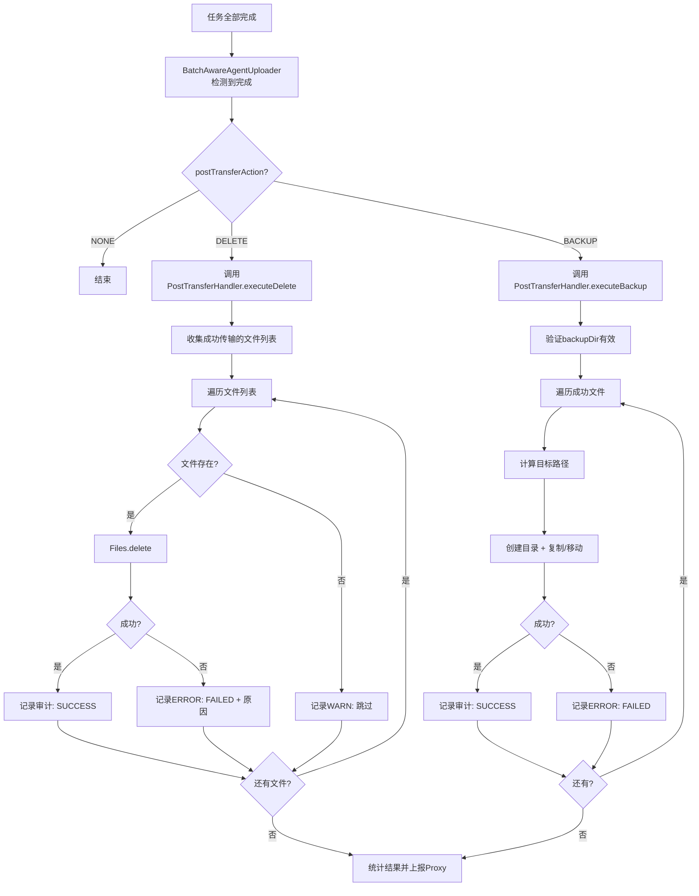

**关键方法签名**:

```java
@Component
public class PostTransferHandler {
    
    /**
     * 执行传输后处理
     * @param taskId 任务ID
     * @param successFiles 成功传输的文件相对路径列表
     * @param config 后处理配置
     * @return 处理结果统计
     */
    public PostProcessResult execute(Long taskId, 
                                     List<String> successFiles,
                                     PostTransferConfig config);
    
    /**
     * 删除源文件
     */
    private ProcessResult deleteFiles(List<String> filePaths, Path sourceBaseDir);
    
    /**
     * 备份源文件到指定目录
     */
    private ProcessResult backupFiles(List<String> filePaths,
                                       Path sourceBaseDir,
                                       Path backupBaseDir,
                                       BackupMode mode,
                                       boolean preserveStructure);
    
    /**
     * 验证备份目录有效性
     */
    private void validateBackupDir(Path backupDir) throws InvalidBackupDirException;
}

/**
 * 后处理配置
 */
public class PostTransferConfig {
    private TransferAction action;          // NONE / DELETE / BACKUP
    private Path backupDir;                // 备份目录
    private BackupMode backupMode;         // COPY / MOVE
    private boolean preserveDirStructure;   // 是否保持目录结构
}

/**
 * 后处理结果
 */
public class PostProcessResult {
    private int totalFiles;                // 总处理文件数
    private int successCount;              // 成功数
    private int failedCount;               // 失败数
    private List<ProcessError> errors;     // 错误详情列表
    private long durationMs;               // 处理耗时
}
```

**安全机制实现**:

1. **操作范围限制**: 仅处理本次任务的文件，不影响其他文件
2. **原子性**: 单个文件失败不中断整体流程
3. **日志记录**: 每个操作都详细记录（成功/失败+原因）
4. **结果上报**: 完成后上报Proxy进行统计和告警

**异常处理策略**:

| 异常类型                        | 触发条件        | 处理方式           |
| --------------------------- | ----------- | -------------- |
| `InvalidBackupDirException` | 目录不存在、不可写   | 终止处理，生成告警      |
| `SecurityException`         | 路径超出允许范围    | 终止处理，记录安全告警    |
| `IOException` (单文件)         | 单个文件删除/复制失败 | 记录错误，继续处理下一个文件 |
| `DiskFullException`         | 磁盘空间不足      | 终止处理，生成告警      |

### 7.3 BatchFileScanner 详细设计

**核心职责**: 基于Glob模式的目录扫描与文件元数据收集

**关键特性**:

- 支持递归目录遍历（`walkFileTree`）
- 标准Glob语法支持（`**`, `*`, `?`, `[]`, `{}`）
- 包含/排除双重过滤机制
- 文件数量截断保护（防止OOM）
- 按修改时间排序（保证传输顺序确定性）

**处理流程**:

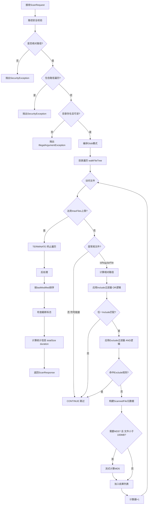

**异常处理策略**:

| 异常类型                       | 触发条件         | 处理方式                          |
| -------------------------- | ------------ | ----------------------------- |
| `SecurityException`        | 路径不合法、路径遍历攻击 | 直接抛出，终止扫描                     |
| `IllegalArgumentException` | 目录不存在、非目录    | 直接抛出，终止扫描                     |
| `IOException` (单文件)        | 单个文件无权限访问    | 记录WARN日志，跳过该文件继续              |
| `PatternSyntaxException`   | Glob模式语法错误   | 包装为IllegalArgumentException抛出 |

**性能优化点**:

- **早停机制**: 达到`maxFiles`立即终止遍历
- **隐藏目录跳过**: 自动跳过`.git`, `.svn`等
- **选择性MD5**: 仅对小文件（<100MB）计算，大文件跳过
- **Windows路径标准化**: 自动将`\`转换为`/`

**输入输出**:

```
输入: ScanRequest { baseDir, includePatterns[], excludePatterns[], maxFiles }
输出: ScanResponse { files[], totalFiles, totalSizeBytes, truncated, scanDurationMs }
```

### 7.3 BatchTransferQueueManager 详细设计

**核心职责**: 双队列管理（发送队列 + 重试队列）与指标采集

**架构设计**:

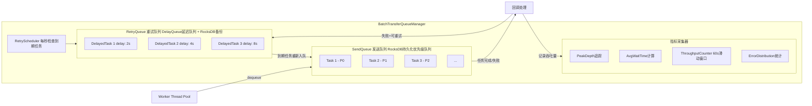

**核心操作流程**:

#### 7.3.1 入队操作 (Enqueue)

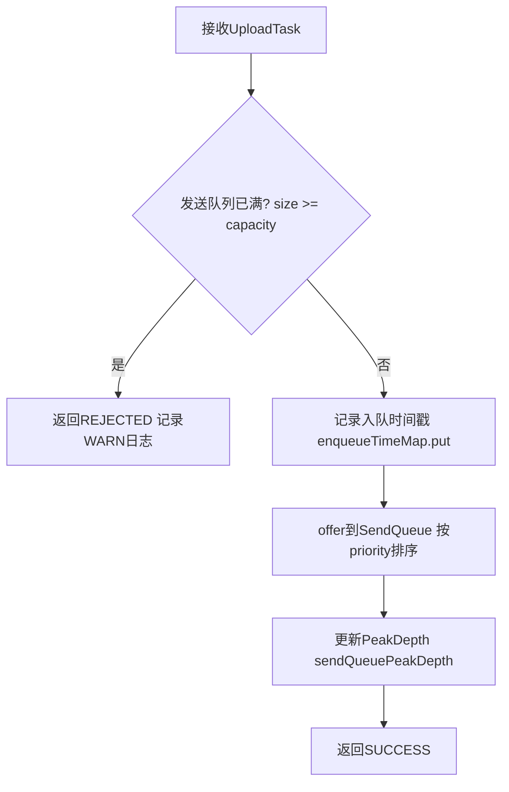

#### 7.3.2 出队操作 (Dequeue)

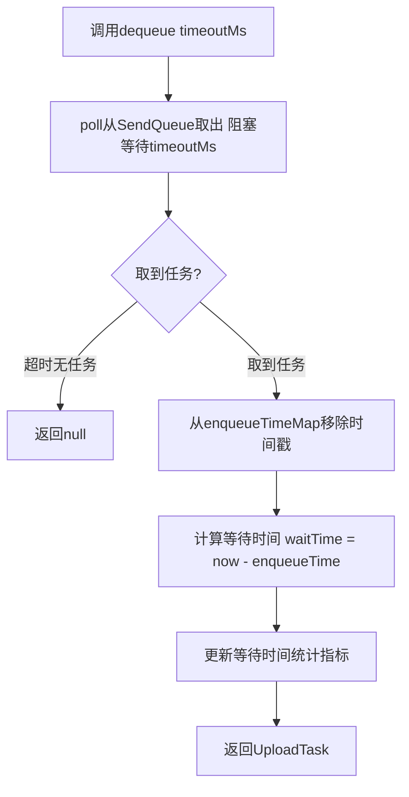

#### 7.3.3 失败重试机制

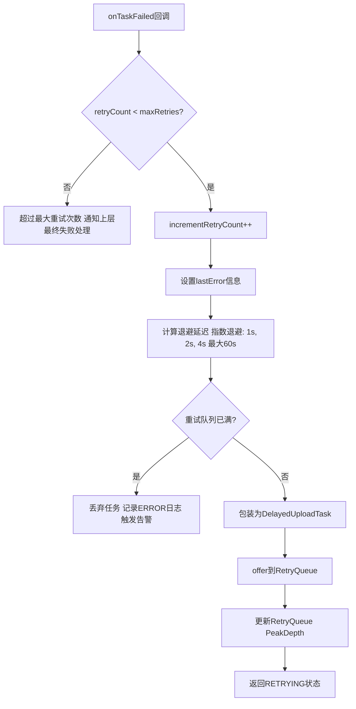

#### 7.3.4 重试调度器工作流程

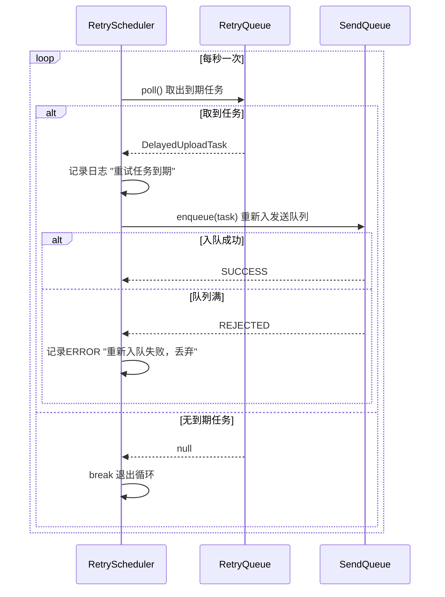

**关键配置参数**:

| 参数                   | 默认值   | 说明            |
| -------------------- | ----- | ------------- |
| `sendQueueCapacity`  | 10000 | 发送队列容量上限      |
| `retryQueueCapacity` | 5000  | 重试队列容量上限      |
| `maxRetries`         | 3     | Agent本地最大重试次数 |
| `baseDelayMs`        | 1000  | 指数退避基础延迟（1秒）  |
| `maxDelayMs`         | 60000 | 最大退避延迟（60秒）   |
| `throughputWindowMs` | 60000 | 吞吐量统计滑动窗口     |

**优雅关闭流程**:

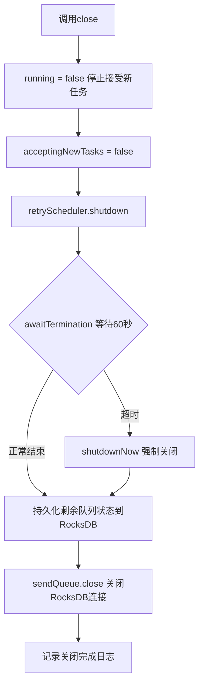

**数据持久化策略**:

- **SendQueue**: 基于RocksDB的持久化优先级队列，Agent重启后自动恢复
- **RetryQueue**: 内存DelayQueue + RocksDB双写，重启后从RocksDB恢复未完成任务
- **恢复时机**: 构造函数中调用`recoverPendingTasks()`加载所有非终态任务

### 7.4 BatchAwareAgentUploader 详细设计

**核心职责**: 批量感知的上传执行器，继承现有`AgentUploader`并增强批量传输能力

**增强能力**:

1. 接收Proxy下发的批量子任务并加入队列
2. 任务完成/失败时自动上报进度到Proxy
3. 支持动态带宽限制调整
4. 周期性上报队列状态（每10秒）

**组件交互关系**:

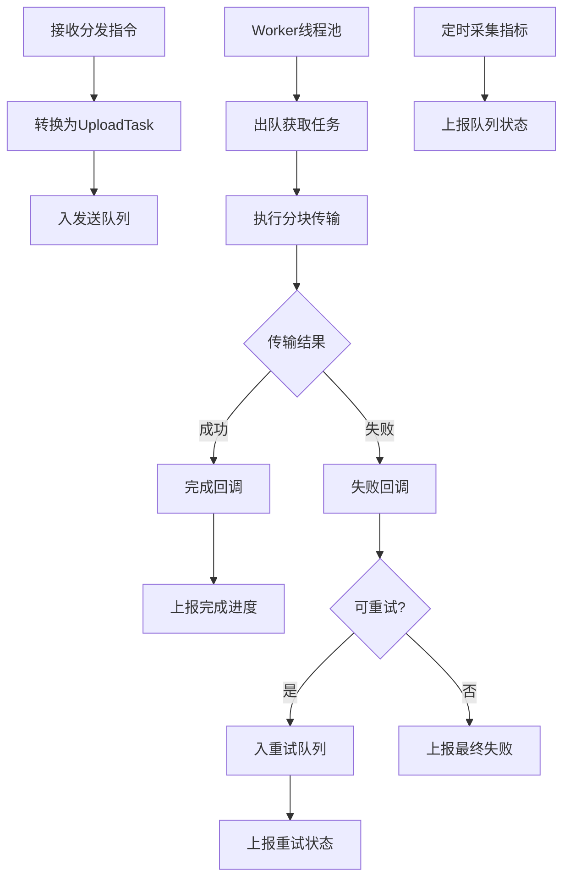

**核心流程时序图**:

#### 7.4.1 任务分发与接收流程

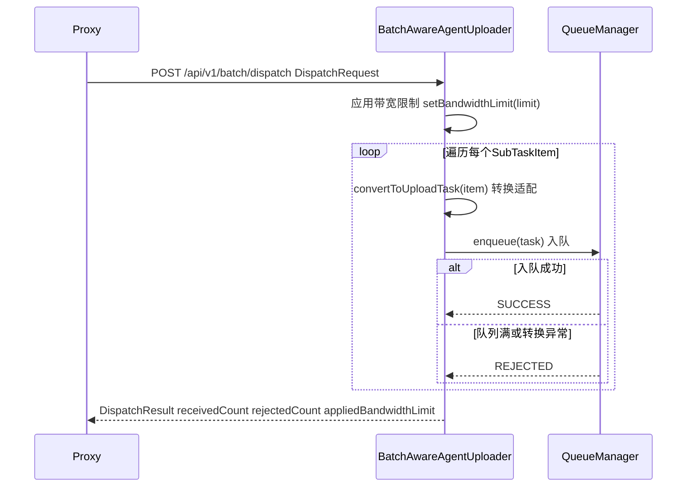

#### 7.4.2 任务完成处理流程

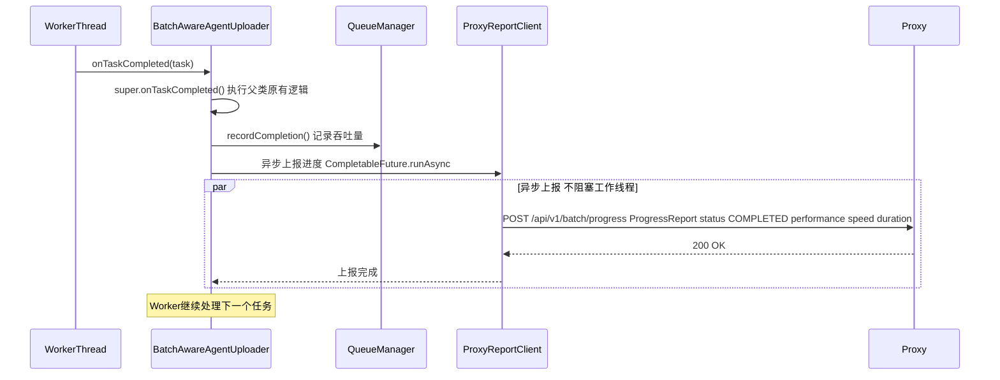

#### 7.4.3 任务失败与重试决策流程

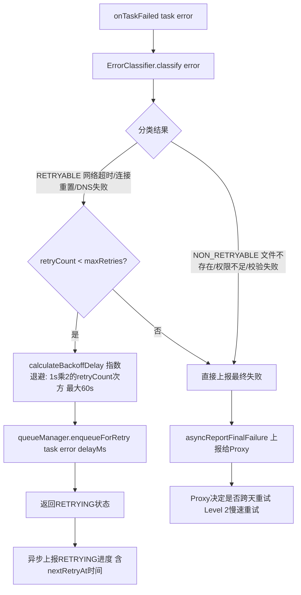

**带宽控制机制**:

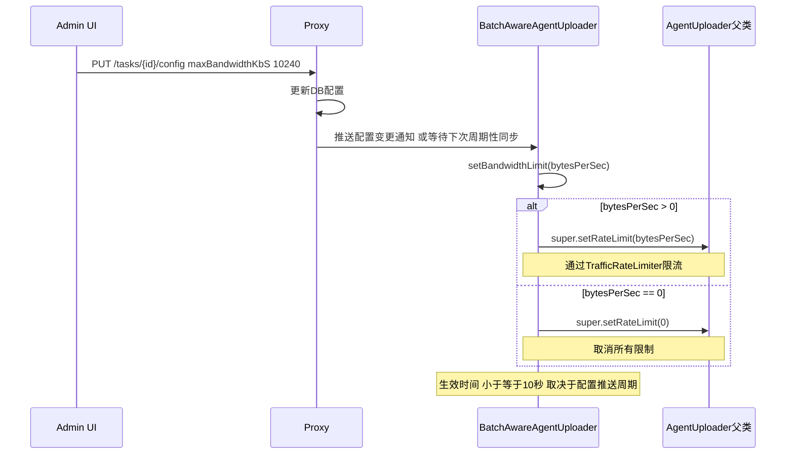

**关键设计点**:

| 设计项        | 实现方式                               | 说明                      |
| ---------- | ---------------------------------- | ----------------------- |
| **异步上报**   | `CompletableFuture.runAsync()`     | 不阻塞Worker线程，避免影响传输性能    |
| **错误分类**   | `ErrorClassifier`                  | 区分可重试/不可重试错误，避免无效重试     |
| **指数退避**   | delay = baseDelay × 2^attempt      | 1s, 2s, 4s, 8s... 最大60s |
| **带宽动态调整** | `volatile`字段 + 父类RateLimiter       | 支持运行时热更新，无需重启           |
| **周期性上报**  | `ScheduledExecutorService` (10s间隔) | 上报队列指标快照供监控使用           |

***

## 8. Proxy端组件设计

### 8.1 BatchTaskScheduler 详细设计

**核心职责**: 批量任务生命周期管理、子任务拆分与分发调度

**主要功能**:

- 任务启动（两阶段提交：扫描 → 生成子任务 → 分发）
- 暂停/恢复/取消任务
- 子任务笛卡尔积生成（文件 × 目标Agent）
- 异常处理与状态回滚

**任务启动完整流程**:

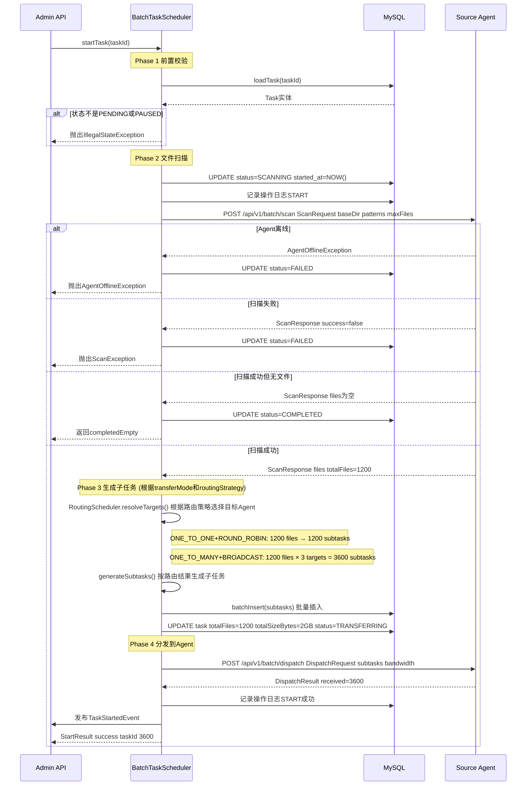

**子任务生成逻辑**:

```mermaid
graph TD
    A[输入扫描结果] --> B[获取目标Agent列表]
    B --> C[查询注册中心]

    C --> D[遍历每个文件]
    D --> E[遍历每个目标Agent]

    E --> F[构建子任务实体]
    F --> G[加入子任务列表]
    G --> E

    E -->|目标遍历完成| D
    D -->|文件遍历完成| H[返回子任务列表]
```

### 8.1.1 RoutingScheduler 路由调度器 (新增)

**核心职责**: 根据传输模式和路由策略，为每个文件选择合适的目标Agent

**组件交互关系**:

```mermaid
graph TB
    A[BatchTaskScheduler] --> B[RoutingScheduler]
    B --> C{transferMode?}
    
    C -->|ONE_TO_ONE| D{routingStrategy?}
    C -->|ONE_TO_MANY| E{routingStrategy?}
    
    D -->|SINGLE| F[SingleRoutingStrategy]
    D -->|ROUND_ROBIN| G[RoundRobinRoutingStrategy]
    D -->|REGION_BASED| H[RegionBasedRoutingStrategy]
    D -->|RANDOM| I[RandomRoutingStrategy]
    
    E -->|BROADCAST| J[BroadcastRoutingStrategy]
    E -->|其他策略| K[降级为ONE_TO_ONE模式]
    
    F & G & H & I & J --> L[返回文件→目标Agent映射]
    L --> M[生成子任务列表]
```

**核心接口定义**:

```java
public interface RoutingStrategy {
    
    /**
     * 为单个文件选择目标Agent
     * @param filePath 文件相对路径
     * @param candidates 候选目标Agent列表
     * @param context 路由上下文(包含taskId、历史路由记录等)
     * @return 选中的目标AgentID
     */
    String selectTarget(String filePath, List<String> candidates, RoutingContext context);
}

/**
 * 路由上下文 - 传递路由所需的额外信息
 */
public class RoutingContext {
    private Long taskId;
    private Map<String, String> fileToAgentCache;  // 文件→Agent缓存(用于一致性)
    private AtomicInteger roundRobinCounter;         // 轮询计数器
    private RegionConfig regionConfig;               // 区域配置(REGION_BASED用)
}
```

**各路由策略实现**:

##### SingleRoutingStrategy (单机/会话粘性)

```java
@Component
public class SingleRoutingStrategy implements RoutingStrategy {
    
    @Override
    public String selectTarget(String filePath, List<String> candidates, RoutingContext ctx) {
        // 基于文件路径的哈希，保证相同文件始终路由到同一台Agent
        int hash = Math.abs(filePath.hashCode() % candidates.size());
        return candidates.get(hash);
    }
    
    // 特点: 重试、重传都保证在同一台Agent执行
}
```

##### RoundRobinRoutingStrategy (轮询)

```java
@Component
public class RoundRobinRoutingStrategy implements RoutingStrategy {
    
    @Override
    public String selectTarget(String filePath, List<String> candidates, RoutingContext ctx) {
        // 全局计数器，按顺序分配
        int index = ctx.getRoundRobinCounter().getAndIncrement() % candidates.size();
        return candidates.get(index);
    }
    
    // 特点: 保证均匀分布到各Agent，简单有效
}
```

##### RegionBasedRoutingStrategy (区域路由)

```java
@Component
public class RegionBasedRoutingStrategy implements RoutingStrategy {
    
    @Override
    public String selectTarget(String filePath, List<String> candidates, RoutingContext ctx) {
        // 1. 匹配文件路径与区域规则
        String matchedRegion = matchRegion(filePath, ctx.getRegionConfig());
        
        // 2. 筛选该区域的Agent
        List<String> regionAgents = filterAgentsByRegion(candidates, matchedRegion);
        
        // 3. 如果该区域没有可用Agent，使用默认区域或fallback
        if (regionAgents.isEmpty()) {
            regionAgents = filterAgentsByRegion(candidates, ctx.getRegionConfig().getDefaultRegion());
        }
        
        // 4. 在区域内轮询选择
        int index = Math.abs(filePath.hashCode() % regionAgents.size());
        return regionAgents.get(index);
    }
    
    private String matchRegion(String filePath, RegionConfig config) {
        for (RegionRule rule : config.getRules()) {
            if (filePathMatchesPattern(filePath, rule.getPattern())) {
                return rule.getRegion();
            }
        }
        return config.getDefaultRegion();
    }
}
```

##### RandomRoutingStrategy (随机)

```java
@Component
public class RandomRoutingStrategy implements RoutingStrategy {
    
    private final Random random = new SecureRandom();
    
    @Override
    public String selectTarget(String filePath, List<String> candidates, RoutingContext ctx) {
        // 随机选择一台Agent
        return candidates.get(random.nextInt(candidates.size()));
    }
    
    // 特点: 无状态，适用于测试环境或无特殊要求的场景
}
```

##### BroadcastRoutingStrategy (广播)

```java
@Component
public class BroadcastRoutingStrategy implements RoutingStrategy {
    
    @Override
    public String selectTarget(String filePath, List<String> candidates, RoutingContext ctx) {
        // 广播模式下此方法不适用，由调用方特殊处理
        throw new UnsupportedOperationException("Broadcast mode should be handled specially");
    }
    
    /**
     * 广播模式: 返回所有候选Agent
     */
    public List<String> selectAllTargets(List<String> candidates) {
        return new ArrayList<>(candidates);
    }
}
```

**RoutingScheduler 主调度逻辑**:

```java
@Service
public class RoutingScheduler {
    
    @Autowired
    private Map<String, RoutingStrategy> strategyMap;
    
    /**
     * 解析所有文件的目标Agent映射
     * @return Map<filePath, List<targetAgentId>> 
     *         ONE_TO_* 模式下每个文件对应1个Agent (list size=1)
     *         BROADCAST 模式下每个文件对应所有Agent
     */
    public Map<String, List<String>> resolveTargets(
            List<ScannedFile> files,
            List<String> targetAgents,
            TransferMode transferMode,
            RoutingStrategyType strategyType,
            RoutingConfig routingConfig) {
        
        Map<String, List<String>> result = new LinkedHashMap<>();
        RoutingContext context = buildContext(routingConfig);
        
        // 模式兼容性检查
        if (transferMode == TransferMode.ONE_TO_ONE && strategyType == RoutingStrategyType.BROADCAST) {
            strategyType = RoutingStrategyType.SINGLE;  // 自动降级
        }
        
        RoutingStrategy strategy = strategyMap.get(strategyType.name());
        
        if (strategy instanceof BroadcastRoutingStrategy && transferMode == TransferMode.ONE_TO_MANY) {
            // 广播模式: 每个文件 → 所有Agent
            List<String> allTargets = ((BroadcastRoutingStrategy) strategy).selectAllTargets(targetAgents);
            for (ScannedFile file : files) {
                result.put(file.getRelativePath(), allTargets);
            }
        } else {
            // 其他模式: 每个文件 → 选1个Agent
            for (ScannedFile file : files) {
                String selected = strategy.selectTarget(file.getRelativePath(), targetAgents, context);
                result.put(file.getRelativePath(), Collections.singletonList(selected));
            }
        }
        
        return result;
    }
}
```

**任务控制操作**:

| 操作     | 前置状态                                 | 目标状态         | 关键动作                              |
| ------ | ------------------------------------ | ------------ | --------------------------------- |
| **暂停** | TRANSFERRING                         | PAUSED       | 更新DB + 发送PauseCommand给Agent       |
| **恢复** | PAUSED                               | TRANSFERRING | 更新DB + 发送ResumeCommand            |
| **取消** | PENDING/SCANNING/TRANSFERRING/PAUSED | CANCELLED    | 更新DB + 清空Agent队列 + 标记子任务CANCELLED |

**异常处理策略**:

```mermaid
graph TD
    A["startTask执行中"] --> B{"异常类型"}

    B -->|AgentOfflineException| C["标记任务FAILED 直接抛出"]
    B -->|ScanException| C
    B -->|其他Exception| D["标记任务FAILED 记录错误日志 包装为TaskStartupException抛出"]

    C --> E["事务回滚 保证数据一致性"]
    D --> E
```

### 8.2 QueueMonitor 详细设计

**核心职责**: Agent队列状态监控、堵塞检测与告警生成

**执行周期**: 每30秒（可通过配置`batch.monitor.interval-ms`调整）

**堵塞检测算法**:

```mermaid
graph TD
    A["定时触发 analyzeQueues"] --> B["查询所有Agent最新快照 findLatestSnapshotPerAgent"]

    B --> C{"遍历每个Agent快照"}

    C --> D["calculateCongestionLevel 多维度综合评估"]

    D --> E{"新等级 vs 当前等级?"}

    E -->|无变化且为NORMAL| F["跳过 无需处理"]
    E -->|有变化| G["更新快照记录 congestionLevel isCongested"]

    G --> H["handleCongestionChange 处理状态变化"]

    H --> I["生成AlertEvent 保存到告警表"]

    I --> J{"新等级?"}

    J -->|CRITICAL| K["generateMitigationSuggestions 生成缓解建议"]
    K --> L["sendAlert 发送通知 邮件 钉钉 Webhook"]
    J -->|WARNING| M["仅记录日志 UI显示黄色标识"]
    J -->|NORMAL| N["标记原告警已解决 is_resolved=true"]

    L --> O["保存更新后的快照"]
    M --> O
    N --> O

    O --> C
```

**多维度评分机制**:

```mermaid
graph LR
    D1[队列深度] --> S1{维度1评分}
    D2[等待时间] --> S2{维度2评分}
    D3[利用率] --> S3{维度3评分}

    S1 -->|高分| A1[加3分]
    S1 -->|低分| A2[加1分]

    S2 -->|超时| B1[加3分]
    S2 -->|警告| B2[加1分]

    S3 -->|高利用率| C1[加2分]
    S3 -->|中利用率| C2[加1分]

    A1 --> F{综合判定}
    A2 --> F
    B1 --> F
    B2 --> F
    C1 --> F
    C2 --> F

    F -->|5分以上| R1[CRITICAL]
    F -->|2到5分| R2[WARNING]
    F -->|2分以下| R3[NORMAL]
```

**缓解建议生成策略**:

| 触发条件                        | 建议内容                 |
| --------------------------- | -------------------- |
| `sendQueueDepth > WARNING`  | 降低扫描频率至当前值×2         |
| `processingRatePerSec < 10` | 减小maxScanFiles至当前值÷2 |
| `avgWaitTime > MAX_WAIT/2`  | 临时降低带宽限制至当前50%       |
| **任何CRITICAL情况**            | 考虑暂停非紧急任务释放资源        |

**关键配置参数**:

| 参数                         | 默认值          | 说明             |
| -------------------------- | ------------ | -------------- |
| `warning-depth-threshold`  | 1000         | WARNING级别队列深度  |
| `critical-depth-threshold` | 5000         | CRITICAL级别队列深度 |
| `max-wait-ms`              | 300000 (5分钟) | 最大允许平均等待时间     |
| `monitor-interval-ms`      | 30000 (30秒)  | 检测执行间隔         |

***

## 9. Admin后端服务设计

### 9.1 Controller层

**API端点总览**:

```mermaid
graph LR
    T1[POST创建任务] --> API[BatchTransferController]
    T2[PUT启动任务] --> API
    T3[PUT暂停任务] --> API
    T4[PUT恢复任务] --> API
    T5[PUT取消任务] --> API
    T6[PUT动态调参] --> API

    Q1[GET任务列表] --> API
    Q2[GET任务详情] --> API
    Q3[POST手动重试] --> API

    M1[GET队列状态] --> API
    M2[GET监控仪表盘] --> API
```

**权限控制矩阵**:

| 端点                  | 所需权限                 | 说明       |
| ------------------- | -------------------- | -------- |
| `POST /tasks`       | `batch:task:create`  | 创建新任务    |
| `PUT /.../start`    | `batch:task:start`   | 启动任务     |
| `PUT /.../pause`    | `batch:task:pause`   | 暂停任务     |
| `PUT /.../resume`   | `batch:task:resume`  | 恢复任务     |
| `PUT /.../cancel`   | `batch:task:cancel`  | 取消任务     |
| `PUT /.../config`   | `batch:task:update`  | 调整参数     |
| `GET /tasks`        | `batch:task:view`    | 查看列表（只读） |
| `GET /.../detail`   | `batch:task:view`    | 查看详情（只读） |
| `POST /.../retry`   | `batch:task:retry`   | 手动触发重试   |
| `GET /queue-status` | `batch:monitor:view` | 队列监控（只读） |
| `GET /dashboard`    | `batch:monitor:view` | 仪表盘（只读）  |

**请求处理流程**:

```mermaid
sequenceDiagram
    participant Client as 前端Admin UI
    participant Ctrl as BatchTransferController
    participant Auth as AuthFilter
    participant Svc as BatchTransferService
    participant Proxy as Proxy内部调用

    Client->>Ctrl: HTTP Request

    Note over Ctrl,Auth: 阶段1 权限校验
    Ctrl->>Auth: RequirePermission检查
    alt 权限不足
        Auth-->>Client: 403 Forbidden
    end

    Note over Ctrl,Svc: 阶段2 参数校验
    Ctrl->>Ctrl: Valid Bean Validation
    alt 校验失败
        Ctrl-->>Client: 400 Bad Request加错误详情
    end

    Note over Svc,Proxy: 阶段3 业务处理
    Ctrl->>Svc: 调用Service方法
    Svc->>Proxy: 内部HTTP或gRPC调用如需要
    Proxy-->>Svc: 返回结果
    Svc-->>Ctrl: 返回业务数据

    Note over Ctrl,Client: 阶段4 响应封装
    Ctrl->>Ctrl: 包装为ApiResponse
    Ctrl-->>Client: 200 OK加JSON响应
```

***

## 10. 前端UI组件设计

### 10.1 页面路由配置

```javascript
// src/router/batchRoutes.js
const batchRoutes = [
  {
    path: '/batch/tasks',
    component: BatchTaskList,
    meta: { title: '批量传输任务', permission: 'batch:task:view' }
  },
  {
    path: '/batch/tasks/:id',
    component: BatchTaskDetail,
    meta: { title: '任务详情', permission: 'batch:task:view' }
  },
  {
    path: '/batch/queue-monitor',
    component: QueueMonitor,
    meta: { title: '队列监控', permission: 'batch:monitor:view' }
  },
  {
    path: '/batch/dashboard',
    component: BatchDashboard,
    meta: { title: '传输仪表盘', permission: 'batch:monitor:view' }
  }
];
```

**权限与元数据**:

| 路由路径                   | 页面组件             | 标题     | 所需权限                 |
| ---------------------- | ---------------- | ------ | -------------------- |
| `/batch/tasks`         | `BatchTaskList`  | 批量传输任务 | `batch:task:view`    |
| `/batch/tasks/:id`     | `TaskDetailPage` | 任务详情   | `batch:task:view`    |
| `/batch/queue-monitor` | `QueueMonitor`   | 队列监控   | `batch:monitor:view` |
| `/batch/dashboard`     | `BatchDashboard` | 传输仪表盘  | `batch:monitor:view` |

**页面导航关系**:

- **任务列表** → 点击某一行 → **任务详情**（展示三层进度）
- **队列监控** → 点击某个Agent → **Agent队列详情**
- **仪表盘** → 汇总所有关键指标，提供快速入口到其他页面

### 10.2 核心组件清单

| 组件名                       | 文件路径                                           | 功能                      |
| ------------------------- | ---------------------------------------------- | ----------------------- |
| `BatchTaskList`           | `pages/batch/BatchTaskList.jsx`                | 任务列表展示、筛选、批量操作          |
| `CreateTaskModal`         | `components/batch/CreateTaskModal.jsx`         | 创建任务弹窗表单                |
| `BatchTaskDetail`         | `pages/batch/BatchTaskDetail.jsx`              | 三层进度详情页                 |
| `TaskSummaryCard`         | `components/batch/TaskSummaryCard.jsx`         | 任务级总览卡片                 |
| `TargetProgressPanel`     | `components/batch/TargetProgressPanel.jsx`     | 目标Agent进度面板             |
| `SubtaskTable`            | `components/batch/SubtaskTable.jsx`            | 子任务明细表格                 |
| `FileProgressBar`         | `components/batch/FileProgressBar.jsx`         | 单文件进度条                  |
| `QueueMonitorPage`        | `pages/batch/QueueMonitorPage.jsx`             | 队列监控主页面                 |
| `QueueStatusCard`         | `components/batch/QueueStatusCard.jsx`         | 单Agent队列状态卡片            |
| `QueueTrendChart`         | `components/batch/QueueTrendChart.jsx`         | 队列趋势折线图(ECharts)        |
| `AlertList`               | `components/batch/AlertList.jsx`               | 告警事件列表                  |
| `MitigationSuggestion`    | `components/batch/MitigationSuggestion.jsx`    | 缓解建议组件                  |
| `TransferModeSelector`    | `components/batch/TransferModeSelector.jsx`    | 传输模式选择器(1:1/1:N)        |
| `RoutingStrategySelector` | `components/batch/RoutingStrategySelector.jsx` | 路由策略选择器(广播/单机/轮询/区域/随机) |
| `RegionConfigEditor`      | `components/batch/RegionConfigEditor.jsx`      | 区域路由规则编辑器               |

### 10.3 CreateTaskModal 表单设计增强 (传输模式与路由策略)

**表单布局**:

```
┌─────────────────────────────────────────────────────────────────┐
│                    创建批量传输任务                              │
├─────────────────────────────────────────────────────────────────┤
│                                                                 │
│  [基本信息]                                                     │
│  ┌─────────────────────┐ ┌─────────────────────┐              │
│  │ 任务名称 *          │ │ 源Agent *           │              │
│  └─────────────────────┘ └─────────────────────┘              │
│  ┌───────────────────────────────────────────────────┐         │
│  │ 源目录 * (如 /var/app/logs)                        │         │
│  └───────────────────────────────────────────────────┘         │
│                                                                 │
│  [文件过滤]                                                     │
│  ┌─────────────────────┐ ┌─────────────────────┐              │
│  │ 包含模式             │ │ 排除模式             │              │
│  │ ["*.log","*.gz"]    │ │ ["*.tmp"]            │              │
│  └─────────────────────┘ └─────────────────────┘              │
│                                                                 │
│  [目标配置]                                                     │
│  ┌───────────────────────────────────────────────────┐         │
│  │ 目标Agent *                                      │ [▼ 选择] │
│  │ ✓ agent-test-01  ✓ agent-test-02                 │         │
│  └───────────────────────────────────────────────────┘         │
│                                                                 │
│  ══════════════════════════════════════════════════════════ │
│  🆕 传输模式与路由策略                                        │
│  ══════════════════════════════════════════════════════════ │
│                                                                 │
│  传输模式 *                                                    │
│  ┌────────────────┐  ┌────────────────┐                       │
│  │ ○ 一对一 (1:1)  │  │ ● 一对多 (1:N)  │  ← 默认选中         │
│  │ 每个文件传给一台  │  │ 每个文件传给所有  │                     │
│  └────────────────┘  └────────────────┘                       │
│                                                                 │
│  路由策略 *                                                    │
│  ┌────────────────┐  ┌────────────────┐  ┌────────────────┐  │
│  │ ○ 广播 (所有)   │  │ ● 单机 (会话粘性)│  │ ○ 轮询         │  │
│  └────────────────┘  └────────────────┘  └────────────────┘  │
│  ┌────────────────┐  ┌────────────────┐                       │
│  │ ○ 区域路由     │  │ ○ 随机          │                       │
│  └────────────────┘  └────────────────┘                       │
│                                                                 │
│  ┌─ 选择"区域路由"时展开以下配置 ─────────────────────────┐     │
│  │                                                         │     │
│  │  区域路由规则配置                                         │     │
│  │  ┌─────────────────────────────────────────────────┐   │     │
│  │  │ 规则1:                                            │   │     │
│  │  │ 文件模式: [logs/**/*.log      ]  区域: [cn-east ▼] │   │     │
│  │  │ [+ 添加规则]                                     │   │     │
│  │  │                                                  │   │     │
│  │  │ 默认区域: [cn-east ▼]                             │   │     │
│  │  └─────────────────────────────────────────────────┘   │     │
│  └─────────────────────────────────────────────────────────┘     │
│                                                                 │
│  [高级选项] ▸ (可折叠)                                          │
│  ┌─────────────────────┐ ┌─────────────────────┐              │
│  │ 带宽限制(KB/s)       │ │ 重试配置...           │              │
│  └─────────────────────┘ └─────────────────────┘              │
│  ┌───────────────────────────────────────────────────┐         │
│  │ 传输后处理: ○ 无操作  ● 删除源文件  ○ 备份到指定目录    │         │
│  └───────────────────────────────────────────────────┘         │
│                                                                 │
│                              [取消]  [创建任务]                │
└─────────────────────────────────────────────────────────────────┘
```

**交互逻辑**:

```javascript
// TransferModeSelector 组件逻辑
const [transferMode, setTransferMode] = useState('ONE_TO_MANY');
const [routingStrategy, setRoutingStrategy] = useState('BROADCAST');

// 当传输模式切换时，自动调整路由策略选项
useEffect(() => {
  if (transferMode === 'ONE_TO_ONE') {
    // 一对一模式下，广播不可用，默认选单机
    if (routingStrategy === 'BROADCAST') {
      setRoutingStrategy('SINGLE');
      message.info('一对一模式下已自动切换为单机路由策略');
    }
  }
}, [transferMode]);

// 当路由策略切换为区域路由时，显示区域配置编辑器
const showRegionConfig = routingStrategy === 'REGION_BASED';
```

**任务列表页展示增强**:

在任务列表表格中新增列:

| 列名       | 字段              | 展示方式                            |
| -------- | --------------- | ------------------------------- |
| **传输模式** | transferMode    | Tag标签: `1:1` 或 `1:N`            |
| **路由策略** | routingStrategy | Tag标签: `广播`/`单机`/`轮询`/`区域`/`随机` |

**任务详情页展示增强**:

在任务详情的config区域新增展示:

```json
{
  "config": {
    "sourceDir": "/var/app/logs",
    
    // 新增: 传输模式与路由策略
    "transferMode": {
      "value": "ONE_TO_ONE",
      "label": "一对一",
      "description": "每个文件只传输到一个目标Agent"
    },
    "routingStrategy": {
      "value": "ROUND_ROBIN",
      "label": "轮询",
      "description": "按顺序轮流分配给不同的目标Agent"
    },
    
    // 子任务分布统计 (新增)
    "targetDistribution": [
      {"agentId": "agent-test-01", "fileCount": 600, "percent": 50.0},
      {"agentId": "agent-test-02", "fileCount": 400, "percent": 33.3},
      {"agentId": "agent-staging", "fileCount": 200, "percent": 16.7}
    ]
  }
}
```

### 10.4 关键API调用封装

```javascript
// src/api/batch/task.js
import request from '@/utils/request';

export const batchTaskApi = {
  
  // 创建任务
  createTask: (data) => request.post('/batch/tasks', data),
  
  // 启动任务
  startTask: (taskId) => request.put(`/batch/tasks/${taskId}/start`),
  
  // 暂停任务
  pauseTask: (taskId) => request.put(`/batch/tasks/${taskId}/pause`),
  
  // 恢复任务
  resumeTask: (taskId) => request.put(`/batch/tasks/${taskId}/resume`),
  
  // 取消任务
  cancelTask: (taskId) => request.put(`/batch/tasks/${taskId}/cancel`),
  
  // 更新配置
  updateConfig: (taskId, data) => request.put(`/batch/tasks/${taskId}/config`, data),
  
  // 任务列表
  listTasks: (params) => request.get('/batch/tasks', { params }),
  
  // 任务详情
  getTaskDetail: (taskId) => request.get(`/batch/tasks/${taskId}/detail`),
  
  // 手动重试子任务
  retrySubtask: (taskId, subtaskId) => 
    request.post(`/batch/tasks/${taskId}/subtasks/${subtaskId}/retry`)
};

// src/api/batch/monitor.js
export const batchMonitorApi = {
  
  // Agent队列状态
  getQueueStatus: (agentId, params) => 
    request.get(`/batch/agents/${agentId}/queue-status`, { params }),
  
  // 全局仪表盘
  getDashboard: () => request.get('/batch/monitor/dashboard')
};
```

***

## 11. 错误处理与重试机制

### 11.1 错误分类体系

```java
package com.cq.agent.client.upload;

/**
 * 错误分类器 - 用于决定重试策略
 */
public class ErrorClassifier {
    
    public enum ErrorType {
        // 可重试错误 (瞬时故障)
        NETWORK_TIMEOUT("CONNECTION_TIMEOUT", true, "网络连接超时"),
        CONNECTION_RESET("CONNECTION_RESET", true, "连接被重置"),
        TARGET_UNAVAILABLE("TARGET_OFFLINE", true, "目标Agent暂时不可用"),
        RATE_LIMIT_EXCEEDED("RATE_LIMITED", true, "触发速率限制"),
        CHUNK_TRANSFER_ERROR("CHUNK_ERROR", true, "分块传输异常"),
        
        // 可能可重试 (取决于具体场景)
        CHECKSUM_MISMATCH("CHECKSUM_MISMATCH", false, "MD5校验失败"),
        DISK_SPACE_INSUFFICIENT("DISK_FULL", false, "目标磁盘空间不足"),
        PERMISSION_DENIED("PERMISSION_DENIED", false, "权限不足"),
        
        // 不可重试 (致命错误)
        FILE_NOT_FOUND("FILE_NOT_FOUND", false, "源文件不存在"),
        TASK_CANCELLED("TASK_CANCELLED", false, "任务已被取消"),
        INVALID_CONFIG("INVALID_CONFIG", false, "无效配置参数");
        
        private final String code;
        private final boolean retryable;
        private final String description;
    }
    
    /**
     * 根据异常类型分类
     */
    public static Classification classify(Throwable error) {
        
        if (error instanceof java.net.SocketTimeoutException) {
            return new Classification(ErrorType.NETWORK_TIMEOUT, true);
        }
        
        if (error instanceof java.net.ConnectException || 
            error instanceof java.net.HttpRetryException) {
            return new Classification(ErrorType.CONNECTION_RESET, true);
        }
        
        if (error instanceof ChecksumException) {
            return new Classification(ErrorType.CHECKSUM_MISMATCH, false);
        }
        
        if (error instanceof FileNotFoundException) {
            return new Classification(ErrorType.FILE_NOT_FOUND, false);
        }
        
        // 默认: 网络类异常视为可重试
        if (isNetworkRelated(error)) {
            return new Classification(ErrorType.CHUNK_TRANSFER_ERROR, true);
        }
        
        return new Classification(ErrorType.CHUNK_TRANSFER_ERROR, false);
    }
}
```

### 11.2 两级重试策略详细说明

**Level 1: Agent本地快速重试**

```
适用场景:
- 网络抖动、瞬时超时
- 目标Agent短暂不可用
- 连接池耗尽

执行位置: Source Agent内存中
实现方式: DelayQueue + 指数退避
最大次数: agentConfig.uploadMaxRetries (默认3次)
延迟策略:
  Attempt 1 失败 → 等待 1秒 后重试
  Attempt 2 失败 → 等待 2秒 后重试
  Attempt 3 失败 → 等待 4秒 后重试
  Attempt 4 (第3次重试) 失败 → 上报Proxy进入Level 2
```

**Level 2: Proxy调度层慢速重试**

```
适用场景:
- Level 1全部失败后的最终兜底
- 目标Agent长时间离线后恢复
- 磁盘空间问题临时解决后

执行位置: Proxy MySQL数据库
实现方式: Quartz定时任务扫描
保留窗口: task.retryMaxDays (默认7天)
调度间隔: task.retryIntervalMin (默认30分钟)

数据流:
  Subtask.status=FAILED 
    → 写入 next_retry_after = now() + retryIntervalMin
    → Quartz Job 每30min扫描: WHERE status=FAILED AND next_retry_after <= NOW()
    → 符合条件 → 重新dispatch到Source Agent SendQueue
    → proxy_retry_count++
    → 若再次最终失败 → next_retry_after 再次推迟
    
过期清理:
  WHERE status=FAILED AND create_time < NOW() - INTERVAL retry_max_days DAY
    → 标记为 EXPIRED
    → 发送失败通知给创建人
```

### 11.3 重试状态机

```
                    ┌─────────────┐
                    │   QUEUED    │
                    └──────┬──────┘
                           │ dequeue()
                           ▼
                    ┌─────────────┐
              ┌────→│   SENDING   │◄──────────┐
              │     └──────┬──────┘           │
              │            │                  │
              │   成功      │ 失败             │ 重试成功
              │            ▼                  │
              │     ┌─────────────┐          │
              │     │  RETRYING   │──────────┘
              │     └──────┬──────┘
              │            │
              │     Level 1 retries exhausted
              │            ▼
              │     ┌─────────────┐
              └─────│   FAILED    │ (等待Proxy Level 2调度)
                    └──────┬──────┘
                           │
              ┌────────────┼────────────┐
              ▼            ▼            ▼
       ┌──────────┐  ┌──────────┐  ┌──────────┐
       │ COMPLETED│  │RETRIED(L2│  │ EXPIRED  │
       │(L2成功)  │  │ 再次失败)│  │(超时放弃)│
       └──────────┘  └──────────┘  └──────────┘
```

***

## 12. 性能优化策略

### 12.1 数据库优化

**索引策略**:

```sql
-- 子任务表复合索引 (高频查询路径)
CREATE INDEX idx_subtask_task_status ON batch_transfer_subtask(task_id, status);
CREATE INDEX idx_subtask_target_status ON batch_transfer_subtask(target_agent_id, status, create_time);

-- 队列快照分区表 (按时间范围快速清理)
ALTER TABLE agent_queue_snapshot PARTITION BY RANGE (TO_DAYS(snapshot_time)) (
    PARTITION p202604 VALUES LESS THAN (TO_DAYS('2026-05-01')),
    PARTITION p202605 VALUES LESS THAN (TO_DAYS('2026-06-01')),
    PARTITION p_future VALUES LESS THAN MAXVALUE
);

-- 读写分离: 写操作走主库, 监控查询走从库
```

**批量插入优化**:

```java
// 使用JDBC批量插入替代逐条insert (性能提升10x+)
@Repository
public class SubTaskRepositoryImpl implements SubTaskRepositoryCustom {
    
    @PersistenceContext
    private EntityManager em;
    
    @Override
    public void batchInsert(List<BatchSubtask> subtasks) {
        Session session = em.unwrap(Session.class);
        
        session.doWork(connection -> {
            try (PreparedStatement ps = connection.prepareStatement(
                "INSERT INTO batch_transfer_subtask " +
                "(task_id, file_path, file_name, file_size_bytes, target_agent_id, status, create_time) " +
                "VALUES (?, ?, ?, ?, ?, ?, NOW())")) {
                
                for (BatchSubtask subtask : subtasks) {
                    ps.setLong(1, subtask.getTaskId());
                    ps.setString(2, subtask.getFilePath());
                    ps.setString(3, subtask.getFileName());
                    ps.setLong(4, subtask.getFileSizeBytes());
                    ps.setString(5, subtask.getTargetAgentId());
                    ps.setString(6, subtask.getStatus().name());
                    ps.addBatch();
                    
                    // 每1000条提交一次批次
                    if (subtasks.indexOf(subtask) % 1000 == 0) {
                        ps.executeBatch();
                        ps.clearBatch();
                    }
                }
                ps.executeBatch();  // 提交剩余批次
            }
        });
    }
}
```

### 12.2 API响应缓存

**Redis缓存策略**:

```java
@Service
@CacheConfig(cacheNames = "batch:task")
public class BatchTransferServiceImpl {
    
    // 任务列表缓存5秒 (允许短暂不一致, 减少DB压力)
    @Cacheable(key = "#query.hashCode()", unless = "#result.list.isEmpty()")
    public PageResult<BatchTaskVO> queryTaskList(BatchTaskQuery query) {
        // ...
    }
    
    // 队列状态缓存10秒
    @Cacheable(value = "batch:queue", key = "#agentId", unless = "#result == null")
    public AgentQueueStatusVO getAgentQueueStatus(String agentId) {
        // ...
    }
    
    // 仪表盘缓存15秒
    @Cacheable(value = "batch:dashboard", unless = "#result == null")
    public DashboardVO getDashboardData() {
        // ...
    }
    
    // 写操作自动清除相关缓存
    @CacheEvict(allEntries = true)
    public void updateTaskStatus(Long taskId, TaskStatus status) {
        // ...
    }
}
```

### 12.3 WebSocket推送优化

**消息合并与节流**:

```java
@Component
public class ProgressAggregator {
    
    // 短时间内多个子任务进度更新 → 合并为一条消息推送
    private final Map<Long, List<ProgressUpdate>> pendingUpdates = new ConcurrentHashMap<>();
    
    @Scheduled(fixedDelay = 500)  // 每500ms聚合一次
    public void flushAggregatedUpdates() {
        
        for (Map.Entry<Long, List<ProgressUpdate>> entry : pendingUpdates.entrySet()) {
            Long taskId = entry.getKey();
            List<ProgressUpdate> updates = entry.getValue();
            
            if (!updates.isEmpty()) {
                // 计算聚合后的任务级进度
                TaskProgressSummary summary = calculateSummary(updates);
                
                // 推送到所有订阅该任务的WebSocket客户端
                webSocketService.broadcastToTaskSubscribers(taskId, summary);
                
                updates.clear();
            }
        }
    }
}
```

### 12.4 Agent端并发优化

**线程池配置**:

```properties
# agent.properties
# 批量传输专用线程池
batch.upload.worker.count=8           # 工作线程数 (= CPU核心数 * 2)
batch.upload.queue.capacity=10000     # 队列容量
batch.retry.scheduler.count=2         # 重试调度线程数
batch.reporter.pool.size=2            # 上报线程池大小

# 与现有上传器共享的全局限流
upload.concurrent.uploads=20          # 全局并发上传数 (所有任务共享)
download.concurrent.downloads=10
```

***

## 13. 安全性设计

### 13.1 认证与授权

**Admin UI → Admin API**: JWT Token + Spring Security Filter (复用现有AuthLite模块)

**Proxy ↔ Agent通信**: mTLS或Shared Secret认证

```yaml
# application.yml (Proxy端)
batch:
  internal-auth:
    type: shared-secret  # 或 mtls
    secret: ${INTERNAL_API_SECRET}  # 从环境变量读取
    header-name: X-Internal-Token
```

### 13.2 输入验证

**路径遍历防护**:

```java
public Path sanitizePath(String rawPath) {
    Path normalized = Paths.get(rawPath).normalize();
    
    // 拒绝包含 .. 的路径
    if (normalized.toString().contains("..")) {
        throw new SecurityException("非法路径: 包含路径遍历序列");
    }
    
    // 确保在允许的基础目录下
    Path baseDir = Paths.get(agentConfig.getAllowedBaseDirectory()).normalize();
    if (!normalized.startsWith(baseDir)) {
        throw new SecurityException("非法路径: 超出允许的目录范围");
    }
    
    return normalized;
}
```

**Glob注入防护**:

```java
public void validateGlobPattern(String pattern) {
    // 拒绝可能造成DoS的模式 (如递归匹配整个文件系统)
    if (pattern.contains("/../") || pattern.startsWith("..")) {
        throw new IllegalArgumentException("非法Glob模式: " + pattern);
    }
    
    // 限制模式复杂度
    if (pattern.length() > 256) {
        throw new IllegalArgumentException("Glob模式过长 (>256字符)");
    }
    
    // 尝试编译以验证语法
    try {
        FileSystems.getDefault().getPathMatcher("glob:" + pattern);
    } catch (PatternSyntaxException e) {
        throw new IllegalArgumentException("无效的Glob语法: " + pattern);
    }
}
```

### 13.3 审计日志

所有关键操作必须记录审计日志（见4.2.4节operation\_log表）：

- 任务创建/启动/暂停/取消
- 参数调整
- 手动重试
- 用户登录IP、操作时间、变更前后值

***

## 14. 监控与告警

### 14.1 关键指标定义

| 指标名称                        | 类型        | 单位        | 采集点   | 说明        |
| --------------------------- | --------- | --------- | ----- | --------- |
| `batch_task_total`          | Gauge     | 个         | Proxy | 当前总任务数    |
| `batch_task_active`         | Gauge     | 个         | Proxy | 进行中的任务数   |
| `batch_subtask_created`     | Counter   | 个         | Proxy | 累计创建子任务数  |
| `batch_subtask_completed`   | Counter   | 个         | Proxy | 累计完成子任务数  |
| `batch_subtask_failed`      | Counter   | 个         | Proxy | 累计失败子任务数  |
| `batch_transfer_bytes`      | Histogram | Bytes     | Agent | 传输文件大小分布  |
| `transfer_duration_seconds` | Histogram | Seconds   | Agent | 单文件传输耗时分布 |
| `agent_send_queue_depth`    | Gauge     | 个         | Agent | 发送队列当前深度  |
| `agent_retry_queue_depth`   | Gauge     | 个         | Agent | 重试队列当前深度  |
| `bandwidth_usage_bytes`     | Gauge     | Bytes/sec | Agent | 实时带宽使用量   |

### 14.2 告警规则

```yaml
# Prometheus AlertManager Rules
groups:
  - name: batch_transfer_alerts
    rules:
      - alert: BatchTaskHighFailureRate
        expr: rate(batch_subtask_failed[5m]) / rate(batch_subtask_created[5m]) > 0.1
        for: 5m
        labels:
          severity: warning
        annotations:
          summary: "批量传输任务失败率超过10%"
          
      - alert: AgentQueueCriticalCongestion
        expr: agent_send_queue_depth > 5000
        for: 2m
        labels:
          severity: critical
        annotations:
          summary: "Agent {{ $labels.agent_id }} 队列严重堵塞"
          
      - alert: BandwidthExceeded
        expr: bandwidth_usage_bytes > task_bandwidth_limit * 1.1
        for: 3m
        labels:
          severity: warning
        annotations:
          summary: "带宽使用超过限制10%"
```

***

## 15. 配置管理

### 15.1 Agent新增配置项

```properties
# ===== 批量传输配置 =====

# 扫描器
batch.scan.max-files.default=10000
batch.scan.compute-md5=false

# 队列管理
batch.queue.send.capacity=10000
batch.queue.retry.capacity=5000
batch.queue.report-interval-ms=10000

# 上传增强
batch.upload.worker-count=8
batch.upload.graceful-shutdown-timeout-ms=30000

# Glob匹配
batch.glob.exclude-hidden-dirs=true
```

### 15.2 Proxy新增配置项

```properties
# ===== 批量传输调度配置 =====

# 监控间隔
batch.monitor.queue-analysis-interval-ms=30000
batch.monitor.snapshot-retention-days=7

# 堵塞阈值
batch.queue.warning-depth=1000
batch.queue.critical-depth=5000
batch.queue.max-wait-time-ms=300000

# 重试调度
batch.retry.scheduler-cron="0 */30 * * * ?"  # 每30分钟
batch.retry.default-max-days=7
batch.retry.default-interval-min=30

# 性能限制
batch.task.max-target-agents=20
batch.task.max-files-per-task=100000
```

***

## 16. 数据库迁移脚本

### 16.1 初始化DDL (完整版)

见本文档第4节数据模型设计的完整DDL脚本。

### 16.2 权限SQL

```sql
-- 创建批量传输专用角色 (若使用RBAC)
INSERT INTO sys_role (role_name, role_key, role_sort, status, create_time)
VALUES ('batch_operator', 'batch:operator', 10, '0', NOW());

-- 分配菜单权限 (假设菜单ID已创建)
INSERT INTO sys_role_menu (role_id, menu_id)
SELECT r.role_id, m.menu_id
FROM sys_role r, sys_menu m
WHERE r.role_key = 'batch:operator'
  AND m.perms LIKE 'batch:%';

-- 创建运维角色 (可查看监控但不能操作)
INSERT INTO sys_role (role_name, role_key, role_sort, status, create_time)
VALUES ('batch_monitor', 'batch:monitor', 11, '0', NOW());

-- 分配只读权限
INSERT INTO sys_role_menu (role_id, menu_id)
SELECT r.role_id, m.menu_id
FROM sys_role r, sys_menu m
WHERE r.role_key = 'batch:monitor'
  AND m.perms IN ('batch:task:list', 'batch:task:query', 'batch:monitor:view');
```

***

## 17. 实施计划与里程碑

### Phase 1: 基础框架 (Week 1-2)

**目标**: 搭建项目骨架，实现核心数据流

| 任务                   | 负责模块  | 交付物                                     | 验收标准          |
| -------------------- | ----- | --------------------------------------- | ------------- |
| 数据库表创建               | Admin | DDL脚本                                   | 表结构通过评审       |
| Entity & Mapper      | Admin | Java实体类 + MyBatis XML                   | CRUD单元测试通过    |
| 基础CRUD API           | Admin | TaskController基础接口                      | Swagger文档可访问  |
| Agent HTTP Handler骨架 | Agent | BatchScanHandler + BatchDispatchHandler | 端点可访问返回Mock数据 |
| Proxy Service骨架      | Proxy | BatchTaskScheduler空实现                   | 编译通过          |

### Phase 2: 核心功能 (Week 3-4)

**目标**: 实现端到端的单任务传输流程

| 任务          | 负责模块        | 交付物                               | 验收标准           |
| ----------- | ----------- | --------------------------------- | -------------- |
| 文件扫描器       | Agent       | BatchFileScanner                  | 单元测试覆盖Glob匹配场景 |
| 子任务生成与分发    | Proxy       | generateSubtasks + dispatch       | 正确生成笛卡尔积       |
| 队列管理器       | Agent       | BatchTransferQueueManager         | RocksDB持久化正常工作 |
| 增强版Uploader | Agent       | BatchAwareAgentUploader           | 能接收分发并执行传输     |
| 进度上报链路      | Agent→Proxy | ProgressReportClient + Aggregator | 数据正确写入DB       |

**集成测试场景**:

1. 创建任务 → 启动 → 扫描100个文件 → 生成200个子任务(2 targets) → 下发 → Agent执行 → 完成
2. 验证三层进度数据正确性

### Phase 3: 高级特性 (Week 5-6)

**目标**: 实现重试、监控、UI

| 任务               | 负责模块        | 交付物                             | 验收标准        |
| ---------------- | ----------- | ------------------------------- | ----------- |
| 两级重试机制           | Agent+Proxy | RetryScheduler + DelayQueue     | 失败任务自动重试    |
| 队列监控             | Proxy       | QueueMonitor                    | 堵塞检测准确率>95% |
| Admin UI - 任务管理页 | UI          | BatchTaskList + CreateTaskModal | 可创建/启动/查看任务 |
| Admin UI - 详情页   | UI          | TaskDetailPage (三层进度)           | 实时进度更新正常    |
| Admin UI - 队列监控页 | UI          | QueueMonitorPage                | 趋势图渲染正确     |
| 动态参数调整           | Proxy+Agent | ConfigUpdate + applyBandwidth   | 参数热生效≤10s   |

### Phase 4: 优化与加固 (Week 7-8)

**目标**: 性能优化、安全加固、文档完善

| 任务      | 负责模块        | 交付物                 | 验收标准                |
| ------- | ----------- | ------------------- | ------------------- |
| 性能压测    | 全栈          | 压测报告                | 满足NFR-01指标          |
| 安全审计    | 全栈          | 安全评估报告              | 无高危漏洞               |
| 操作手册    | Docs        | 运维手册                | 新人可按手册部署            |
| API文档完善 | Proxy+Admin | OpenAPI 3.0 YAML    | 覆盖所有接口              |
| 监控接入    | Proxy       | Prometheus Exporter | Grafana Dashboard可用 |

### 里程碑检查点

| 时间节点       | 里程碑        | 定义               |
| ---------- | ---------- | ---------------- |
| Week 2 End | M1: 基础就绪   | 所有代码编译通过，DB表创建完成 |
| Week 4 End | M2: 核心功能可用 | 能完成一个完整的批量传输任务   |
| Week 6 End | M3: 功能完整   | 所有P0/P1需求实现并通过测试 |
| Week 8 End | M4: 生产就绪   | 通过性能测试和安全审计，文档齐全 |

***

## 附录A: 术语表

| 术语      | 英文                    | 定义                                  |
| ------- | --------------------- | ----------------------------------- |
| 批量任务    | Batch Task            | 一次批量传输操作的顶层抽象，包含源、目标、过滤规则等配置        |
| 子任务     | Sub Task              | 单个文件向单个目标Agent传输的最小执行单元             |
| 一对多广播   | One-to-Many Broadcast | 一个源Agent同时向多个目标Agent传输相同文件的场景       |
| Glob通配符 | Glob Pattern          | Unix风格的文件名模式匹配语法 (\*\*, \*, ?, \[]) |
| 笛卡尔积    | Cartesian Product     | 文件集合 × 目标Agent集合生成的完整子任务组合          |
| 发送队列    | Send Queue            | 存储待执行的传输任务的优先级队列 (RocksDB持久化)       |
| 重试队列    | Retry Queue           | 存储失败后等待重试的任务的延迟队列                   |
| 堵塞检测    | Congestion Detection  | 监控队列深度和等待时间，识别潜在的性能瓶颈               |
| 两级重试    | Two-Level Retry       | Agent本地快速重试 + Proxy跨天慢速重试的组合策略      |
| 进度聚合    | Progress Aggregation  | 将大量子任务进度汇总为任务级/目标级统计信息的过程           |

***

## 附录B: 参考文档

- [Java NIO FileVisitor API](https://docs.oracle.com/javase/tutorial/essential/io/file.html)
- [Glob Pattern Syntax](https://docs.oracle.com/javase/tutorial/essential/io/fileOps.html#glob)
- [RocksDB Java API](https://github.com/facebook/rocksdb/tree/main/java)
- [Spring Boot Scheduled Tasks](https://docs.spring.io/spring-framework/docs/current/reference/html/integration.html#scheduling)
- [Ant Design Pro Components](https://pro.ant.design/components)
- [ECharts Documentation](https://echarts.apache.org/handbook/en/get-started/)

***

**文档结束**

*本设计文档经过充分的需求分析和架构评审，确保每个实施细节都清晰无歧义。如有疑问请及时沟通确认。*
