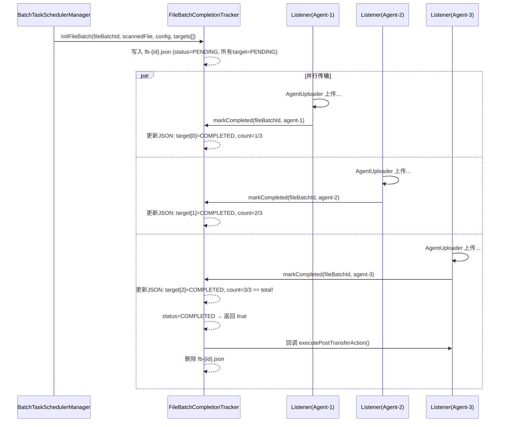
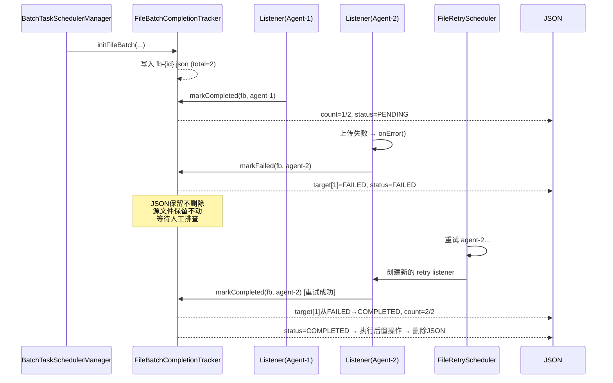
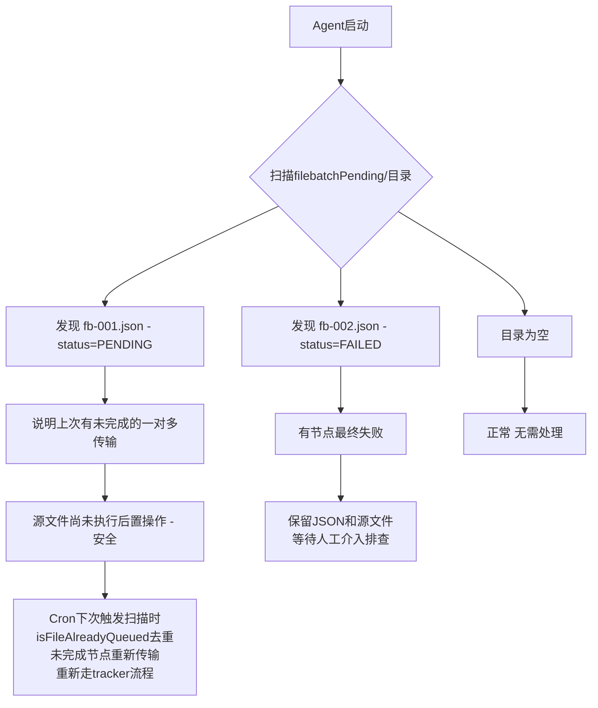

# FileBatch Completion Tracker 设计文档

## 1. 背景与问题

### 1.1 现状

`BatchUploadListener` 的 `executePostTransferAction()` 方法在 `onComplete()` 回调中直接执行传输后操作（DELETE/BACKUP 源文件）。对于 **一对一** 传输任务，此逻辑正确。

### 1.2 问题

对于 **一对多** 传输任务（如 BROADCAST 路由，一个源文件发往 N 个目标 Agent），当前逻辑存在缺陷：

```
文件A ──→ Agent-1  onComplete → executePostTransferAction() ← 问题！Agent-2 还在传
     └─→ Agent-2  传输中...
     └─→ Agent-3  传输中...
```

**只要任一目标节点完成就立即执行后置操作**，导致：
- 源文件被过早删除，其余节点传输失败或收到不完整文件
- 源文件被过早备份/移动，其余节点读取到错误内容

### 1.3 需求

- 一对多场景下，**所有目标节点全部成功接收文件后**，才执行传输后操作（DELETE/BACKUP）
- 任一目标节点最终失败（达最大重试次数），则**不执行**后置操作，保留源文件供排查
- 使用 JSON 文件持久化追踪状态，Agent 重启不丢失
- JSON 文件存在 = 事务未完成；文件被删除 = 事务已完成

## 2. 方案概述

### 核心思路

以 `fileBatchId` 为维度，用 **JSON 文件** 追踪同一文件发往多个目标 Agent 的整体完成状态。复用 Agent 现有的 `AtomicFileWriter` + `Gson` 序列化模式。

### 设计原则

- 改动最小：仅涉及 Agent 模块内部，不影响 Proxy/Admin/前端
- 一对一场景零影响：`routedTargets.size() == 1` 时完全跳过追踪
- 崩溃安全：JSON 文件存在即表示"未完成"，重启后可恢复判断
- 复用现有模式：沿用 TransferMetaStore 的原子写入 + Gson 序列化风格

## 3. 数据模型

### 3.1 文件存储位置

在现有队列目录旁新增 `filebatchPendingDir`：

```
/tmp/my-panel/admin/data/transfers/
├── uploadSendingQueue/          # 现有
├── uploadSuccessQueue/          # 现有
├── uploadFailRetryQueue/        # 现有
└── filebatchPending/            # 新增
    └── fb-{fileBatchId}.json   # 每个一对多文件批次一个文件
```

### 3.2 JSON 文件格式

```json
{
  "fileBatchId": 1234567890,
  "taskId": 1001,
  "taskName": "日志文件分发任务",
  "scanBatchId": 9876543210,

  "source": {
    "agentId": "agent-source-001",
    "agentName": "root@192.168.1.10:7777",
    "sourceDir": "/data/app/logs",
    "filePath": "/data/app/logs/app.log",
    "fileName": "app.log",
    "fileSizeBytes": 104857600,
    "lastModified": "2026-05-18 09:00:00.000"
  },

  "transferConfig": {
    "transferMode": "ONE_TO_MANY",
    "routingStrategy": "BROADCAST",
    "postTransferAction": "DELETE",
    "backupDir": null,
    "backupMode": null
  },

  "targets": [
    {
      "agentId": "agent-target-001",
      "agentName": "root@192.168.1.20:7777",
      "targetDir": "/data/remote/logs",
      "targetPath": "/data/remote/logs/app.log",
      "status": "PENDING",
      "completedAt": null
    }
  ],

  "summary": {
    "totalTargets": 3,
    "completedCount": 2,
    "failedCount": 0,
    "pendingCount": 1
  },

  "status": "PENDING",

  "createTime": "2026-05-18 10:30:00.000",
  "updateTime": "2026-05-18 10:32:10.500"
}
```

### 3.3 字段来源映射

| 分组 | 字段 | 数据来源 |
|------|------|----------|
| 标识 | fileBatchId, taskId, taskName, scanBatchId | 构造参数 + AgentTaskConfig |
| 源端 | agentId, agentName, sourceDir | AgentTaskConfig |
| | filePath, fileName, fileSizeBytes, lastModified | ScannedFile |
| 传输配置 | transferMode, routingStrategy, postTransferAction, backupDir, backupMode | TransferConfig |
| 目标列表 | targets[].agentId/agentName/targetDir | TargetAgentInfo（循环） |
| | targets[].targetPath | targetDir + fileName（拼接） |
| | targets[].status, completedAt | 运行时更新 |
| 汇总 | totalTargets, completedCount, failedCount, pendingCount | targets 数组实时计算 |
| 整体状态 | status | 判定逻辑产出 |
| 时间戳 | createTime, updateTime | 系统生成 |

### 3.4 状态定义

#### targets[n].status（单节点状态）

| 值 | 含义 |
|---|------|
| PENDING | 初始状态，等待传输或正在传输 |
| COMPLETED | 该节点成功接收文件 |
| FAILED | 该节点失败（含最终失败和可重试的临时失败） |

#### 整体 status（文件批次状态）

| 值 | 含义 | 后置操作 | JSON处理 |
|---|------|---------|---------|
| PENDING | 有节点还在传输或等待重试 | 不执行 | 保留 |
| FAILED | 有节点达到最大重试次数终态失败 | 永不执行 | 保留（供人工排查） |
| COMPLETED | 所有节点均成功 | 执行 DELETE/BACKUP | 执行完毕后删除 |

## 4. 流程设计

### 4.1 整体时序



### 4.2 失败场景时序



### 4.3 状态判定伪代码

```
function determineStatus(targets):
    hasFinalFailure = any(target.status == "FINAL_FAILURE" for target in targets)
    allCompleted = all(target.status == "COMPLETED" for target in targets)

    if hasFinalFailure:
        return "FAILED"
    else if allCompleted and len(completed) == totalTargets:
        return "COMPLETED"
    else:
        return "PENDING"
```

### 4.4 markFailed 的两层语义

为区分「可重试的临时失败」和「达到最大重试次数的最终失败」：

| 调用场景 | 行为 |
|---------|------|
| `onError()` 首次失败 | target.status = "FAILED"，整体 status 保持 PENDING（还在重试中） |
| 达到 maxRetries 最终失败 | target.status = "FINAL_FAILURE"，整体 status = "FAILED"（终态） |
| 重试后又成功 | target.status 从 "FAILED"/"FINAL_FAILURE" 回滚为 "COMPLETED" |

## 5. 类设计与职责

### 5.1 新增类：FileBatchCompletionTracker

```
FileBatchCompletionTracker
├── 属性
│   ├── filebatchPendingDir: String       // 追踪文件目录
│   ├── gson: Gson                        // 序列化器（复用TransferMetaStore风格）
│   └── executor: ExecutorService         // 异步写IO线程池（可选）
│
├── 方法
│   ├── initFileBatch(fileBatchId, scannedFile, config, targets[]) → void
│   │   └── 写入初始JSON文件（所有target=PENDING）
│   │
│   ├── markCompleted(fileBatchId, targetAgentId) → boolean
│   │   ├── 原子读JSON → 更新对应target为COMPLETED + 计数+1
│   │   ├── 重新计算summary和status
│   │   ├── 原子写回JSON
│   │   └── 返回 true(全部完成) / false(还有待完成的)
│   │
│   ├── markFailed(fileBatchId, targetAgentId, isFinalFailure) → void
│   │   ├── 原子读JSON → 更新对应target为FAILED/FINAL_FAILURE
│   │   ├── 如果isFinalFailure=true → 整体status=FAILED
│   │   └── 原子写回JSON
│   │
│   ├── recoverPendingBatches() → List<FileBatchState>
│   │   └── 启动时扫描目录，返回所有残留的未完成批次
│   │
│   └── deleteFileBatch(fileBatchId) → void
│       └── 全部完成后清理JSON文件
```

### 5.2 内部数据结构：FileBatchState（Java Bean）

```java
public class FileBatchState {
    private Long fileBatchId;
    private Long taskId;
    private String taskName;
    private Long scanBatchId;

    private SourceInfo source;              // 嵌套对象
    private TransferConfigInfo transferConfig; // 嵌套对象
    private List<TargetProgress> targets;   // 目标节点进度列表
    private Summary summary;                // 汇总统计

    private String status;                  // PENDING / FAILED / COMPLETED
    private String createTime;
    private String updateTime;
}
```

### 5.3 改动点汇总

| # | 文件 | 改动类型 | 说明 |
|---|------|---------|------|
| 1 | `FileBatchCompletionTracker.java` | **新增** | ~200行，核心追踪逻辑 |
| 2 | `FileBatchState.java` | **新增** | ~80行，JSON对应的Java Bean（含嵌套类） |
| 3 | `BatchTaskSchedulerManager.java` | **修改** | processScannedFiles 中一对多时调用 tracker.initFileBatch() |
| 4 | `BatchUploadListener.java` | **修改** | onComplete/onError 中改为通过 tracker 交互；构造函数注入 tracker 引用 |
| 5 | `AgentConfig.java` | **修改** | 新增 filebatch.pending.dir 配置项 |
| 6 | `AgentApplication.java` | **修改** | 创建并注入 FileBatchCompletionTracker 单例 |

**不改动的模块**：Proxy、Admin、前端、my-panel-common（DTO已够用）

## 6. 崩溃恢复机制

### 6.1 启动恢复流程



### 6.2 安全保证

| 场景 | JSON状态 | 后置操作 | 安全性 |
|------|---------|---------|--------|
| 正常运行中 | 存在，status=PENDING | 不执行 | 安全 |
| 全部完成瞬间崩溃 | 已删除（先删JSON再执行后置操作？不，先执行后删） | 见下方 | 见下方 |
| 执行后置操作中途崩溃 | 可能已删除也可能未删除 | 幂等操作 | DELETE重复调用无 harm；BACKUP目标追加时间戳 |
| 重启后残留PENDING文件 | 存在 | 不执行 | 安全，等下次补传 |
| 重启后残留FAILED文件 | 存在 | 不执行 | 安全，人工排查 |

### 6.3 完成操作的原子顺序

```
1. markCompleted() 返回 true（检测到全部完成）
2. executePostTransferAction()     ← 先执行后置操作
3. deleteFileBatch()               ← 再删除JSON文件
```

顺序不可反：如果先删JSON再执行后置操作，崩溃后无法知道是否已执行过。当前顺序下：
- 崩溃在步骤2：JSON仍在，重启后不会重复执行（但需要人工确认是否部分执行）
- 崩溃在步骤3：后置操作已完成，JSON残留但无害（下次启动可清理孤立JSON）

## 7. 边界场景处理

### 7.1 一对一场景

`routedTargets.size() == 1` 时，**完全跳过 tracker**，行为与现有逻辑完全一致：

```
processScannedFiles():
    routedTargets = router.route(...)  // size = 1
    if (routedTargets.size() > 1):     // false, 跳过
        tracker.initFileBatch(...)

onComplete():
    if (tracker != null):              // null, 走else分支
        ...
    else:
        executePostTransferAction()    // 原有逻辑不变
```

### 7.2 并发写竞争

多个 Listener 的 onComplete/onError 可能同时更新同一 JSON 文件：

- 使用 `AtomicFileWriter.writeAtomically()` 保证单次写入原子性
- 文件级别加锁（synchronized on fileBatchId）：同一 fileBatchId 的更新串行执行
- 不同 fileBatchId 之间互不影响（不同文件）

### 7.3 重试回退

```
agent-3 onError → markFailed(fb, agent-3, isFinalFailure=false)
    → target[2].status = "FAILED", 整体status保持PENDING

... FileRetryScheduler 重试 ...

agent-3 重试成功 → markCompleted(fb, agent-3)
    → target[2].status 从 "FAILED" → "COMPLETED"
    → completedCount++ → 检查是否全部完成
```

### 7.4 目录初始化

`AgentApplication` 或 `BaseAgentClient` 启动时创建 `filebatchPendingDir` 目录（与其他队列目录一起），不存在则 `Files.createDirectories()`。

## 8. 配置变更

### AgentConfig 新增配置项

```yaml
# 文件批次完成状态追踪目录（一对一多传输时追踪所有目标节点的完成情况）
filebatch:
  pending:
    dir: /tmp/my-panel/admin/data/transfers/filebatchPending
```

默认值与其他队列目录保持相同的 base path 风格。
