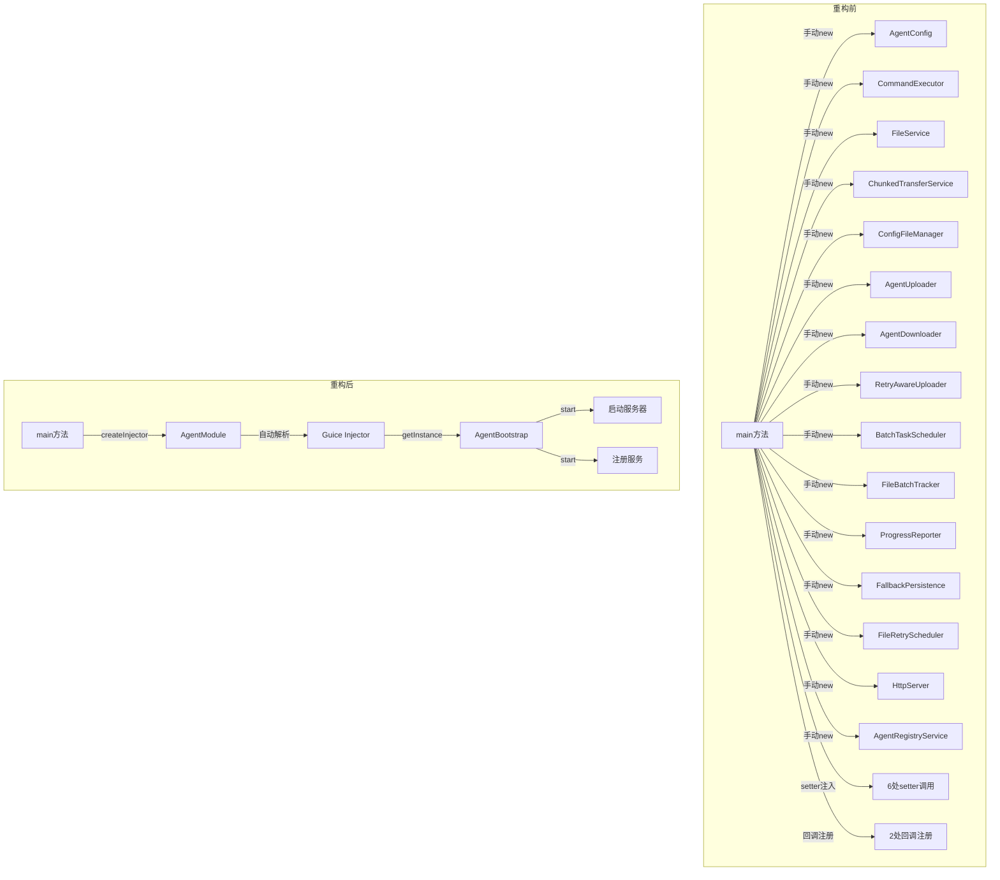
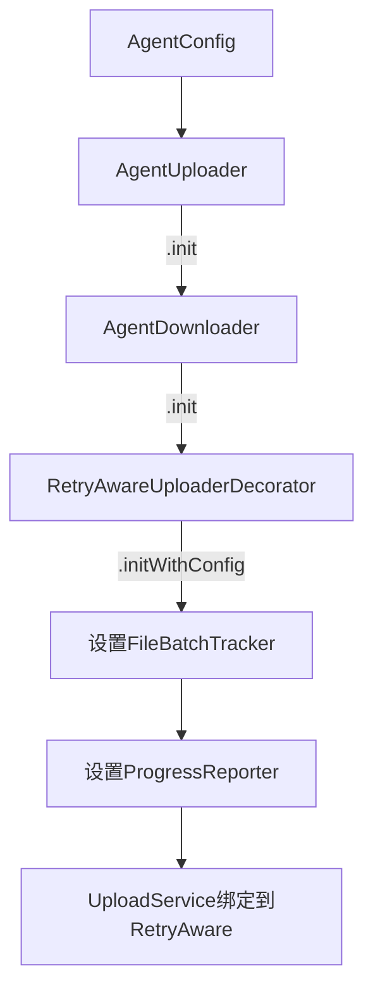
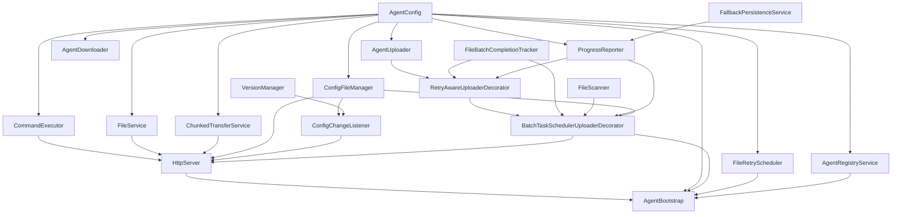
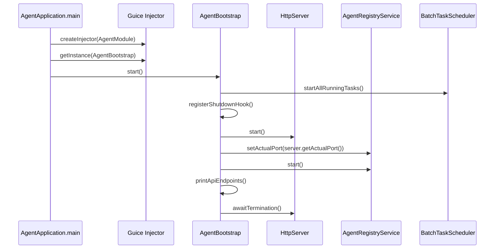

# Agent Guice 依赖注入重构设计

## 1. 背景与目标

### 1.1 现状

Agent 模块是纯 Java + Netty 应用（无 Spring 框架），当前所有组件在 `AgentApplication.main()` 中手动 `new` + setter 注入组装，约 240 行代码管理 20+ 个组件的创建和依赖关系。

**痛点**：
- 组件创建顺序必须严格手动保证，容易出错
- 新增组件需要理解完整的组装链路，侵入 `main()` 方法
- setter 后置注入分散在多个方法中，依赖关系不直观
- 回调注册逻辑与组件创建混合，职责不清

### 1.2 目标

引入 Google Guice 7.x 依赖注入框架，重构 Agent 启动前的组件组装过程：
- **不影响现有功能**：所有组件类零修改，仅迁移组装逻辑
- **方便后续扩展**：新增组件只需在 Module 中添加绑定
- **依赖关系显式化**：通过 Guice Module 统一管理所有绑定

## 2. 方案选型

| 方案 | 描述 | 优点 | 缺点 |
|------|------|------|------|
| **A. 单 Module + Provider** | 一个 AgentModule，复杂组件用 Provider 封装 | 改动最小，风险最低，扩展简单 | 单 Module 随组件增多可能变大 |
| B. 多 Module 分层 | 按功能域拆分多个 Module | 模块化清晰 | 改动大，装饰者链跨模块复杂 |
| C. 混合模式 | Guice 管核心 + 手动组装边缘 | 渐进式迁移 | 两套模式，认知负担 |

**选择方案 A**：Agent 模块组件数量有限（约 20 个），单 Module 完全可管理；Provider 能优雅处理装饰者链和 setter 注入。

## 3. 架构设计

### 3.1 重构前后对比



### 3.2 新增文件清单

| 文件 | 包路径 | 职责 |
|------|--------|------|
| `AgentModule` | `com.cq.agent.di` | Guice Module，集中管理所有组件绑定 |
| `AgentBootstrap` | `com.cq.agent.di` | 启动编排类，处理运行时启动逻辑 |
| 各 Provider 类 | `com.cq.agent.di.provider` | 封装复杂组件的创建逻辑 |

### 3.3 修改文件清单

| 文件 | 修改内容 |
|------|----------|
| `AgentApplication` | 简化为创建 Injector + 启动 AgentBootstrap |
| `pom.xml` | 添加 Guice 7.x 依赖 |

**现有组件类零修改**：CommandExecutor、FileService、ChunkedTransferService、AgentUploader、AgentDownloader、RetryAwareUploaderDecorator、BatchTaskSchedulerUploaderDecorator 等均不修改。

## 4. AgentModule 绑定设计

### 4.1 简单绑定（Guice 自动解析构造函数依赖）

这些组件只需 `AgentConfig` 作为依赖，Guice 可自动解析：

| 绑定类型 | 实现类 | 说明 |
|----------|--------|------|
| `AgentConfig` | instance | `toInstance(new AgentConfig())` |
| `CommandExecutor` | 构造函数注入 | 依赖 AgentConfig |
| `FileService` | 构造函数注入 | 依赖 AgentConfig |
| `ChunkedTransferService` | 构造函数注入 | 依赖 AgentConfig |
| `VersionManager` | 默认构造 | 无依赖 |
| `FileScanner` | 默认构造 | 无依赖 |

### 4.2 Provider 绑定（复杂初始化逻辑）

#### ConfigFileManagerProvider


- 从 AgentConfig 获取 `fileBaseDirectory`，拼接 `batch-config` 子目录
- 调用 `new ConfigFileManager(batchConfigDir)`

#### UploadServiceDecoratorChainProvider

这是最复杂的 Provider，封装三层装饰者链的创建：



创建步骤：
1. `new AgentUploader(config)` → `init()`
2. `new AgentDownloader(config)` → `init()`
3. `new RetryAwareUploaderDecorator(agentUploader)` → `initWithConfig(config)`
4. `setFileBatchTracker(tracker)`
5. `setGlobalProgressReporter(progressReporter)`

#### BatchTaskSchedulerProvider

创建步骤：
1. `new BatchTaskSchedulerUploaderDecorator(retryAwareUploader, configFileManager)`
2. `setRetryAwareUploader(retryAwareUploader)`
3. `setAgentConfig(config)`
4. `setFileScanner(fileScanner)`
5. `setProgressReporter(progressReporter)`
6. `setFileBatchTracker(fileBatchTracker)`

#### ConfigChangeListenerProvider

创建步骤：
1. `new ConfigChangeListener(configFileManager, versionManager)`
2. 注册 `onCronChange` 回调
3. 注册 `onAnyChange` 回调

#### FallbackPersistenceServiceProvider

创建步骤：
1. `new FallbackPersistenceService(config.getProgressFallbackDir())`
2. `setProgressReporter(progressReporter)`
3. `configureAutoRetry(30, 10)`
4. 将 `fallbackHandler` 设置到 `progressReporter`

#### FileRetrySchedulerProvider

创建步骤：
1. `new FileRetryScheduler(retryAwareUploader, config.getFailedQueueScanIntervalMs())`

#### AgentRegistryServiceProvider

创建步骤：
1. `new AgentRegistryService(config)`

#### HttpServerProvider

创建步骤：
1. `new HttpServer(config, commandExecutor, fileService, chunkedTransferService, configFileManager, configChangeListener, batchTaskUploader)`

### 4.3 绑定汇总



## 5. AgentBootstrap 设计

`AgentBootstrap` 负责运行时启动编排，这些逻辑无法放在 Provider 中（依赖运行时状态）：



## 6. AgentApplication 重构后

重构后的 `main()` 方法约 10 行：

```java
public static void main(String[] args) {
    try {
        Injector injector = Guice.createInjector(new AgentModule());
        AgentBootstrap bootstrap = injector.getInstance(AgentBootstrap.class);
        bootstrap.start();
    } catch (Exception e) {
        logger.error("Failed to start agent", e);
        System.exit(1);
    }
}
```

## 7. 后续新增组件流程

新增组件只需两步：

1. **编写组件类**：构造函数声明依赖即可
2. **在 AgentModule 中添加绑定**：
   - 简单组件：Guice 自动解析构造函数依赖，无需额外配置
   - 复杂组件：编写 Provider 类并 `bind(NewService.class).toProvider(NewServiceProvider.class)`

## 8. 测试策略

| 测试类 | 测试内容 |
|--------|----------|
| `AgentModuleTest` | 验证 Guice Injector 能成功创建所有绑定组件 |
| `AgentBootstrapTest` | 验证启动流程（mock 依赖） |
| 现有测试 | 不受影响（组件类零修改） |

## 9. 风险与缓解

| 风险 | 缓解措施 |
|------|----------|
| Guice 创建组件顺序与手动不同 | Provider 中显式控制创建顺序，与原 main() 一致 |
| 装饰者链绑定复杂 | 使用 `@Named` 注解区分同类型不同实现 |
| 回调注册时机 | 在 ConfigChangeListenerProvider.get() 中完成注册，确保创建即可用 |
| 循环依赖 | 当前无循环依赖，Guice 会检测并报错 |
